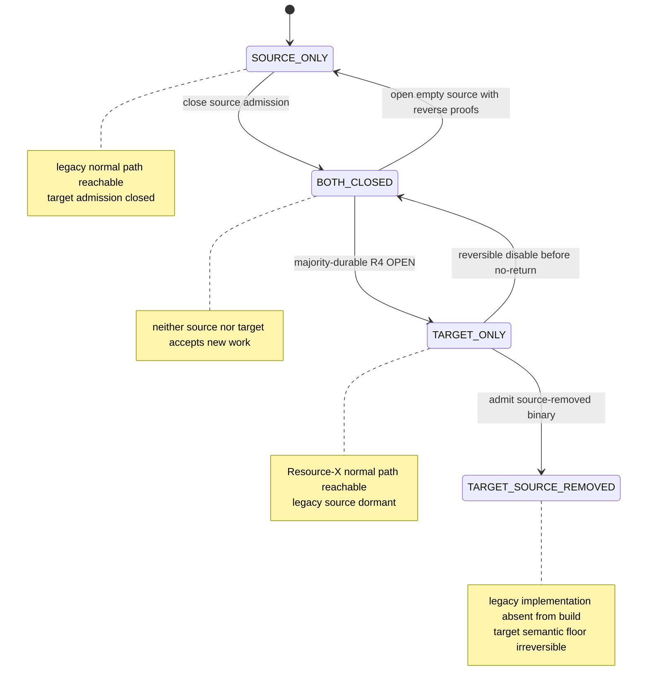
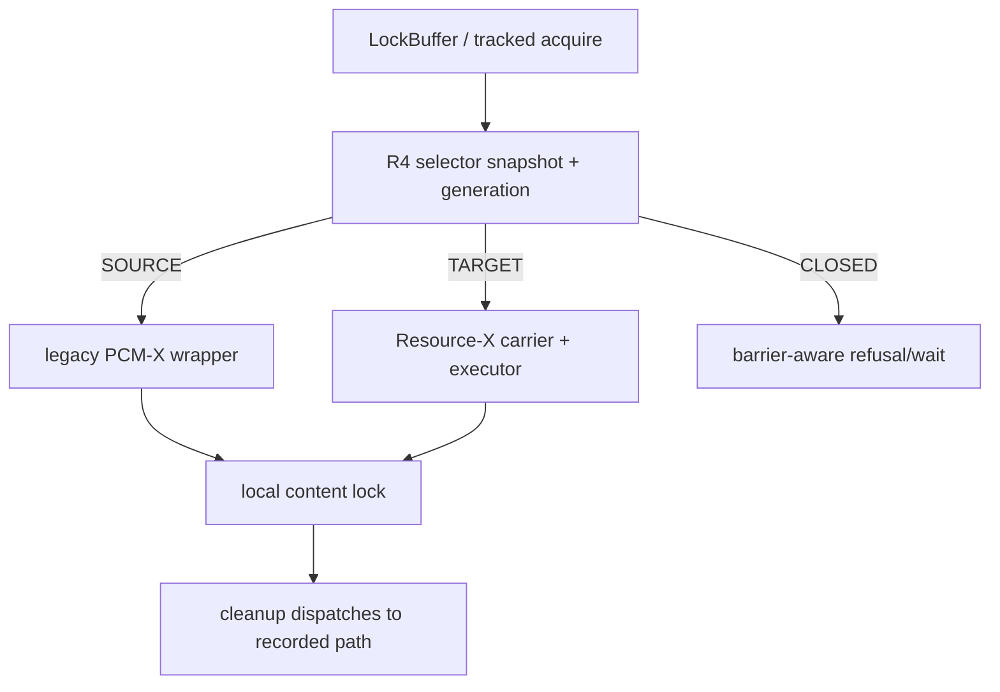
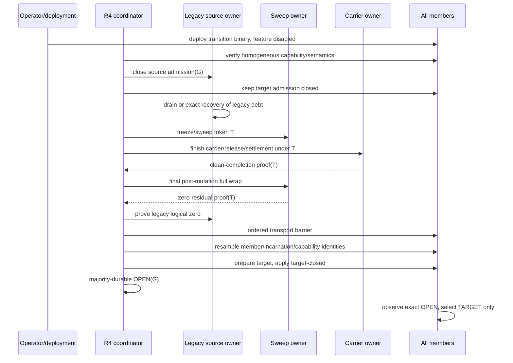
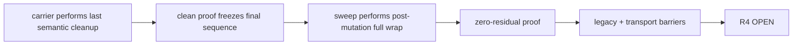
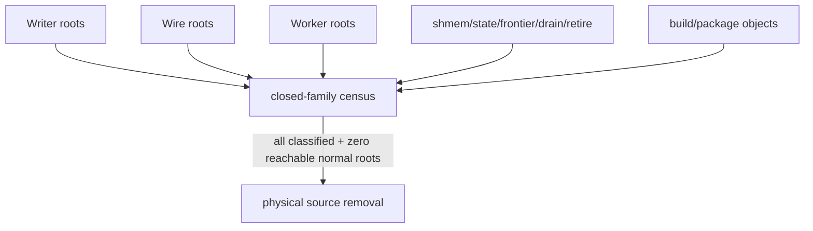
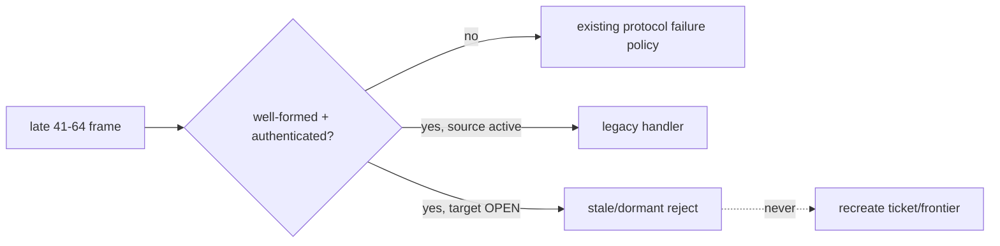

# 07：R4 OPEN、双路径切换与旧 ticket 家族退役

Resource-X 不能通过一个本地 GUC 从旧 PCM-X 路径“瞬间切过去”。两个实现对 equality、queue、retry、terminal 和 cleanup 的解释不同；任何双开或混合解释都可能为同一资源产生两套 authority。R4 提供集群范围的 source/target 切换框架，并把唯一 OPEN 决定持久化。

## 1. 四个派生状态

R4 持久记录、feature floor 与本地 selector 共同派生四种运行形态：



不存在 `BOTH_OPEN`。如果 proof 不完整、member/capability 变化、transport barrier 失效或 token mismatch，合法结果是保持 `BOTH_CLOSED`，而不是选择一个看起来更可能正确的路径。

## 2. Sole writer selector

所有 tracked shared-buffer lock/acquire 都要经过唯一 selector：



固定规则：

1. selector 在 content lock 之前读取一次；
2. source 只调用 legacy wrapper；
3. target 只调用 Resource-X acquire；
4. closed 不调用任一 acquisition；
5. cleanup 根据请求创建时记录的 path 回收，不能在 unlock 时重新选择；
6. generation 中途变化时走原 owner 的 stale/closed unwind，绝不“顺便切到另一条路径”；
7. target 即使拿到 content lock，仍必须通过同 generation 的 T3/write-fence 重校验。

## 3. 切换前置条件

R4 只消费 proof，不替前置模块制造 proof。一次 exact generation `G` 和 token `T` 的 precutover 至少要求：

```text
all admitted members run the same semantic feature set
AND source admission is closed
AND target admission is closed
AND legacy logical debt is exact zero
AND legacy transport debt is exact zero
AND Resource-X zero-residual proof(T) is valid
AND Resource-X clean-completion proof(T) is valid
AND both proofs refer to the same final mutation sequence
AND writer/wire/worker source census is complete
AND ordered transport barrier crossed every admitted connection incarnation
AND member boot/incarnation/capability identities remain unchanged
```

任一 absent、unknown、stale、mismatch、unclassified 或 unreadable 都等于 false。

### Legacy logical debt zero

不是 allocation counter 为零，而是没有 live ticket/tag/member/reliable leg/writer ledger/deferred cleanup/frontier/retry obligation。source owner 必须在自己仍存在且 admission 已关闭时产生完整性证据。

### Legacy transport debt zero

不是 ring depth 为零，而是每个旧 logical send target 与每个 physical DATA/CONTROL copy 都已 terminal，旧 handler 不在执行，并且 ordered barrier 已越过所有 admitted connection incarnation。

## 4. 完整 activation 顺序



**线性化点只有一个：R4 的集群级、持久、满足 quorum 的 OPEN 记录。** 本地 selector 变为 target 是观察该记录后的派生动作，不是独立决定。

## 5. 为什么 final full wrap 在 clean completion 之后



如果顺序反过来，sweep 先看到零，carrier 随后为 release/reclaim 产生一个新 sidecar 或 intent，就会出现“proof 声称零，但状态已经非零”。same token 还不够；proof 必须绑定 owner 的最终 mutation sequence。

## 6. 三层 legacy 断开

旧协议不是删掉一个函数就算退役。它有三个 authority root：

| 层 | 闭合对象 | 完成条件 |
|---|---|---|
| writer root | buffer acquire → source wrapper → acquire/cleanup/owner-exit | target OPEN 时 source wrapper 不可达；source-removed build 中符号/对象不存在 |
| wire root | 旧 message producer → ring/router → handler → reply producer | normal producer 与 semantic consumer 都为零；只保留明确 stale reject |
| worker root | LMON/LMS formation/image/master/terminal/drain/retire ticks | 所有 legacy periodic call 为零，target retry/sweep/carrier 有正向锚点 |



## 7. 旧消息 41–64 的处理

旧 PCM-X message family 的数字值在 source removal 后继续保留为 reservation，避免未来重用导致迟到 frame 被误解释为新协议。但正常语义全部断开：

- 不再有正常 producer；
- 不再有会推进 ticket/frontier/drain/retire 的 semantic consumer；
- 迟到且 authenticated 的旧 frame 只能被分类为 dormant/stale 并丢弃；
- malformed frame 仍走既有 peer/protocol failure policy；
- stale reject 不拿 semantic lock、不回复旧 ACK、不重建旧 state。



## 8. 物理删除是一个 closed-family 操作

删除顺序强调“先不可达、后删除”：

1. writer root 受 R4 polarity 保护；
2. 旧 send root 受同一 source generation 保护；
3. target positive production tests 通过；
4. normal requester/master/holder/image/terminal/drain/retire roots 变为不可达；
5. old ingress 只剩 stale reject；
6. 静态和动态 census 证明 source graph 零；
7. 删除 ticket queue、global retirement frontier、drain/retire handlers；
8. 删除 legacy shmem sizing/init/attach 与 cleanup ledgers；
9. 删除 legacy LMON/LMS tick，同时保留 target actor；
10. 从所有 build/package manifest 删除 legacy object；
11. 保留 message number reservation 与 compile-time collision assertions。

禁止只删 drain、却保留 retirement frontier；也禁止只删 requester、却让 writer prepare 或 worker tick 继续改旧 state。半删除会产生难以观察的潜在 mutator。

## 9. Rollback 与 no-return

### Source 仍存在时的 reversible disable

只有精确证明 target 没留下 source 无法解释的 catalog/WAL/page/control/wire 结果，并且 target logical/transport/T1/T2/T3/C-intent/settlement/reclaim debt 全部为零，才可：

1. 关闭 target admission；
2. 用新的 reverse token 重新完成 zero/clean proofs；
3. R4 进入 both-closed；
4. 打开一个**空的** source；
5. 不把 Resource-X entry 翻译成 ticket，也不 replay 旧消息。

### Source-removed no-return

第一台 source-removed binary 被正式 admitted 后，Resource-X semantic feature 进入 formation floor：

- 旧 source binary 不能再 join；
- 不能通过 GUC、local file、timeout 或 operator override 降级；
- repair 只能沿 target semantics 向前；
- transition binary 即使仍含 source code，也必须让 source 保持 dormant；
- heterogeneous capability/member change 继续 fail-closed。

## 10. Crash/restart 矩阵

| crash 点 | 恢复结果 |
|---|---|
| R4 PREPARE 前 | stable source-only |
| source close 后、logical zero 前 | owner 完成 source debt 或保持 both-closed |
| clean proof 后、final zero 前 | both-closed，重新完成 final wrap 或启新 token |
| final zero 后、transport barrier 前 | both-closed，重新验证 barrier/member identity |
| target-closed apply 后、OPEN 前 | 依 R4 持久记录恢复，local target 不可达 |
| majority OPEN 后、本地 callback 前 | record truth 已是 target；restart 观察 OPEN 后才开本地 selector |
| target ordinary workload 中 | 只走 Resource-X/recovery；不 fallback source |
| source-removed rollout 中 | 只允许 homogeneous target member |
| no-return 后 | feature floor 持久，拒绝旧 binary |

## 11. 完成证据

实现版验收必须同时包含：

- source-only、both-closed、target-only 的 selector 动态测试；
- exact R4 generation/token 与 crash boundary 测试；
- Resource-X carrier、retry、T1/T2/T3 的 target positive traffic；
- legacy writer/wire/worker 的 negative reachability；
- message reservation/stale reject；
- source-present reversible round trip；
- source-removed build 的 symbol、link map、object、shmem 与 package census；
- fixed four-node repeated workload，零 error/timeout/forced cancel/zero-op；
- feature disabled 基线与 target 性能对照；
- 所有 artifact 绑定同一 product tree、formation、generation 与 token。

“运行中没看到旧消息”不等于 producer 为零；“源码删了”不等于旧 work 已 terminal；“所有单测绿”也不能替代真实四节点 target traffic。

[上一篇：Formation sweep](06-reconfiguration-sweep-and-zero-residual.md) · [返回目录](README.md) · [下一篇：Oracle RAC 对比](08-oracle-rac-comparison-and-boundaries.md)
