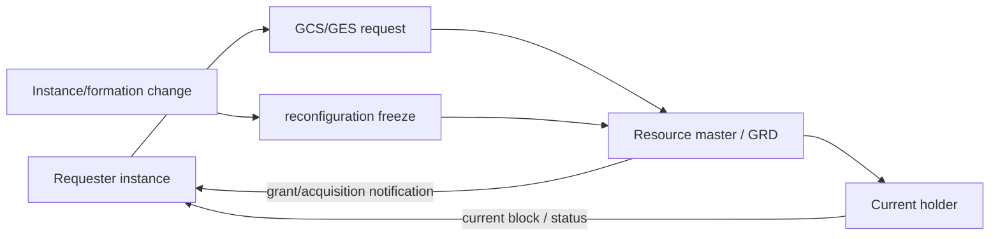
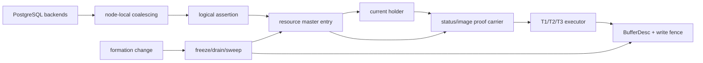
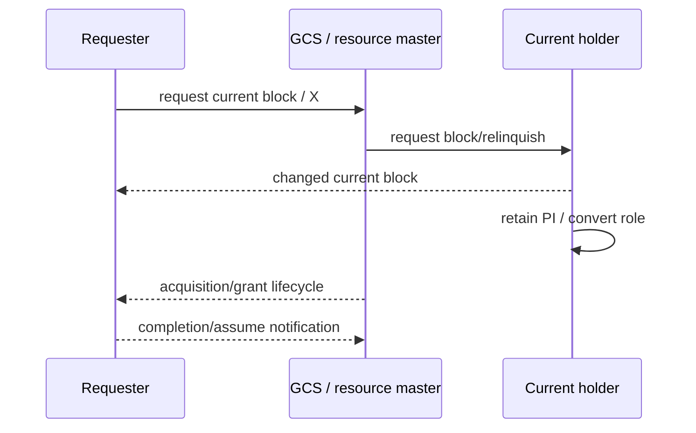
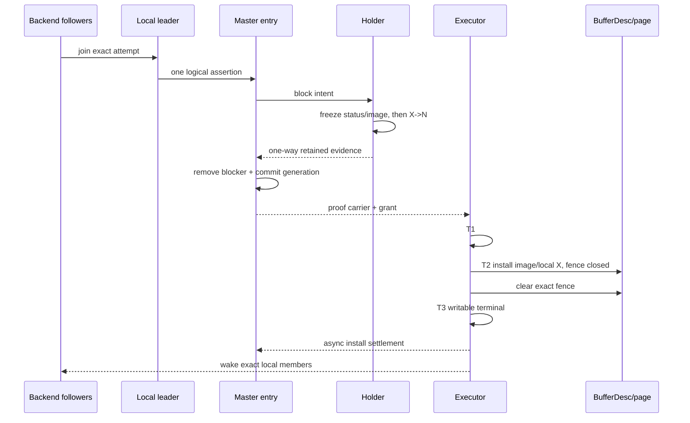
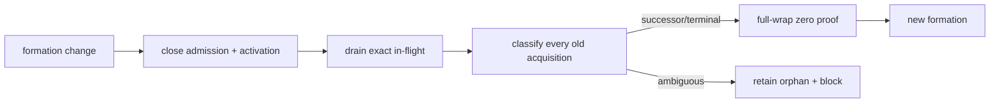

# 08：Oracle RAC 行为对照、PGRAC 适配与公开边界

Resource-X 的设计目标是对齐 Oracle RAC 已公开的 resource mastering、granted/convert queue、Cache Fusion current-block transfer 与 reconfiguration freeze 行为，同时把 PostgreSQL 特有的 backend、BufferDesc、content lock、dirty publication 和 error unwind 纳入一条可证明的路径。

它不是 Oracle 私有实现的复刻。Oracle 没有公开 PGRAC 的 logical assertion、attempt witness、transport witness、T1/T2/T3、C-intent、R4 token 或 ticket 退役机制。

## 1. Oracle 公开的职责链

**Oracle 已验证：**

- GCS、GES 与 GRD 协调跨实例的数据块和 enqueue 资源；
- GRD 分布在 active instances 上，记录资源角色与状态；
- 一个资源由某个 master 管理，锁请求可处于 granted/convert 等队列角色；
- changed current block 转移时，旧 holder 可以保留 PI，requester 获得 current/X；
- requester 完成块接收后向 GCS 报告/完成相应 acquisition 生命周期；
- 实例失败恢复与 GRD reconfiguration 期间，新 GCS resource/write 请求会暂时挂起；
- reconfiguration 会重新建立资源 master/authority，并处理 pending requests/writes。

这些公开事实给出角色与外部顺序，但不提供 Oracle 的内部 struct、wire byte、generation、scan cursor、retry backoff 或数据库 buffer lock order。

## 2. PGRAC Resource-X 的对应职责链

Resource-X 把 Oracle 公开行为中没有展开的“requester 何时真正可以写”细化为 PostgreSQL 可验证步骤：master grant 是 T1，current image/local X 安装是 T2，exact local fence clear 与 resource terminal 是 T3。

## 3. 逐项对照

| 主题 | Oracle 官方公开行为 | Resource-X 设计 | 结论 |
|---|---|---|---|
| authority 粒度 | resource 有 master，GRD 维护资源状态 | master entry 以完整 block resource 为 key | 行为对齐；内部布局未知 |
| holder/convert | granted 与 convert queue 角色公开可见 | holder set + FIFO convert attempts | 角色对齐；queue node/generation 为 PGRAC 自研 |
| 同实例复用 | 已在本地 cache 的块可被该实例后续事务利用 | 同节点 backend 合并为一个 cluster assertion，本地 ownership 不合并 | 目标形状一致；coalescing 算法自研 |
| XCUR 唯一性 | cluster 中只有一个 XCUR 版本 | 同 resource 的 exact authority generation 只允许一个 current writable owner | 安全目标对齐 |
| changed block transfer | holder 发送 changed block、保留 PI、requester 获得 X | immutable status/image carrier + exact grant/image join + T2 | 行为顺序对齐；proof fields/wire 自研 |
| grant notification | acquisition notification 表示 requester 获得锁 | T1 记录 master grant，但不单独开放 PostgreSQL 写入 | 更细的 PG integration；不声称 Oracle 也有 T1 位 |
| local write opening | Oracle 公共资料不披露 DB buffer 内部步骤 | T2 image/local-X，T3 fence clear/terminal，write census | PGRAC 必需适配 |
| retry | Oracle wait events 公开自动 retry/ongoing request 现象 | shared pump、backoff、absolute deadline、pre/post-no-return | 外部行为一致；producer/数值/算法未知 |
| normal release | holder relinquish/status 与后继 grant | 先 arm immutable status，再 X→N，单向 release，master exact apply | 角色顺序对齐；ACK 策略为 PGRAC 设计 |
| reconfiguration | GRD rebuild 时暂停新 GCS work | close admission/activation、drain、bounded sweep、zero proof | freeze 形状对齐；sweep/token 自研 |
| dead requester | pending work 在 recovery 中被 cancel/replay/重建 | head/non-head exact reclaim 或 orphan | 目标对齐；分类算法未知 |
| transport | Oracle interconnect 内部协议未公开 | session freshness 与 logical identity 分离，C-intent/physical copy 分离 | PGRAC 自研 |
| cutover | Oracle 不涉及 PGRAC legacy PCM-X migration | R4 both-closed、durable OPEN、ticket family removal | 完全是 PGRAC migration 机制 |

## 4. 名词不要强行一一对应

| PGRAC 术语 | 可以怎样理解 | 不能怎样宣称 |
|---|---|---|
| Resource-X assertion | resource/requester 级 logical claimant | “Oracle 内部也有同名/同字段 assertion” |
| attempt witness | 防止顺序 acquisition ABA 的 base-generation 绑定 | “Oracle 使用相同 generation 算法” |
| transport witness | stale frame/session reject 上下文 | “Oracle connection generation 不参与任何内部 identity” |
| T1/T2/T3 | PGRAC 对 grant→image→local writable 的三阶段落地 | “Oracle 有相同三个位或 callback” |
| C-intent | logical send obligation 与 ring copy 分离 | “Oracle 使用同样的 slot/state machine” |
| orphan | 无法安全归零的旧 formation evidence | “Oracle 对应记录也叫 orphan” |
| R4 OPEN | PGRAC 集群语义切换线性化点 | “Oracle 用同样的 feature bit/token” |

## 5. 两种正常 transfer 的时序对照

### Oracle 公开行为抽象

### Resource-X 细化后的 PostgreSQL 落地

第二张图不是对第一张图内部实现的逆向还原，而是 PGRAC 为保持相同安全顺序所需的本地扩展。

## 6. Reconfiguration 对照

### Oracle 公开形状

官方资料描述实例失败后，GES/GCS/GRD 进入重配置与恢复阶段，新的相关请求暂时挂起，资源被重新掌握，pending requests/writes 被处理，之后服务恢复。

### PGRAC 目标形状

相同点是“reconfiguration 期间不让旧 authority 与新请求并发穿越”；差异是 PGRAC 公开定义了 token、bounded cursor、BufferDesc neutralize 和 zero-residual proof，而 Oracle 官方资料没有披露对应内部算法。

## 7. 为什么 PGRAC 需要额外的 BufferDesc fence

Oracle 数据库内核、buffer cache 与 GCS 是一体化实现；其内部 local-write 开放条件未公开。PGRAC 基于 PostgreSQL，需要把集群 authority 接到已有的本地机制：

- `BufferTag` 与 buffer mapping；
- buffer header spinlock；
- content shared/exclusive lock；
- pin/raw pin 与 I/O owner；
- dirty/hint dirty/writeback；
- ResourceOwner、ERROR/longjmp cleanup；
- background process 不能无限阻塞 content lock。

因此 T2 sidecar 与 T3 write fence 不是声称“比 Oracle 多一层协议”，而是说明“PGRAC 必须显式证明 PostgreSQL 本地写入口没有绕过全局 grant”。

## 8. 安全目标相同，故障域不同

| 维度 | Oracle RAC | PGRAC Resource-X |
|---|---|---|
| cluster membership/fencing | Oracle Clusterware/CSS 等独立于 DB instance 的层参与 | 当前 PGRAC 的多数协调进程位于 postmaster 体系，外部 fencing 是独立边界 |
| resource service | GCS/GES/GRD 与 RAC background processes | PGRAC GCS/GES/GRD-like modules 与 PostgreSQL auxiliary processes |
| buffer cache integration | Oracle 自有 buffer/cache 内核 | PostgreSQL `bufmgr` 上增加 cluster-aware fence 与 typed helper |
| storage | RAC shared storage + ASM/other supported stack | PGRAC shared-disk/storage manager 体系 |
| protocol disclosure | 内部 wire/queue/generation 大量未公开 | PGRAC 代码与文档可公开检查 |

所以“对齐 Oracle 行为”不等于“故障隔离级别已经完全相同”。特别是外部 fencing、部署认证、独立 clusterware daemon 等能力，需要按各自范围和证据单独验收。

## 9. Oracle 未公开的关键问题

公开资料不能回答：

- Oracle 内部是否有等价于 PGRAC ticket 的对象；
- Oracle 的 logical request equality 是否包含哪些字段；
- retry producer、backoff、deadline 与 scan fairness 的具体算法；
- wire opcode、payload、CRC、ACK 和 physical-copy ownership；
- grant/image join 的内部 generation 结构；
- local buffer write gate 的锁序与字段；
- reconfiguration sweep cursor、orphan record 或 zero proof；
- 在线协议切换如何进行 source-code family retirement。

本文对这些问题统一标记为“Oracle 未公开”，不会用动态视图中“没有某列”推导 Oracle 内部“没有某对象”。

## 10. 当前文档边界与 v2 修订

本组文档是目标架构设计，不把尚未完成的 production wiring 写成现状。实现完成后的 v2 将补充：

- 实际公开 C 类型、size/offset 与 capability；
- production producer/consumer 的源码链接；
- local coalescing、retry、sweep、carrier 与 R4 selector 的真实调用图；
- unit/TAP/fault/formal 测试编号及覆盖边界；
- 四节点运行 artifact、故障注入与性能结果；
- 设计与最终实现之间的差异清单；
- 已删除的旧 ticket/wire/worker/build roots 的静态证据。

在 v2 之前，读者应把本文中的 Resource-X 状态与 API 名称理解为稳定语义，而不是承诺公开主线已存在完全同名的函数或字段。

## 11. Oracle 官方资料

- [Oracle RAC 架构：GCS、GES、GRD、LMS/LMON](https://docs.oracle.com/en/database/oracle/oracle-database/26/racad/introduction-to-oracle-rac.html)
- [Oracle RAC resource coordination](https://docs.oracle.com/cd/A97630_01/rac.920/a96597/coord.htm)
- [Oracle Cache Fusion、current block transfer 与 recovery](https://docs.oracle.com/cd/A97630_01/rac.920/a96597/pslkgdtl.htm)
- [Oracle RAC software architecture 与 resource mastering](https://docs.oracle.com/cd/A97630_01/rac.920/a96597/pssvarch.htm)
- [Oracle `V$GES_RESOURCE`](https://docs.oracle.com/en/database/oracle/oracle-database/19/refrn/V-GES_RESOURCE.html)
- [Oracle `V$GES_ENQUEUE`](https://docs.oracle.com/en/database/oracle/oracle-database/19/refrn/V-GES_ENQUEUE.html)
- [Oracle RAC backup/recovery 与 surviving-instance recovery](https://docs.oracle.com/en/database/oracle/oracle-database/26/racad/managing-backup-and-recovery.html)

[上一篇：R4 切换与 ticket 退役](07-r4-open-cutover-and-ticket-retirement.md) · [返回目录](README.md)
