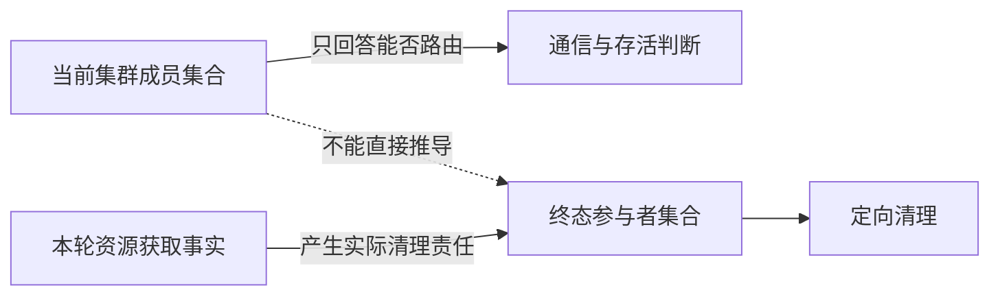
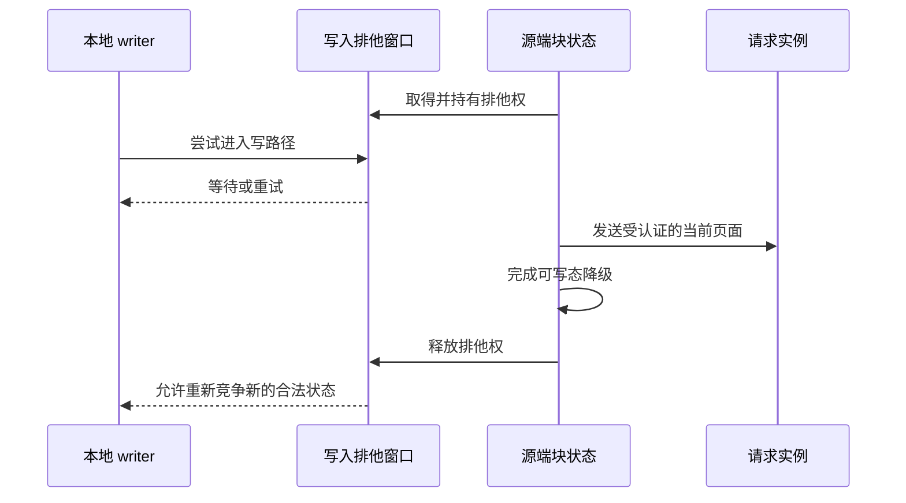
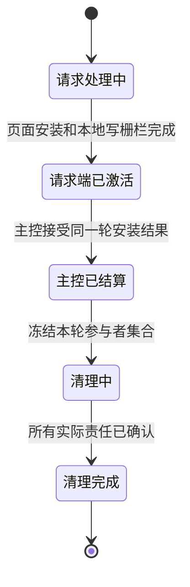
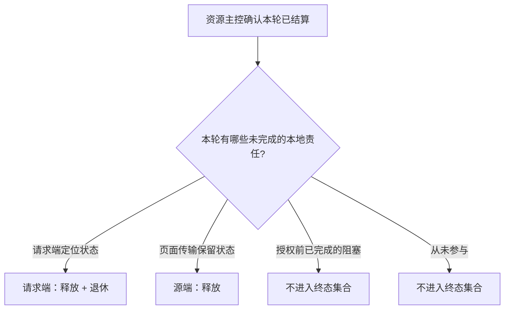
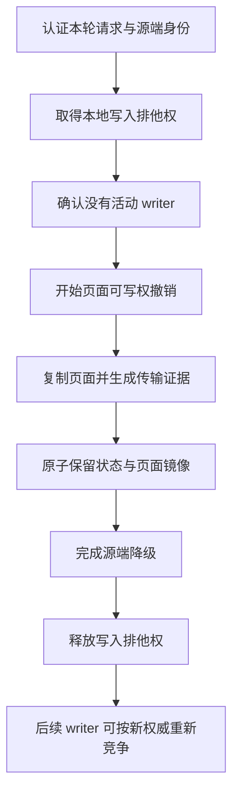
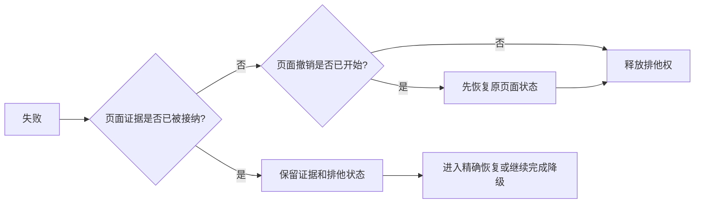
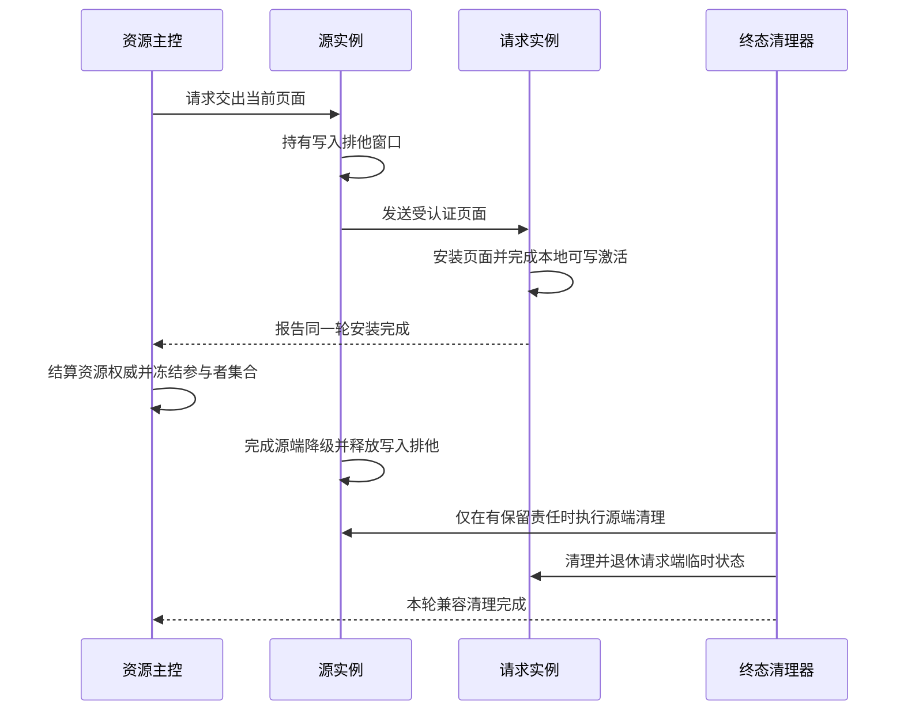
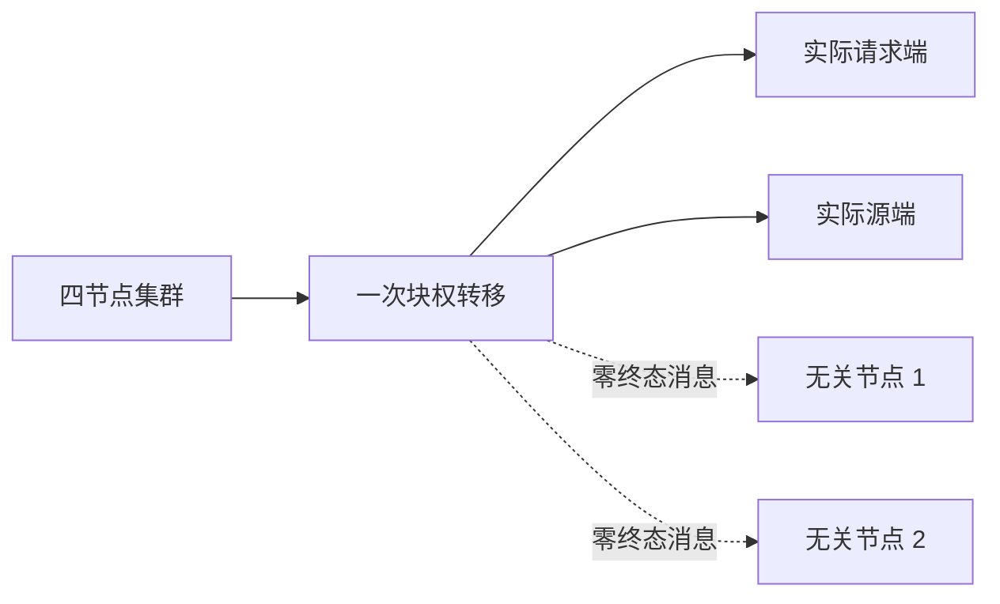

# 09：终态参与者与源端写入排他窗口

Resource-X 把一个数据块的可写权从源实例交给请求实例时，最后阶段同时存在两类工作：

1. 新持有者完成页面安装并成为唯一可写实例；
2. 仍保存本轮临时状态的实例完成清理，使协议对象可以安全退休。

这两类工作不能混为一谈。新持有者已经可以安全写，不代表所有临时清理都已结束；反过来，
后台清理也不能重新授予写权限。本章说明两个相互配合的安全机制：

- **终态参与者集合**：只联系本轮确实负有清理责任的实例；
- **持有式写入排他窗口**：源实例开始交出可写权后，持续阻止新的本地 writer，直到源端降级完成。

本文描述的是 Resource-X 的公开目标行为和运维语义。具体共享内存布局、消息字段、锁实现和
恢复记录属于内部实现，不在公开文档中展开。

---

## 1. 为什么需要单独定义这两个机制

### 1.1 集群成员不等于终态参与者

一个实例属于当前集群，只能证明它可以参与路由、心跳和资源服务，不能证明它在某次块权转移中
保存了需要清理的状态。

例如，四节点集群中可能只有：

- 请求实例保存了本轮请求定位状态；
- 源实例保存了本轮页面传输或降级状态；
- 另外两个实例虽然在线，却从未参与这次资源获取。

如果清理器依次询问所有在线实例，那么第一个无本轮状态的实例可能返回“找不到”或“已过期”，
从而挡住真正需要完成清理的实例。正确做法是由本轮资源生命周期产生参与者集合，而不是从成员
列表猜测。



### 1.2 两次检查不能代替持续排他

源实例交出可写权时，下面这种做法存在竞态：

```text
检查：当前没有 writer
    ↓
开始复制页面并准备降级
    ↓
再次检查：仍没有 writer
    ↓
完成降级
```

即使两次检查都成立，也不能保证第二次检查之后没有新 writer 进入。安全协议必须在开始交接前
取得一个持续持有的排他权，并把它保持到源实例完成降级。



---

## 2. 三种“完成”必须分开

Resource-X 的一次获取至少有三个不同的完成点：

| 完成点 | 表示什么 | 不表示什么 |
|---|---|---|
| 请求端激活完成 | 请求实例已安装正确页面，并成为本轮唯一可写实例 | 所有兼容期临时对象已经清理 |
| 资源主控结算完成 | 资源主控已接受本轮安装结果，权威状态已收敛 | 每个参与实例的本地残留都已删除 |
| 兼容清理完成 | 本轮所有实际清理责任都已结算，可释放临时定位状态 | 产生新的写授权 |



这样拆分有两个好处：

- 请求端不会因为无关实例的清理而延迟正常事务；
- 清理路径不会反向修改已经生效的 Resource-X 写授权。

---

## 3. 终态参与者集合

### 3.1 集合从哪里来

参与者只能由本轮已经发生的事实产生，例如：

- 请求实例建立了本轮请求的本地定位状态；
- 源实例为本轮保留了可重试的页面传输状态；
- 某个实例在结算后仍保存需要显式释放的本地资源。

下面这些事实本身不能让一个实例成为终态参与者：

- 它当前是集群成员；
- 它具备提供页面的能力；
- 它曾在更早一轮持有过该块；
- 它只在授权前短暂阻塞过本轮请求，但相关责任已完成。

### 3.2 参与者角色

公开行为可归纳为三类：

| 角色 | 结算责任 | 典型来源 |
|---|---|---|
| 请求端定位者 | 先释放本轮临时资源，再退休请求定位状态 | 新持有者 |
| 页面传输保留者 | 释放本轮保留的传输或重试状态 | 远端源实例 |
| 授权前阻塞者 | 若已在授权前完成降级，则没有终态责任 | 其他共享持有者 |



### 3.3 集合何时冻结

参与者集合在资源主控确认本轮结算后一次性冻结。冻结之后：

- 不能因为新节点加入而扩大；
- 不能因为节点暂时离线而删除责任；
- 不能根据当前成员列表重新计算；
- 重复消息只能确认已有责任，不能生成新的参与者；
- 身份或集群代际不一致时保持关闭，不能把旧完成记录套到新一轮。

这一点保证清理是一个有限、单调的过程。

### 3.4 清理驱动方式

清理器每次只选择一个尚未完成的实际责任，认证目标实例仍属于本轮有效上下文，然后执行或重试。

```text
读取本轮冻结的参与者集合
    ↓
选择一个尚未完成的责任
    ↓
认证目标实例与本轮身份
    ↓
执行一次定向清理
    ↓
精确确认该责任已完成
    ↓
继续下一项；全部完成后退休临时对象
```

“目标实例没有本轮对象”不能自动当作成功。只有存在同一轮的可靠完成记录时，才能把重复清理
识别为幂等完成；否则必须保留责任并进入等待或恢复处理。

---

## 4. 持有式写入排他窗口

### 4.1 它保护什么

源端交出可写权时，需要同时保护两个不同层面：

| 保护层 | 目的 |
|---|---|
| 本地写入准入 | 阻止新的 writer 在交接窗口进入 |
| 页面所有权变更 | 保证同一份页面从可写态安全转换为非写态 |

页面锁只能保护页面操作，不能自动阻止上层排队器接纳新的 writer；上层准入标志也不能替代页面
所有权变更。两者必须在交接窗口内共同成立。

### 4.2 正常生命周期



关键顺序是：

> 先关闭新 writer，再开始交接；先完成源端降级，再重新开放 writer 准入。

### 4.3 本地没有现成队列对象时

“当前没有本地对象”同样不能用两次查询来证明安全，因为新 writer 可能在两次查询之间创建对象。
目标实现会为交接窗口建立一个不可被普通请求接管的临时占位，使并发 writer 看到“交接进行中”并
等待。交接完成或安全撤销后，该占位才被精确删除。

这个占位：

- 不授予任何块访问权；
- 不加入全局资源权威；
- 不跨资源复用；
- 容量不足或身份不确定时返回忙或关闭，不退回不安全的双重检查。

### 4.4 失败发生在不同阶段时怎么办

| 失败阶段 | 必须动作 | 安全含义 |
|---|---|---|
| 尚未开始页面撤销 | 释放写入排他权 | 页面仍由原持有者完整拥有 |
| 已开始撤销，但页面证据尚未被接纳 | 先撤销本次降级，再释放排他权 | 恢复到明确的原可写态 |
| 页面证据已经被接纳 | 保留证据和排他状态，进入关闭式恢复 | 不能把已经可能生效的交接回滚成旧写者 |
| 源端已完成降级，但释放排他前退出 | 由恢复路径确认同一轮降级后再释放 | 防止旧记录释放新一轮的排他状态 |



这里最重要的边界是：页面证据一旦被接纳，就不能为了尽快恢复服务而猜测式地重新开放旧 writer。

---

## 5. 两个机制如何配合

终态参与者集合解决“谁还欠清理”，持有式写入排他窗口解决“源端交接期间谁不能写”。两者在
一次远端页面安装中的关系如下：



安全关系可以压缩为：

```text
唯一可写权
    依赖源端交接期间持续排斥新 writer

有限清理
    依赖参与者只来自本轮真实责任

可恢复性
    依赖每个完成记录都绑定同一轮资源身份
```

---

## 6. 节点变化与消息重放

### 6.1 节点暂时不可达

若参与者暂时不可认证或不在当前可服务集合中，清理责任不能被删除。系统应保持该资源的相关
恢复路径关闭，等待重新认证或由形成期恢复流程接管。

### 6.2 节点重连

重连产生新的通信会话，但不会自动改变旧资源操作的身份。旧完成消息必须同时匹配本轮资源、
请求代际和集群形成上下文；只匹配节点号不够。

### 6.3 重复清理

重复消息可以安全返回成功的前提是，系统能够证明同一轮责任已经完成。否则“找不到本地对象”
仍然是需要调查的状态，而不是隐式完成。

### 6.4 形成期关闭

集群成员变化时，应先停止新的 Resource-X 激活，再分类仍持有写入排他或终态责任的资源。旧轮次
不能被迁移成新轮次的成功记录；无法精确判断时继续 fail closed。

---

## 7. 对并发与性能的影响

这两个机制不会把所有四个实例都加入全局 barrier：

- 清理只访问实际参与者，避免对无关实例广播；
- 每次只推进一个明确责任，消息量与本轮参与者数量成正比；
- 写入排他按数据块和一次交接建立，不是全库锁；
- 正常无争用路径只增加本地准入状态的取得与释放；
- 只有同一数据块上的 writer 会在交接窗口等待。



因此，相比扫描所有成员，精确参与者集合既提高正确性，也减少无效消息和错误重试。持有式排他
窗口的代价集中在同块写竞争最强的瞬间，这是保护唯一写者不可避免的成本。

---

## 8. 运维与诊断应看到什么

当一次资源获取没有及时退休时，诊断信息至少应能回答：

1. 请求端是否已经完成页面安装和可写激活；
2. 资源主控是否已经结算本轮授权；
3. 哪些实例仍有释放或退休责任；
4. 当前正在重试哪一个责任；
5. 源端写入排他是否仍持有；
6. 页面处于可写、交接中还是已降级状态；
7. 是否因节点身份、集群形成或页面版本漂移而保持关闭。

推荐将诊断分成两组：

| 诊断组 | 关注内容 |
|---|---|
| 终态清理 | 实际参与者、未完成责任、当前目标、重复或身份漂移 |
| 写入交接 | 排他窗口、活动 writer、页面所有权阶段、已保留页面证据 |

诊断只需要输出资源摘要和状态，不应包含页面内容、用户数据或部署凭据。

---

## 9. 与 Oracle RAC 的关系

### 9.1 Oracle 已公开的外部行为

Oracle 官方资料明确说明：

- GCS、GES 和 GRD 共同维护全局资源与缓存块状态；
- 一个块同时只能有一个可修改的 current holder；
- 写请求会被协调到 current 或 most-recent holder；
- holder 完成本地工作和必要降级后，通过 Cache Fusion 把块传给请求实例；
- pending global operation 会让同实例上的冲突访问等待；
- 真正持有相关缓存副本或资源状态的实例负责相应的释放与恢复工作。

这些行为要求 PGRAC 同样做到：源端在权力转移期间不能接纳新 writer，清理必须围绕实际 holder、
requester 和保留状态展开，而不是围绕“所有在线实例”展开。

### 9.2 PGRAC 自研适配

Oracle 没有公开其内部参与者集合、完成确认格式或 holder-side 排他锁实现。因此，Resource-X 如何
在 PostgreSQL 的 buffer、后台进程和共享内存模型上表达这两个机制，是 PGRAC 自研适配，不能
描述成 Oracle 内部算法的复刻。

| 层面 | Oracle 公开证据 | PGRAC 公开目标 |
|---|---|---|
| 唯一写者 | 一个块同时最多一个可修改 current holder | 源端交接全窗口阻止新 writer，请求端完成后成为唯一可写者 |
| 块传输 | Cache Fusion 在实例缓存间传送数据块 | Resource-X 认证页面来源、版本和安装结果 |
| 冲突等待 | pending global operation 使冲突访问等待 | 同块 writer 在交接窗口等待或重试 |
| 清理范围 | holder/requester 的实际资源状态驱动处理 | 本轮真实责任产生终态参与者集合 |
| 内部表示 | 未公开 | PostgreSQL 适配；内部细节不归因于 Oracle |

Oracle 官方入口：

- [Oracle Database 21c — Introduction to Oracle RAC](https://docs.oracle.com/en/database/oracle/oracle-database/21/racad/introduction-to-oracle-rac.html)
- [Oracle RAC — Cache Fusion and the Global Cache Service](https://docs.oracle.com/cd/A97630_01/rac.920/a96597/pslkgdtl.htm)
- [Oracle Database 18c — Monitoring Performance](https://docs.oracle.com/en/database/oracle/oracle-database/18/racad/monitoring-performance.html)

---

## 10. 必须保持的公开安全不变量

1. 终态参与者只能由本轮实际清理责任产生，不能由成员列表推导。
2. 参与者集合冻结后只能单调完成，不能在后台扫描中继续增长。
3. 无本轮责任的在线实例不接收本轮终态工作。
4. 需要清理的本地对象缺失时，除非有精确完成证明，否则不能当作成功。
5. 请求端激活、主控结算和兼容清理是三个不同完成点。
6. 源端开始交出可写权前必须关闭新 writer 准入。
7. 写入排他必须保持到源端完成降级，不能用两次检查替代。
8. 页面交接证据已被接纳后，不得猜测式恢复旧写者。
9. 集群形成或实例身份漂移时，旧完成消息不能作用于新一轮。
10. 未知、冲突或无法认证的状态保持 fail closed。

---

## 11. 小结

```text
终态参与者
    = 本轮仍保存清理责任的实例
    ≠ 所有在线成员

源端安全交接
    = 持续关闭新 writer
      + 传输受认证页面
      + 完成源端降级
      + 最后释放写入排他
```

终态参与者集合让清理工作只落到真正负有责任的实例上；持有式写入排他窗口则保证源实例交出
可写权的过程中不会出现新 writer 穿越。两者共同维持 Resource-X 最关键的外部承诺：任何时刻都
只有一个合法可写者，并且一次完成的资源获取最终能够有限、可诊断地清理干净。
