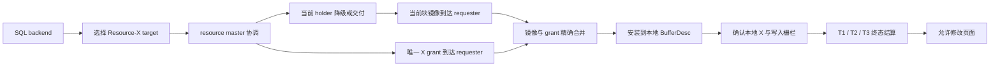
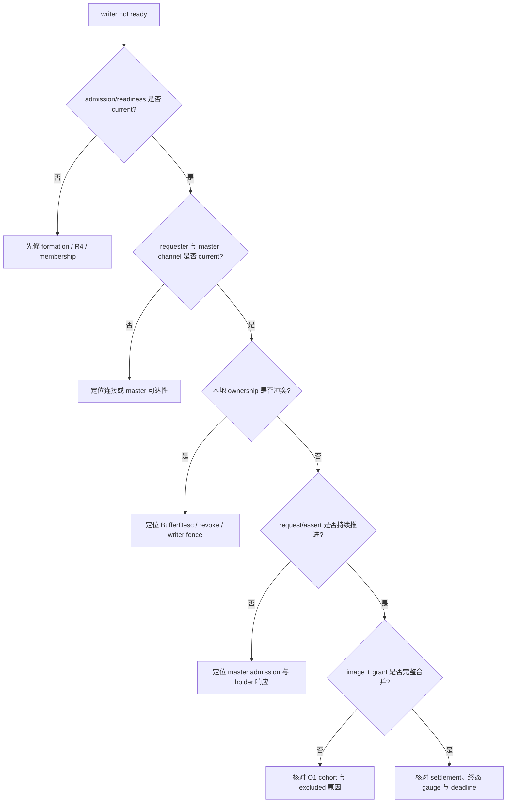
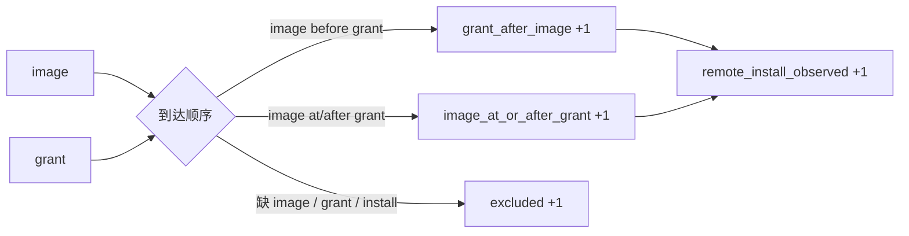
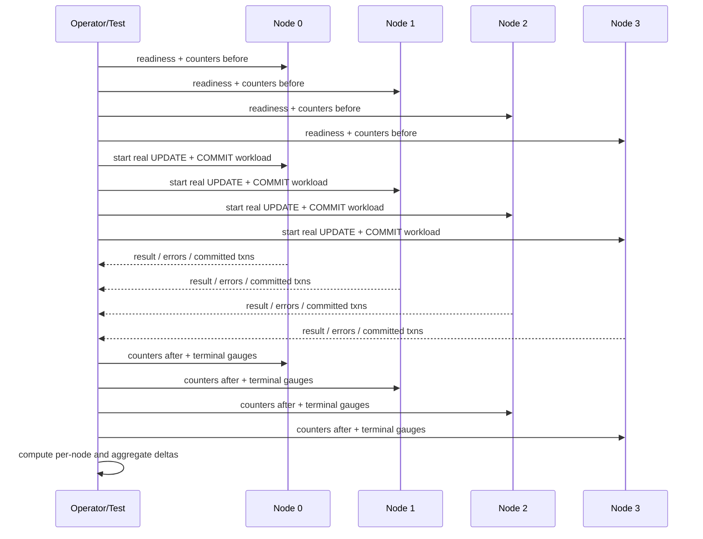
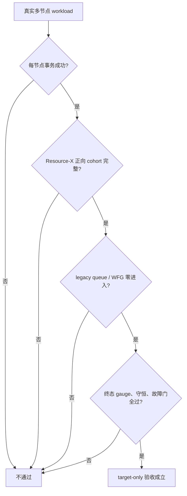

# 10：Target Acquire 诊断与 target-only 切换验收

Resource-X 把一次远端数据块写获取拆成资源协调、当前镜像交付、本地安装和终态结算。对使用者来说，最难排查的情况往往不是明确的网络断开，而是下面这种安全拒绝：

```text
cluster PCM-X writer operation failed
Resource-X writer operation is not ready
```

这类错误表示系统没有收集到足以开放本地写入的完整证据，因此选择 **fail closed**。它不等同于数据损坏，也不能只靠增加超时来处理。本篇给出一套面向开发、测试和运维的公开诊断方法，并说明从旧 ticket 路径切到 Resource-X target-only 后，怎样判断“新路径真实工作、旧路径真实未进入”。

> 本篇描述公开的诊断与验收接口，不公开内部协议布局、私有状态机实现或设计决策记录。不同版本的错误 detail 可能逐步增加更精确的阶段标签；已有的安全拒绝极性不变。

---

## 1. 先理解一次写获取经历了什么

一次需要远端 current block 的写操作，不是收到一个 ACK 就立即可写。它至少需要完成以下链路：



关键点有三个：

1. **grant 不等于可写。** 本地还必须拥有与该 grant 对应的当前镜像，并完成安装。
2. **镜像不等于权威。** 只有镜像而没有唯一 X grant，仍不能修改页面。
3. **错误发生得越晚，越要精确回收。** 已经建立的 requester、master 或 holder 参与状态必须进入统一终态，不能留下半完成资源。

因此，`not ready` 的准确含义是：上述链路的某个必要条件没有在本轮有界等待内得到确认。

---

## 2. 诊断分层：不要把所有失败都当成网络问题

建议把 target acquire 的失败按发生位置分成六类。公开日志可以使用稳定的类别名称；旧版本如果只显示总结果码，则结合后文的状态快照判断。

| 类别 | 典型含义 | 首先检查 | 不应直接采取的动作 |
|---|---|---|---|
| admission | 当前 formation 或 R4 状态尚未允许新 target acquisition | formation、membership、R4、readiness | 绕过 gate 或强制成功 |
| gate/channel | requester、master 或目标节点的当前连接证据不完整 | 节点存活、连接代际、master 可达性 | 无限增大超时 |
| ownership | 本地 BufferDesc 或页面 owner 正处在冲突生命周期 | buffer 状态、revoke、writer fence | 忽略冲突继续写 |
| request/assert | 请求已建立，但 master 尚未接受或断言尚未稳定 | master 队列、holder 响应、重试进度 | 换一个身份重新插队 |
| image/grant | 镜像、grant 或两者的顺序/身份不能精确合并 | O1 计数、时间戳、excluded 计数 | 把旧镜像当 current |
| settlement/deadline | 终态结算未完成，或绝对期限已耗尽 | terminal gauges、T1/T2/T3、残留参与者 | 在不回收旧轮次时开启新轮次 |



这套分类是诊断视图，不是新的授权源。任何 reason、日志或计数器都只能说明“为何拒绝”或“经历了什么”，不能授予 X、替代 GRD 或打开写入栅栏。

---

## 3. 公开可观察面

### 3.1 Readiness

先检查 Resource-X proof 是否具备运行条件：

```sql
SELECT category, key, value
  FROM pg_cluster_state
 WHERE category = 'pcm'
   AND key = 'resource_x_proof_readiness';
```

该值用于快速识别当前 binary/configuration 是否具备对应 proof 路径。它不是一次具体页面请求的成功证明，也不能替代 formation、membership 或 resource master 的当前状态。

### 3.2 Remote install O1 cohort

以下字段共同描述远端页面获取的安装和顺序：

```sql
SELECT category, key, value
  FROM pg_cluster_state
 WHERE category = 'pcm'
   AND key IN (
       'remote_install_observed_count',
       'remote_grant_after_image_count',
       'remote_image_at_or_after_grant_count',
       'remote_episode_excluded_no_install',
       'remote_episode_excluded_missing_grant',
       'remote_episode_excluded_missing_image',
       'last_remote_t_image_us',
       'last_remote_t_grant_us',
       'last_remote_t_install_us'
   )
 ORDER BY key;
```

不要把某一个字段孤立解释。正确读法是：

- `remote_install_observed_count`：完成远端安装的 episode 数；
- `remote_grant_after_image_count`：镜像先到、grant 后到的合法顺序；
- `remote_image_at_or_after_grant_count`：grant 先到或同时、镜像随后到达的合法顺序；
- 三个 `remote_episode_excluded_*`：无法构成完整 install cohort 的 episode；
- 三个 `last_remote_t_*_us`：最近一次镜像、grant、install 的单调时间观测。

对于同一采样窗口，核心守恒关系是：

```text
remote_install_observed_delta
    = remote_grant_after_image_delta
    + remote_image_at_or_after_grant_delta
```

并且三个 excluded delta 应为零。计数为累计值时，必须比较 workload 前后的差值，不能只看绝对值。



### 3.3 Legacy queue 与 WFG 观测

target-only 正常流量不应依赖旧 ticket queue 或旧 PCM-X WFG replacement。可以采集以下公开键：

```sql
SELECT category, key, value
  FROM pg_cluster_state
 WHERE (category = 'pcm' AND key IN (
           'pcm_x_queue_enqueue_count',
           'pcm_x_queue_admit_count',
           'pcm_x_queue_confirm_count',
           'pcm_x_queue_promotion_count',
           'pcm_x_queue_transfer_count',
           'pcm_x_queue_complete_count',
           'pcm_x_queue_revoke_count',
           'pcm_x_queue_wait_count',
           'pcm_x_queue_depth'
       ))
    OR (category = 'lmd' AND key IN (
           'pcm_convert_wfg_replace_count',
           'pcm_convert_wfg_replace_fail_count',
           'pcm_convert_wfg_exact_remove_stale_count'
       ))
 ORDER BY category, key;
```

在 target-only 验收窗口中：

- legacy queue 生命周期 counter 的 delta 应为零；
- legacy WFG replacement 的 delta 应为零；
- queue depth 等终态 gauge 应回到零；
- **只有这些值为零并不能证明新路径成功。** 必须同时有真实事务成功和 Resource-X remote-install 正向证据。

---

## 4. 如何采集一个可信的 before/after 证据窗口

### 4.1 采集顺序



### 4.2 可信窗口的最低条件

一个窗口只有同时满足以下条件才可用于验收：

1. before 与 after 来自同一组 binary、同一集群 formation 和同一次 workload；
2. 四个节点都实际执行普通 `UPDATE + COMMIT`，不能是 no-op；
3. 每个节点进程返回成功、client error 为零、完成事务数大于零；
4. workload 期间没有 skip、forced cancel 或超时放宽；
5. 所有 delta 使用无符号累计计数的安全减法；如果节点重启导致计数基线重置，该窗口作废并重新采集；
6. remote-install、legacy-zero、terminal-zero 和事务结果来自同一 after 快照族。

---

## 5. target-only 的完整通过条件

旧路径切换验收不是“旧 counter 不再增长”这么简单。它是四组证据的合取：

```text
真实四节点事务成功
AND Resource-X remote install 正向 cohort 完整
AND legacy queue / WFG 零进入
AND terminal / conservation / failure gates 全部干净
```

| 证据面 | 必须成立 | 单独成立时为什么不够 |
|---|---|---|
| 真实事务 | 每节点成功、零 client error、提交数大于零 | 可能仍偷偷 fallback 到旧路径 |
| Resource-X 正向 | remote install 有增量，ordering partition 守恒，excluded 为零 | 可能只有部分节点或部分事务成功 |
| legacy 负向 | queue/ticket/WFG 正常路径 delta 为零 | 可能新旧两条路径都没有运行 |
| 终态与安全门 | gauge 排空、守恒成立、故障注入保持 fail closed | 可能成功后遗留半完成资源 |



这里的“legacy 零进入”不要求删除可观察性字段。旧 counter 可以继续存在，用于证明旧路径没有被调用；真正应下线的是旧的正常执行根，而不是把诊断面一并删除。

---

## 6. 出现 `writer operation is not ready` 时的排查步骤

### 步骤 1：保留首个错误

先保存第一个 backend 错误及同一时间窗口内的 postmaster、LMS/LMON 和 peer 日志。后续事务失败通常是级联结果，优先分析最早的 target acquire 拒绝。

不要只保存最后一行 SQL 错误；至少保留：

- 节点号和 backend PID；
- 数据库与关系；
- 错误时间；
- operation/result/reason/stage（若当前版本输出）；
- resource master 节点（若输出）；
- workload before/after 快照。

### 步骤 2：确认不是集群准入问题

核对四个节点的 membership、formation、R4 状态和 `resource_x_proof_readiness`。如果这些状态不 current，不要继续追 image/grant；先修复上游准入。

### 步骤 3：看 O1 cohort 是否开始推进

- remote-install 没有增量：请求可能未到达镜像安装阶段；
- excluded-no-install 增长：episode 建立但没有完成安装；
- excluded-missing-grant 增长：镜像侧存在但 grant 不完整；
- excluded-missing-image 增长：grant 侧存在但镜像不完整；
- ordering 两项之和与 install 不相等：该窗口不满足完整 cohort 守恒。

### 步骤 4：区分旧路径误入和终态残留

- legacy queue/WFG delta 非零：说明 target-only 窗口仍触达旧执行根；
- legacy delta 为零但终态 gauge 不归零：说明问题在新路径生命周期或 settlement，不应恢复旧路径；
- 事务失败、所有 counter 都不动：优先回查 admission/gate/channel。

### 步骤 5：只修第一个被证实的原因

错误分类只是缩小搜索空间。修复时应保持：

- 不改变唯一 X authority；
- 不把 stale image 作为 current；
- 不重置逻辑请求身份来绕过 FIFO；
- 不在旧轮次未结算时启动冲突的新轮次；
- 不通过增加 timeout、重试次数或 fallback 制造绿色。

---

## 7. 常见误判

### “结果码相同，所以根因相同”

错误。相同的 fail-closed 总结果可能来自 admission、channel、ownership、image/grant 或 settlement。应使用首个错误、阶段标签和 before/after 计数联合判断。

### “legacy counter 为零，说明切换成功”

错误。它只能证明没有观察到旧路径。必须再证明真实事务和 Resource-X remote install 正向发生。

### “remote install 大于零，说明所有节点都成功”

错误。聚合计数可能由部分节点贡献。每节点结果、错误和事务数仍是独立硬门。

### “加大 timeout 后能过，就只是机器慢”

不一定。deadline 可能暴露身份漂移、holder 不释放、终态参与者未结算或连接证据不 current。没有 profile 和阶段证据前，扩大 timeout 会把协议错误变成更慢的协议错误。

### “target-only 后可以删除所有 legacy 指标”

不建议。切换期保留只读 counter 能证明旧路径零进入；它们不应再驱动正常执行，也不应被伪造为 Resource-X 成功。

---

## 8. 与 Oracle RAC 公开行为的对应关系

Oracle 官方公开资料确认：

- GCS/GES 与分布式 GRD 协调全局资源状态；
- LMS 参与全局块访问和 Cache Fusion 块传输；
- current block 可以通过实例间互联直接传递；
- global-cache wait 会从请求占位状态归因到更具体的完成或 busy 结果；
- GES 可观察面能够展示资源、请求模式和阻塞关系。

这些公开行为支持两条原则：资源获取仍由 master/GRD 协调；诊断应该尽可能保留精确 outcome，而不是只暴露一个笼统错误。

Oracle 没有公开 PGRAC 的 Resource-X、T1/T2/T3、内部拒绝类别、counter 命名或 target-only 切换判官。因此，本篇的诊断分类和公开指标组合是 PGRAC 的实现与运维接口，不能描述为 Oracle 的内部算法。

参考资料：

- [Oracle RAC Introduction：GCS、GES、GRD 与 Cache Fusion](https://docs.oracle.com/en/database/oracle/oracle-database/18/racad/introduction-to-oracle-rac.html)
- [Oracle Cache Fusion and Global Cache Service](https://docs.oracle.com/cd/A97630_01/rac.920/a96597/pslkgdtl.htm)
- [Oracle RAC Monitoring Performance：global cache wait events](https://docs.oracle.com/en/database/oracle/oracle-database/19/racad/monitoring-performance.html)
- [Oracle `V$GES_BLOCKING_ENQUEUE`](https://docs.oracle.com/en/database/oracle/oracle-database/19/refrn/V-GES_BLOCKING_ENQUEUE.html)

---

## 9. 一页式检查表

### 运行前

- [ ] 四节点 membership、formation 与 R4 状态 current。
- [ ] `resource_x_proof_readiness` 满足当前测试所需条件。
- [ ] 保存每节点 O1、legacy queue/WFG 和 terminal gauge 的 before 快照。
- [ ] 确认四节点使用同一 binary 和配置。

### 运行中

- [ ] 四节点都执行真实 `UPDATE + COMMIT`。
- [ ] 不 skip、不 forced cancel、不临时放宽 timeout。
- [ ] 保留每节点首个错误与进程退出状态。

### 运行后

- [ ] 每节点 result 成功、client error 为零、事务数大于零。
- [ ] remote install delta 大于零。
- [ ] 两个合法 ordering bucket 的 delta 之和等于 install delta。
- [ ] 三个 excluded delta 均为零。
- [ ] legacy queue 与 legacy WFG 正常路径 delta 均为零。
- [ ] terminal gauges 在期限内归零。
- [ ] 资源守恒和故障注入门仍通过。

只有以上条件在同一证据窗口同时成立，才能宣称 Resource-X target-only 路径完成了一次可信验收。
