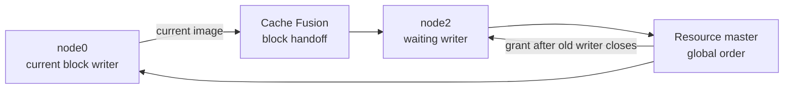
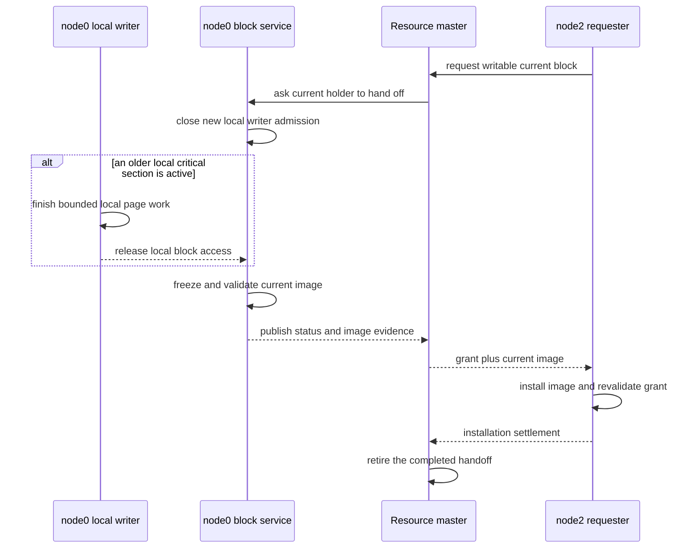
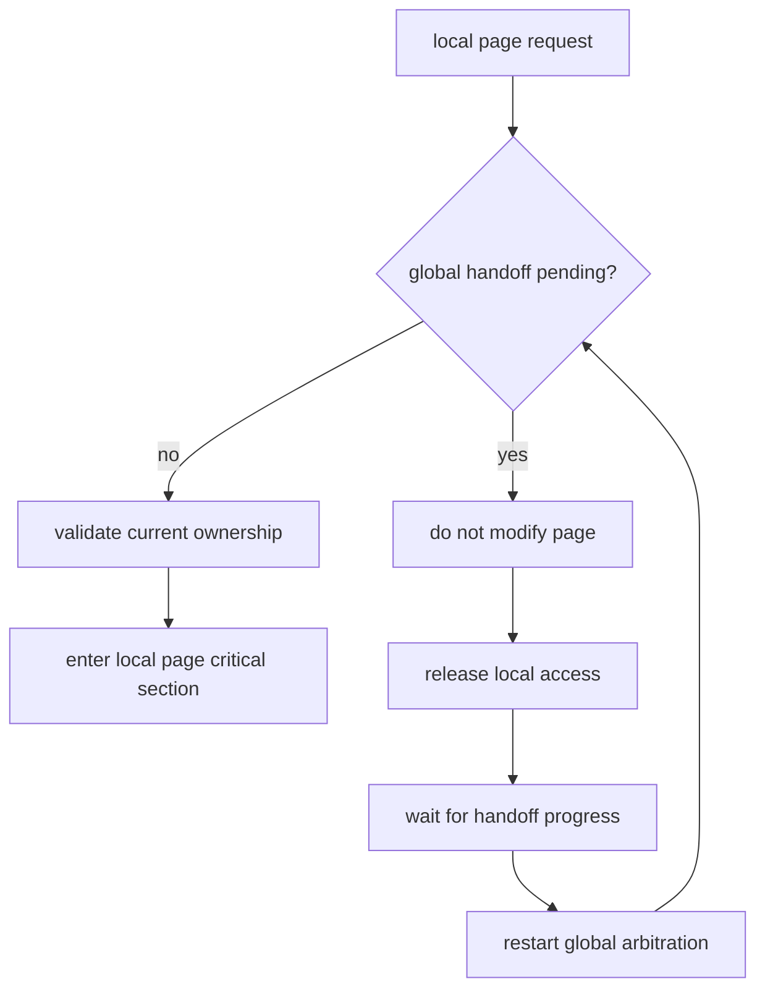
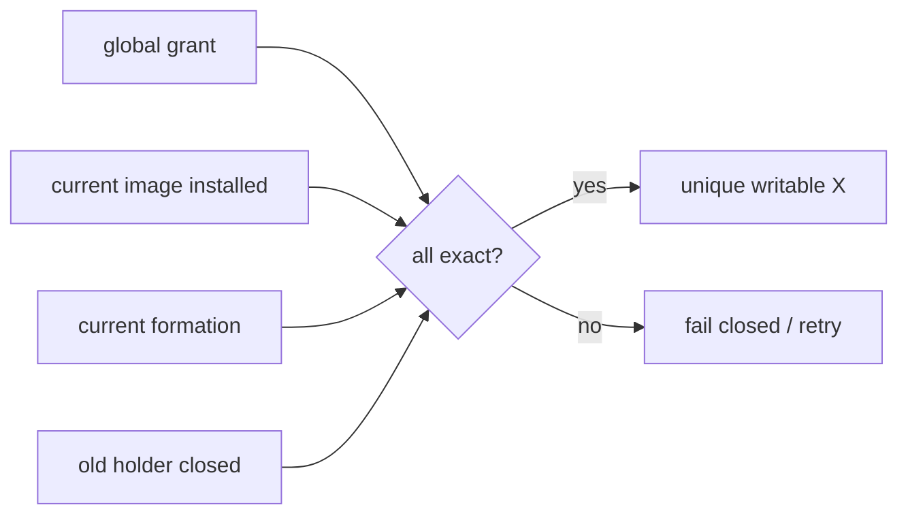

# 11：高并发下的 current block 安全交接

在四节点并发写场景中，同一个数据块可能正被一个实例修改，同时另一个实例请求成为新的写入者。
Resource-X 必须完成一次有序交接：旧实例停止修改并提供一致的块镜像，新实例安装镜像，资源
master 最后确认新的唯一写入者。

这一过程与 Oracle RAC Cache Fusion 的公开行为一致：GCS/GRD 协调全局块状态，LMS 负责全局块
访问和块镜像传输；当 global operation 正在进行时，本地访问需要排队，而不能绕过转换继续写入。

> 本文说明用户可观察的行为和安全边界。PGRAC 的内部锁、generation、消息布局、状态字段和恢复
> 细节属于私有设计，不在公开文档中披露。

## 交接要解决什么问题

假设 node0 当前拥有块 A 的可写副本，node2 请求写同一个块：



安全交接必须同时满足：

1. node0 已进入的本地临界区可以完成；
2. 交接开始后，node0 不再接受新的页面修改；
3. 传输的页面镜像与交接时刻一致；
4. node2 在镜像安装与全局授权都完成前不能写；
5. 网络重发、短暂争用或本地会话并发不能制造两个写入者。

## 正常时序



这里最重要的顺序是：

```text
关闭旧实例的新写入口
    → 等待已进入的本地临界区退出
        → 冻结并发送 current image
            → 新实例安装镜像
                → 新实例才成为唯一写入者
```

## 本地争用如何处理

Resource-X 将本地访问分为三类：

| 本地访问形态 | 行为 |
|---|---|
| 交接前已经进入的短临界区 | 允许完成，然后释放 |
| 交接开始后到达的新写请求 | 在本地排队，等待重新仲裁 |
| 状态、镜像或成员身份发生漂移 | 拒绝本轮，保持 fail-closed |

新的本地请求不会靠高频轮询抢占旧 holder。它会在 PostgreSQL 的本地等待机制中休眠，并在状态变化
后重新验证。这减少无效唤醒，也避免用“重试了多少次”代替正确性证明。



## 为什么不会出现两个写入者

Resource-X 不把“收到页面”“本地缓存中有页面”或“等待结束”当作写权限。新实例需要同时满足：

- resource master 的当前授权仍然有效；
- 收到的镜像属于同一次资源请求；
- 本地安装完成；
- 集群 formation 与连接身份仍然 current；
- 旧 holder 的交接证据已经被 master 接受。

任一条件不成立，本轮都不会进入可写状态。



## 故障和重试语义

| 事件 | 外部行为 |
|---|---|
| 旧实例仍在短临界区 | 请求等待，不提前授权新 writer |
| 消息重复 | 按同一次请求幂等处理，不创建第二次授权 |
| 镜像或状态发生变化 | 丢弃本轮证据，重新获取当前状态 |
| formation 或连接变化 | 旧消息失效，新 formation 重新仲裁 |
| 页面刷新失败 | 不发送不完整镜像，不开放新 writer |
| 等待被取消 | 保持 fail-closed；不会把超时解释为交接成功 |

## 与 Oracle RAC 的对应关系

| 行为 | Oracle RAC 公开资料 | PGRAC |
|---|---|---|
| 全局块状态协调 | GCS/GRD | Resource-X resource master |
| 块镜像跨实例传输 | Cache Fusion / LMS | PGRAC block service 与 interconnect |
| 转换期间本地访问等待 | global operation pending 时本地 buffer access 排队 | 交接期间本地访问释放并重新仲裁 |
| current block busy | 可由本地 holder、flush 或高并发导致 | 暴露为本地/全局块交接等待 |
| 新 writer 开放时机 | current block transfer 与全局协调完成后 | grant、镜像安装、旧 holder closure 全部成立后 |

Oracle 没有公开其内部 latch、消息字段或 holder downgrade 算法，因此 PGRAC 只声明外部行为和安全
性质对齐，不声称内部实现与 Oracle 相同。

## 运维观察

短暂的 current-block 等待在热点页上是正常现象。需要重点关注的是：

- 等待持续时间是否显著高于普通页面临界区；
- 是否伴随页面刷新、I/O 或日志刷新延迟；
- 是否集中在单个热点块；
- formation 或节点连接是否正在变化；
- 交接结束后是否仍有未清理的 terminal/wait 记录。

建议先区分“热点块排队”和“状态无法收敛”：前者应随着旧临界区退出自然推进；后者通常伴随
fail-closed 日志、连接/formation 变化或终态记录未清理。

## 性能边界

安全交接的目标不是让争用消失，而是让争用以可排队、可唤醒、可复核的方式收敛：

- 无争用时不增加额外网络往返；
- 有争用时避免高频固定次数轮询；
- 不持有全局资源锁等待本地页面临界区；
- 不因等待时间达到阈值而提前授予写权限；
- 热点页仍可能限制吞吐，应在正确性门通过后根据 profile 数据优化。

## Oracle 官方资料

- [Oracle Database 21c — Introduction to Oracle RAC](https://docs.oracle.com/en/database/oracle/oracle-database/21/racad/introduction-to-oracle-rac.html)
- [Oracle Database 21c — Monitoring Performance](https://docs.oracle.com/en/database/oracle/oracle-database/21/racad/monitoring-performance.html)
- [Oracle RAC wait events — current block request](https://docs.oracle.com/database/121/RACAD/GUID-991F4A31-E78F-4A27-9849-FC3D9C636586.htm)

