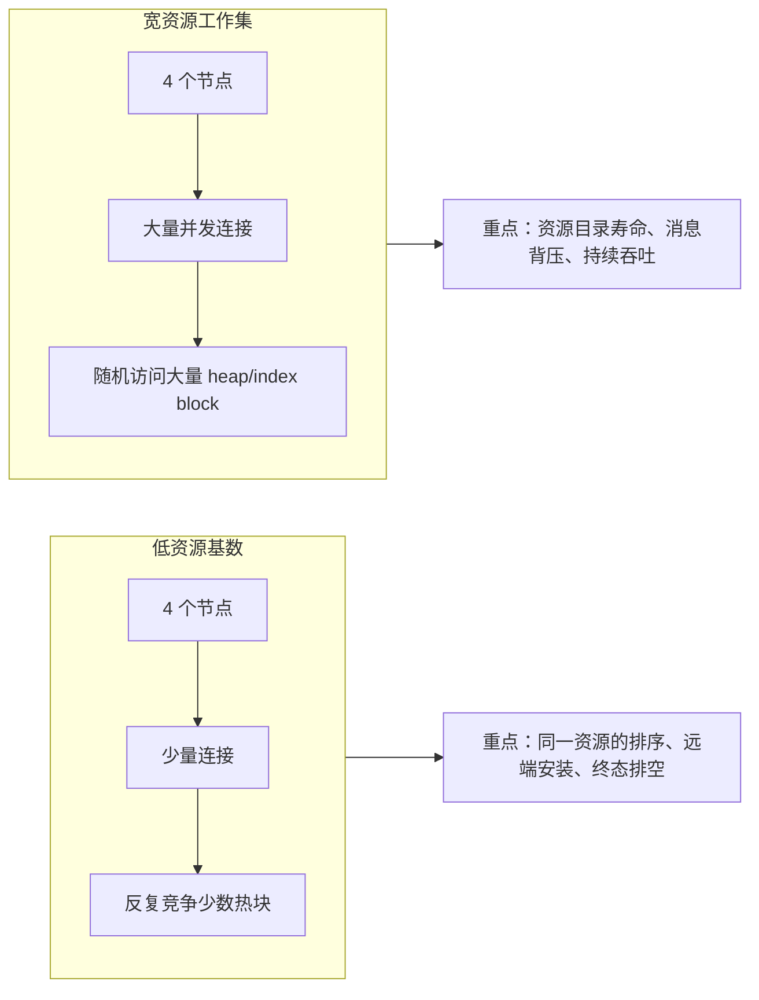
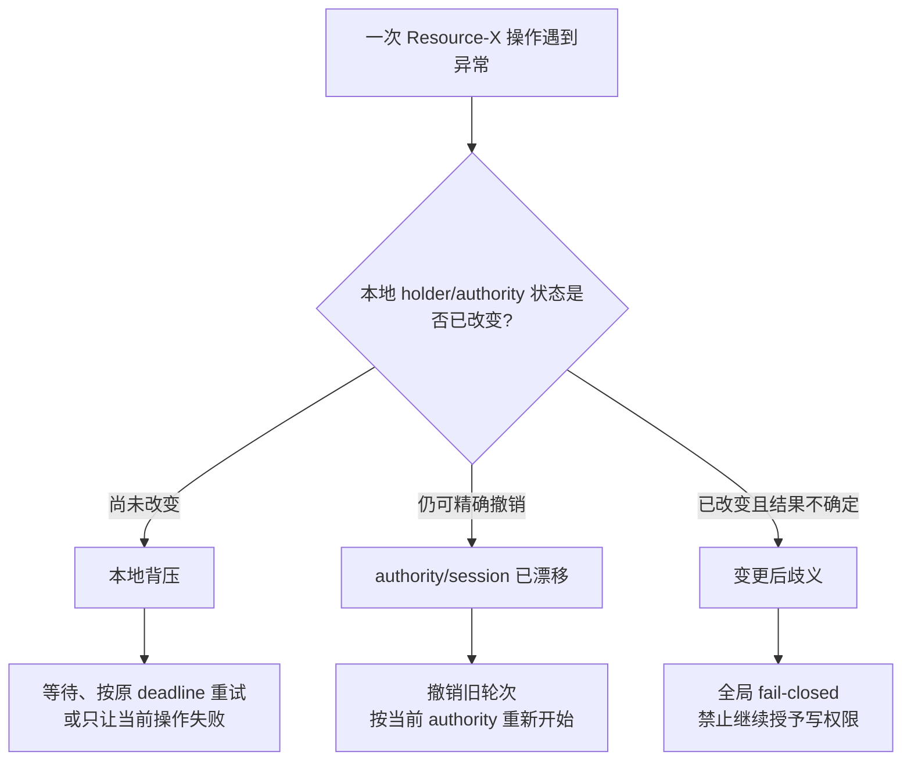
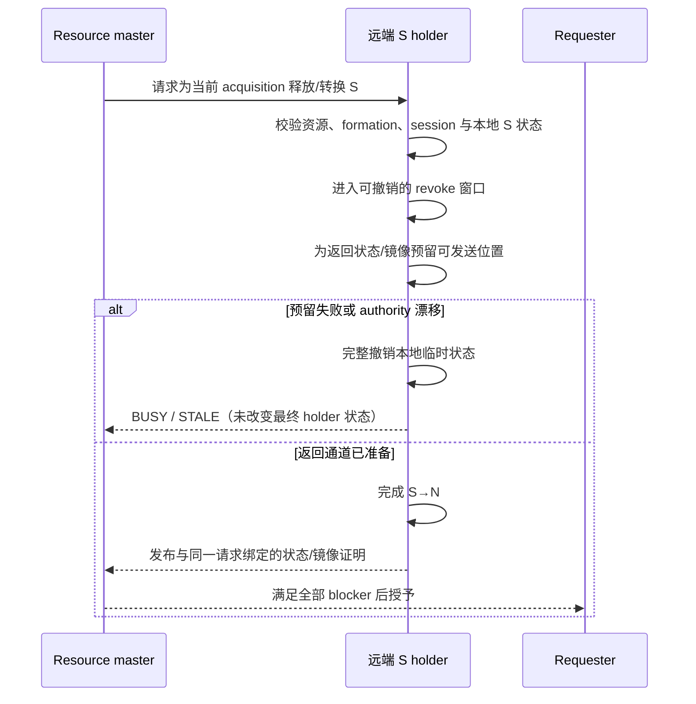
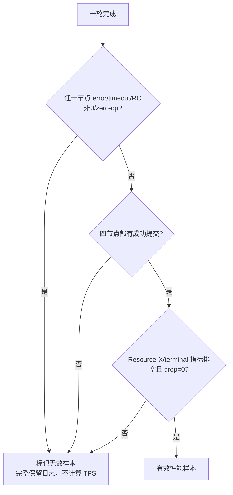

# Resource-X 容量观测与失败隔离

> 本文描述公开的目标架构、诊断口径与验收边界。不同发布版本的可用计数器和资源复用能力可能不同，
> 应以对应版本的 `pg_cluster_state` 输出和发行说明为准。

Resource-X 不只要回答“谁可以获得一个数据块的 X 权限”，还要在高并发、宽工作集下处理两类现实压力：

- 短时间内访问大量不同数据块，PCM/GRD 中的活跃资源数量快速增长；
- 节点间消息发送速度暂时低于请求产生速度，出现可恢复的本地背压。

这两类压力本身并不代表集群 authority 已损坏。正确的外部行为是：空闲资源最终可以被安全复用；
尚未改变 holder 状态的请求可以等待或失败当前操作；只有“资源状态已经改变，但集群无法确定结果”的
情况才需要进入全局 fail-closed。

本文从用户和运维视角说明这三个边界，并给出可直接执行的观测方法。

---

## 1. 为什么低资源竞争测试不能代替宽资源压力测试

四节点测试可以有完全不同的资源形状：



低资源基数测试更容易反复复用同一个资源对象，适合验证 authority 和状态机；宽资源工作集会快速触达
大量 heap/index block，适合验证资源能否在终态后释放控制面占用。两者都需要，但不能互相替代。

---

## 2. PCM/GRD 资源的外部生命周期

从外部观察，一个数据块资源经历以下生命周期：

```mermaid
stateDiagram-v2
    [*] --> Open: 首次在缓存/全局资源层使用
    Open --> Active: 存在 holder、PI、等待者或远端传输
    Active --> Active: S/X 转换、远端镜像安装、重试
    Active --> Idle: mode=N 且 holder/PI/等待与传输债务均已结束
    Idle --> Active: 同一资源再次被访问
    Idle --> Reusable: 安全关闭控制对象
    Reusable --> Open: 控制容量供后续资源使用
```



“当前没有 SQL 正在访问”不等于可以立即复用。以下任一情况存在时，资源仍不是终态：

- 仍有 S/X holder；
- 仍保留 PI 或尚未满足持久化处置条件；
- 仍有转换请求或等待者；
- Resource-X grant、远端镜像、requester 安装或 terminal settlement 尚未闭合；
- 消息已被接纳但 completion 尚未完成；
- formation 正在切换或恢复。

只有这些状态全部闭合，控制对象才具备安全复用的外部条件。

### 与 Oracle RAC 的对应关系

Oracle 官方资料说明，GCS/GES 通过 GRD 维护全局资源状态；块进入缓存时可打开 GCS resource，资源降为
NULL 且不再保留 PI，或 buffer 因替换完成相应处置后，resource 可以关闭并返回可复用集合。

PGRAC 对齐的是“按需打开、终态关闭、控制对象复用”这一外部行为。Oracle 没有公开其内部目录、引用计数、
内存回收或消息队列实现，因此不能把 PGRAC 的内部数据结构描述成 Oracle 的实现细节。

- [Oracle RAC 架构：Cache Fusion、GCS、GES 与 GRD](https://docs.oracle.com/en/database/oracle/oracle-database/21/racad/introduction-to-oracle-rac.html)
- [Oracle RAC：GCS resource 的打开、关闭与复用](https://docs.oracle.com/cd/A91202_01/901_doc/rac.901/a89867/pslkgdtl.htm)

---

## 3. 三类失败必须区别对待



### 3.1 本地背压

典型情况：

- 新请求尚未进入发送队列；
- 本地发送环暂时没有容量；
- 资源控制对象尚未建立；
- 在改变 holder 状态前无法取得所需本地锁。

这些情况表示“工作尚未开始或尚未被接纳”。系统可以在原有绝对 deadline 内等待/重试，或让当前事务
明确失败；它不应自动把整个 Resource-X gate 判为损坏。

### 3.2 authority 漂移

formation、resource master session 或 acquisition generation 在一次请求期间发生变化时，旧证据不再可用。
只要本地临时状态仍能被精确撤销，系统应丢弃整轮旧请求并回到当前 authority，不能把旧 proof、image
或 grant 拼接到新轮次。

### 3.3 变更后歧义

如果本地 holder 已经降级或释放，而对应状态/镜像证明是否成功发布变得不可确定，继续授予 X 可能产生
两个节点对同一块状态理解不一致。此时全局 fail-closed 是必要的安全边界，不能降级为普通 BUSY。

---

## 4. 远端 S holder 的安全顺序

当 requester 申请 X，而另一个节点仍持有共享 current block 时，holder 侧至少要保证下列外部顺序：



关键点是“先确保结果有可靠去处，再完成不可逆 holder 变化”。如果变化前失败且撤销成功，只影响当前请求；
如果变化后无法证明结果，则必须 fail-closed。

---

## 5. 当前可查询的观测面

使用 `pg_cluster_state` 同时查看 PCM 目录和 LMS 发送压力：

```sql
SELECT category, key, value
FROM pg_cluster_state
WHERE (category = 'pcm' AND key IN
       ('pcm_api_state',
        'pcm_grd_max_entries',
        'pcm_grd_allocated_bytes',
        'pcm_grd_active_entries',
        'resource_x_proof_readiness',
        'remote_install_observed_count',
        'remote_grant_after_image_count',
        'remote_image_at_or_after_grant_count'))
   OR (category = 'lms' AND key IN
       ('lms_outbound_not_admitted_count',
        'lms_outbound_requeue_drop_count',
        'lms_outbound_cap_guard_drop_count'))
ORDER BY category, key;
```

### 5.1 这些值如何解释

| key | 解释 |
|---|---|
| `pcm_grd_max_entries` | PCM/GRD 配置的资源控制对象上限；`-1` 表示按当前配置自动解析 |
| `pcm_grd_allocated_bytes` | PCM/GRD 共享内存分配量 |
| `pcm_grd_active_entries` | 当前已建立的 PCM/GRD entry 数量；尚未启用资源复用的版本中可能持续增长 |
| `resource_x_proof_readiness` | Resource-X proof 路径当前 readiness |
| `remote_install_observed_count` | 已观测到的远端页面安装事件 |
| `remote_grant_after_image_count` | grant 在对应 image 之后成立的观测数 |
| `remote_image_at_or_after_grant_count` | image/grant 顺序观测面 |
| `lms_outbound_not_admitted_count` | 发送侧暂未接纳的 frame 数；增长表示背压，需要结合错误和重试结果分析 |
| `lms_outbound_requeue_drop_count` | 已保留 frame 在重排队过程中丢失；正确性验收通常要求保持 0 |
| `lms_outbound_cap_guard_drop_count` | 容量保护触发的丢弃；正确性验收通常要求保持 0 |

`not_admitted` 的短暂增长不等同于数据损坏；`requeue_drop` 或 `cap_guard_drop` 增长则需要立即保留日志并
按失败处理，不能把该轮当成有效性能样本。

---

## 6. 宽资源测试的推荐取证流程

### 6.1 运行前

在四个节点分别保存：

```sql
SELECT now(), category, key, value
FROM pg_cluster_state
WHERE category IN ('pcm', 'lms')
ORDER BY category, key;
```

同时记录：

- 四节点是否完成同一 clean formation；
- 每节点客户端数量；
- 数据集大小和访问分布；
- warmup、measurement 时长；
- 每个节点进程返回码。

### 6.2 运行中

不要只看总 TPS。必须同时保留：

- 每节点 commit/error/timeout；
- 第一条 PCM、GCS、LMS 或 Resource-X 错误及其时间；
- `pcm_grd_active_entries` 的变化；
- outbound 三个计数的增量；
- 四节点是否都有成功提交。

### 6.3 运行后



失败样本不能因为“TPS 数字很低”而被当作性能结果，也不能从报告中删除。

---

## 7. 常见误区

### 误区 1：看到目录满就只增加配置上限

更大的上限可能推迟故障，但不能替代空闲资源关闭与控制对象复用。它还会线性增加共享内存成本。
应先确认资源是否能够在 holder、PI、等待和传输债务都结束后回到可复用状态。

### 误区 2：发送队列满就全局 fence

消息尚未被接纳通常属于局部背压。只有 holder 已改变且结果无法确认，或内部状态损坏时，才需要全局
fail-closed。

### 误区 3：把 `t/400` 通过等同于宽资源性能就绪

`t/400` 重点验证正确性和单资源协议闭环。随机访问大量 heap/index block 的压力测试还会验证目录寿命、
传输容量和并发调度，两者是互补关系。

### 误区 4：为了得到绿色删除失败轮

任何 client error、timeout、forced cancel、zero-op 或节点非零退出都会使该轮无效。保留失败证据是定位第一
瓶颈和确保性能结论可信的必要条件。

---

## 8. 验收边界

资源容量与失败隔离闭环应同时满足：

1. 同构四节点 clean formation；
2. 低资源基数正确性测试保持全绿；
3. 宽资源工作集持续访问时，终态资源可以释放控制面占用；
4. 临时发送背压不会把尚未改变状态的请求误判为全局损坏；
5. 变更后歧义仍严格 fail-closed；
6. 四节点都有成功提交，且无 client error、timeout、forced cancel、zero-op 或非零 RC；
7. terminal、holder、PI、waiter、retained transfer 状态最终排空；
8. 只有满足上述条件的轮次才能进入正式 TPS 统计。

这些条件确保容量修复不会以放宽 authority、安全栅栏或测试判官为代价。
