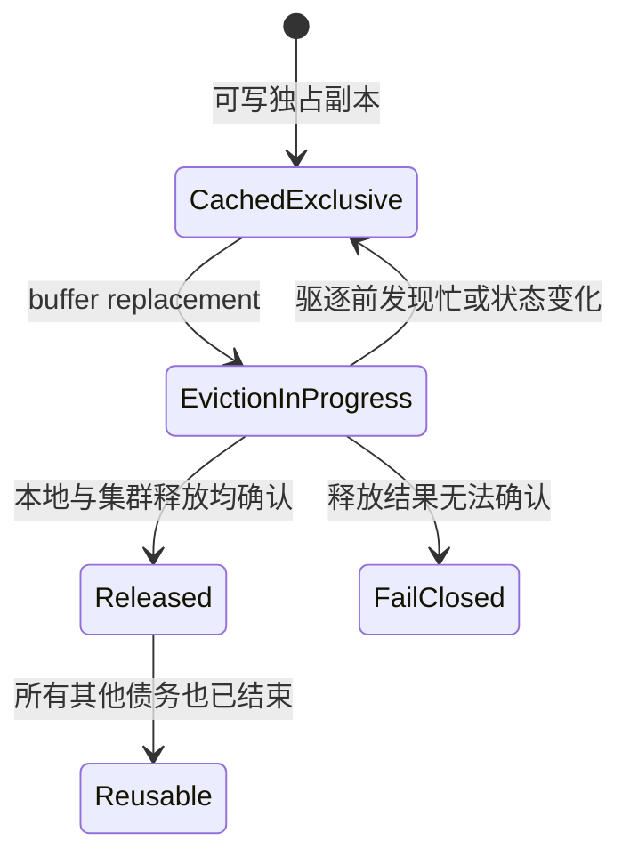
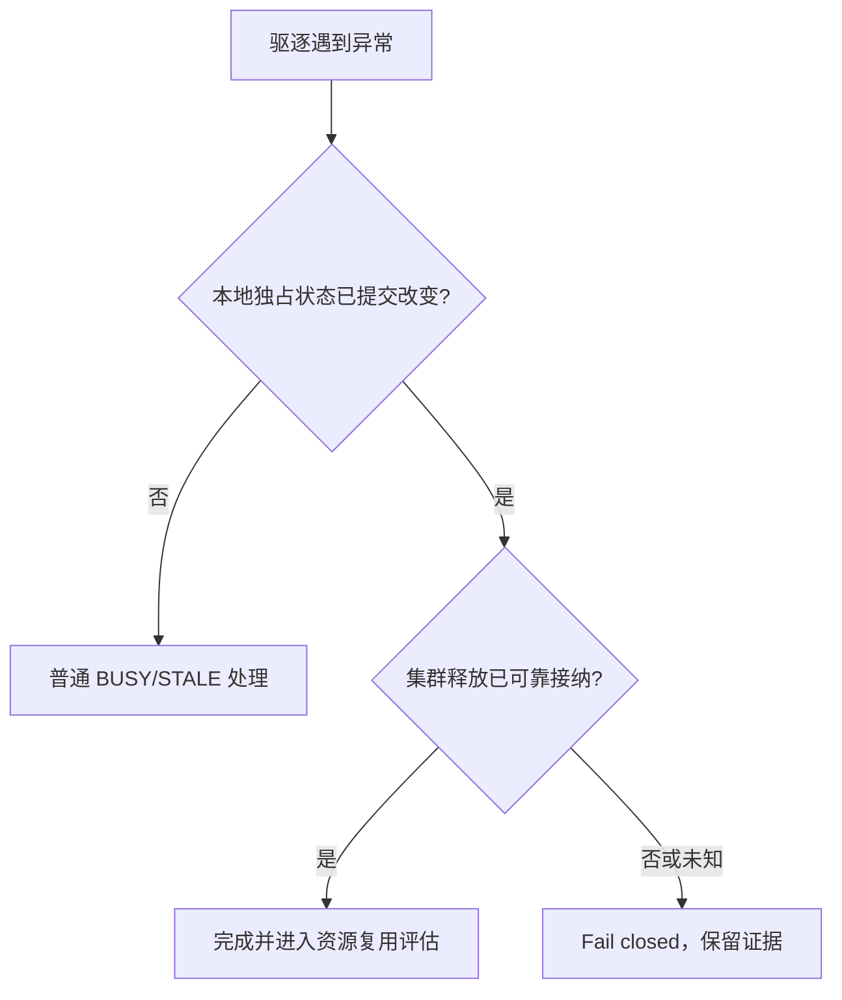
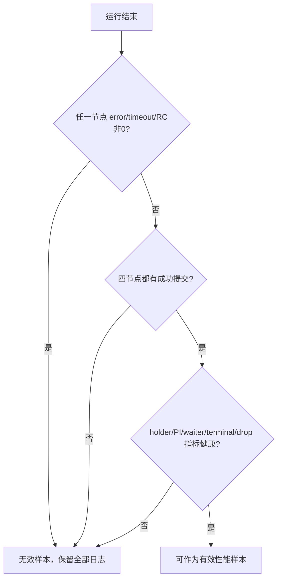

# Resource-X 缓存独占块的安全驱逐与运维观察

> 本文是公开用户手册，只说明系统做什么、故障时如何观察和处置。不同版本的可用指标可能不同，
> 请以当前版本 `pg_cluster_state`、服务器日志和发行说明为准。

当一个 PGRAC 实例持有某个数据块的独占缓存副本时，该实例可以在全局一致性规则允许的范围内修改它。
共享缓冲区需要回收空间时，系统不能只删除本地缓存标签；它还必须让集群资源状态同步反映“这个实例不再
持有该块的独占副本”。

Resource-X 将这两个结果作为一次完整的安全驱逐处理：


只有整条链路成功，buffer 才会回到可复用集合。链路中途出现无法确认的错误时，系统会 fail closed，
而不是猜测释放已经完成。

---

## 1. 用户可观察的正常行为

一次正常驱逐具有以下外部效果：

- 正在被使用、正在 I/O 或仍有并发访问的 buffer 不会被强制回收；
- 本地独占副本停止提供后，集群资源目录会接纳同一资源的释放结果；
- 仍有 holder、PI、等待者或未完成传输的资源不会被提前复用；
- 完全空闲的资源控制对象可以被后续数据块使用，宽工作集不会要求无限保留历史资源；
- 驱逐期间不会退回已下线的 legacy ticket 正常路径。



“驱逐前发现忙”是普通竞争，不等同于集群故障；“本地状态已改变但释放结果无法确认”则需要保守停止，
避免两个实例对同一块的可写状态产生不同理解。

---

## 2. 为什么 buffer 已不在本地仍可能不能复用资源

数据块缓存和集群资源控制对象不是同一个对象。即使本地 buffer 已经不再可见，以下工作仍可能尚未结束：

- 资源 master 仍在处理释放结果；
- 已接纳的节点间消息尚未完成；
- 其他节点仍保存 S holder 或 PI；
- 同一资源还有等待者或转换请求；
- formation 正在切换；
- 持久化条件尚未允许丢弃恢复所需的历史副本。

因此，资源复用遵循“所有债务都结束”而不是“本地 tag 已删除”。这与 Oracle RAC 公开描述的 GCS/GRD
职责一致：GCS 维护缓存块的全局状态，缓存替换或块传输后需要更新资源状态；资源不再管理 buffer 后才可关闭。

- [Oracle RAC：GCS、GES、GRD 与 Cache Fusion](https://docs.oracle.com/en/database/oracle/oracle-database/21/racad/introduction-to-oracle-rac.html)
- [Oracle RAC：Cache Fusion、current block 与资源关闭](https://docs.oracle.com/cd/A97630_01/rac.920/a96597/pslkgdtl.htm)

Oracle 没有公开其内部缓存描述符、消息格式或内存回收算法；PGRAC 的内部实现不应被理解为 Oracle 私有实现的复刻。

---

## 3. 三种结果如何区分

| 结果 | 含义 | 用户看到的行为 |
|---|---|---|
| 暂时忙 | 驱逐尚未改变本地独占状态 | 选择其他 buffer、等待或在原 deadline 内重试 |
| 状态已变化 | formation、master 或连接状态已改变，但本地尚未提交驱逐 | 放弃旧尝试，按当前集群状态重新进入 |
| 结果不确定 | 本地已停止持有独占副本，但集群释放结果无法确认 | fail closed；当前轮性能样本无效 |



不应通过扩大 timeout、忽略错误或把“找不到释放对象”解释为“已经成功”来绕过最后一种情况。

---

## 4. 运维查询

先查看 PCM 目录、Resource-X readiness 与 LMS 发送压力：

```sql
SELECT category, key, value
FROM pg_cluster_state
WHERE (category = 'pcm' AND key IN
       ('pcm_api_state',
        'pcm_grd_max_entries',
        'pcm_grd_allocated_bytes',
        'pcm_grd_active_entries',
        'resource_x_proof_readiness',
        'remote_install_observed_count',
        'remote_grant_after_image_count',
        'remote_image_at_or_after_grant_count'))
   OR (category = 'lms' AND key IN
       ('lms_outbound_not_admitted_count',
        'lms_outbound_requeue_drop_count',
        'lms_outbound_cap_guard_drop_count'))
ORDER BY category, key;
```

如果当前版本还提供资源回收类计数，应同时保存以下名称或同版本发行说明中的对应项：

```sql
SELECT category, key, value
FROM pg_cluster_state
WHERE category = 'pcm'
  AND (key LIKE 'pcm_grd_reclaim_%'
       OR key LIKE 'pcm_grd_retire_%'
       OR key LIKE 'pcm_grd_tombstone_%'
       OR key LIKE 'resource_x_%ambiguity%')
ORDER BY key;
```

### 4.1 读数解释

| 现象 | 可能含义 | 下一步 |
|---|---|---|
| `pcm_grd_active_entries` 接近上限后下降 | 空闲资源被正常关闭并复用 | 结合 error/timeout 确认运行健康 |
| active 长期只增不减 | 工作仍活跃、PI 未清，或资源生命周期未闭合 | 保存前后快照与第一条错误 |
| `lms_outbound_not_admitted_count` 短暂增长 | 本地发送背压 | 观察是否恢复；不单独判数据损坏 |
| requeue/cap-guard drop 增长 | 已接纳工作未正常完成 | 停止计分并保留节点日志 |
| ambiguity/fail-closed 增长 | 释放或状态变化后结果无法确认 | 本轮无效；先解决正确性再测性能 |

---

## 5. 宽工作集运行时的取证顺序

### 运行前

在四个节点分别保存：

```sql
SELECT now(), category, key, value
FROM pg_cluster_state
WHERE category IN ('pcm', 'lms')
ORDER BY category, key;
```

同时记录每节点客户端数、数据集、访问分布、共享缓冲区配置、PCM/GRD 容量和 formation 状态。

### 运行中

保留：

- 每节点 commit、error、timeout；
- 第一条与 buffer eviction、PCM、GCS、Resource-X 或 LMS 有关的错误；
- active entry、reclaim/retire、outbound 指标的时间序列；
- 四节点是否都有成功提交。

### 运行后



fail-closed 运行不是“TPS 较低”，而是没有可计分的性能样本。

---

## 6. 配置建议

`cluster.pcm_grd_max_entries` 控制 PCM/GRD 可容纳的资源控制对象规模。配置时应同时考虑：

- `shared_buffers`；
- 热/冷数据块的资源基数；
- heap 与 index block 的共同增长；
- 四节点并发产生的短时峰值；
- 共享内存预算。

更大的值可以容纳更大的瞬时 working set，但不能替代资源安全关闭与复用。调整参数前后都应验证 active
entry 是否能在工作结束后回落，以及四节点是否保持零错误。

不要用以下方式制造“通过”：

- 忽略或过滤驱逐错误；
- 删除失败轮；
- 降低工作量但沿用原验收名称；
- 把 timeout 轮计入 TPS 中位数；
- 在 fail-closed 后继续写入测试。

---

## 7. 故障报告最小材料

提交问题时至少包含：

1. PGRAC commit/tag 与构建参数；
2. 四节点 `postgresql.conf` 中 cluster、shared buffer、PCM/GRD 相关设置；
3. 运行前后 `pg_cluster_state` 的 `pcm`、`lms` 快照；
4. 四节点第一条相关错误及前后日志时间窗；
5. 每节点客户端、commit/error/timeout/RC；
6. 数据集规模与访问分布；
7. 是否发生 formation/rejoin/recovery。

这些材料可以区分“普通 buffer 忙”“目录/发送背压”和“释放后状态不确定”，避免只根据最后一条级联错误判断。
