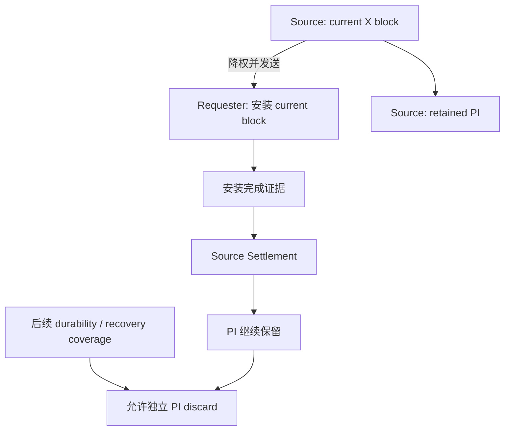
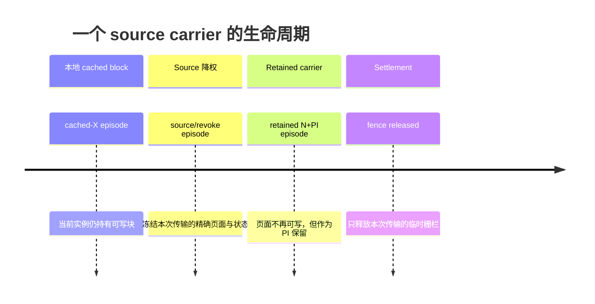
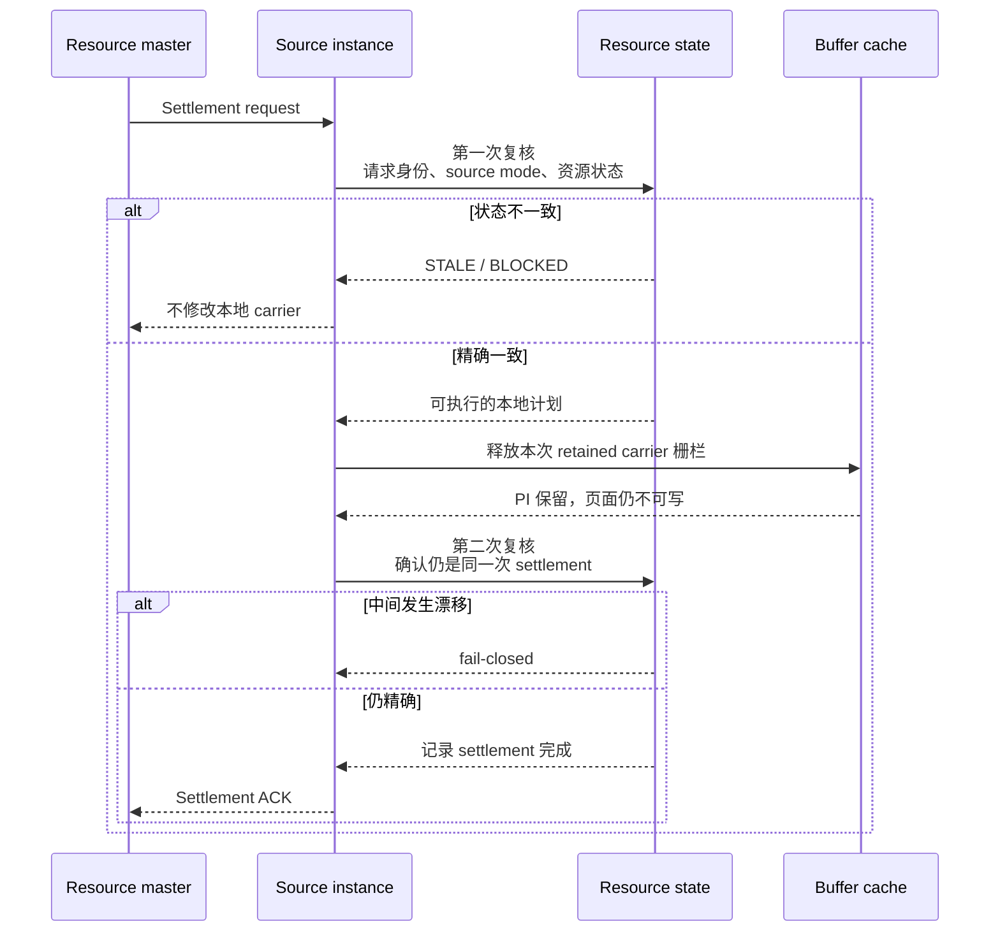
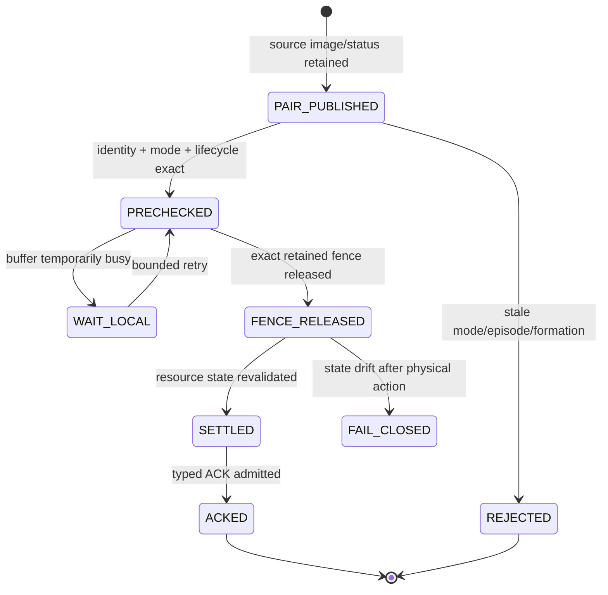
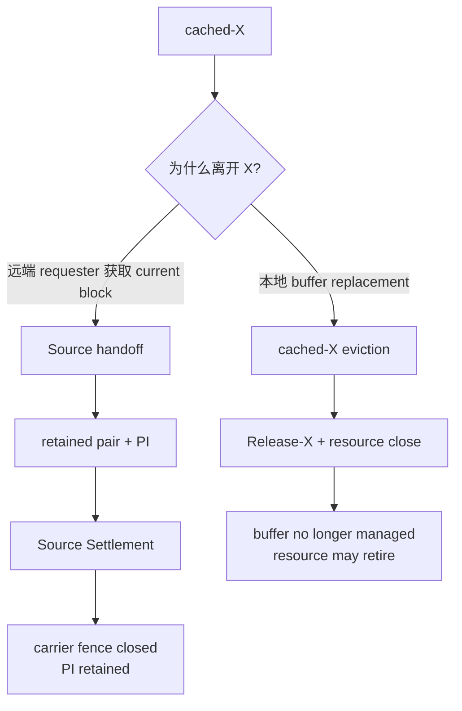

# Source Settlement：远端当前块安装后的源端安全收尾

当一个 PGRAC 实例把当前数据块通过 Cache Fusion 发送给另一个实例后，块的传输并没有在“网络发送成功”这一刻结束。

请求节点需要安装收到的页面并取得新的写权限；原持有节点则需要保留可用于恢复的 Past Image（PI），同时在确认请求节点已经完成安装后，安全释放仅用于本次传输的临时栅栏。这个收尾过程称为 **source settlement**。

它解决的是下面这个问题：

> 如何确认“这次块传输已经完成”，同时避免迟到消息释放另一轮传输的状态、删除仍有恢复价值的 PI，或错误关闭一个仍然代表本地 cached-X 的资源？

本文介绍 Source Settlement 的公开行为、状态关系、失败语义与运维观察方法。

---

## 1. Source Settlement 在整条链路中的位置

一次远端 current block 获取至少包含四个不同阶段：


Source Settlement 只负责阶段 E。它不负责：

- 产生新的 X 权限；
- 决定谁是 resource master；
- 替请求节点安装页面；
- 把 PI 当成 current block；
- 因为传输完成就删除 PI；
- 代替 checkpoint、WAL durability 或恢复证明。

因此，下面三件事必须分开理解：

| 事件 | 证明什么 | 不证明什么 |
|---|---|---|
| Requester install | 新请求节点已经安装目标页面 | 原 source 的 PI 可以删除 |
| Source settlement | 本次不可变传输载体不再需要临时栅栏 | 页面已写盘或恢复债务已清除 |
| PI discard | 已有独立 durability/recovery coverage | 不能反向补授 X 权限 |

---

## 2. 为什么传输完成后仍保留 PI

Oracle RAC 的公开 Cache Fusion 行为中，持有最新 current block 的实例会把块直接发送给请求实例；如果原块是 dirty，原实例会保留一个 Past Image。PI 可在实例故障后参与重建 current version。

PGRAC 采用相同的外部安全方向：



Source Settlement 完成后，source 上的页面保持为非可写 PI。这样可以同时满足：

1. requester 可以作为新的 current holder 继续处理事务；
2. source 不再持有本次传输的临时写入/复用栅栏；
3. PI 在真正获得 durability coverage 前不会提前消失。

这也是为什么“传输 ACK 已收到”不能直接等价于“旧页面可以从缓存删除”。

---

## 3. 三种代际不是同一个数

运维诊断中可能看到多个 generation。它们描述的是不同阶段，而不是可以任意比较大小的一套全局版本号。



可以把它们理解为：

- **cached-X generation**：某次本地可写 cached block 的身份；
- **source generation**：这次源端降权开始时的物理身份；
- **carrier generation**：降权完成后 retained N+PI 的物理身份。

系统只接受由同一次状态转换产生的精确关系。它不会采用“代际更大就更新”“相差一就当作同一轮”之类的模糊规则。

这样做可以防止典型的 ABA 问题：一条迟到 settlement 消息不能因为 tag 相同，就释放该 tag 后来重新获得的另一个 cached block。

---

## 4. Source mode 决定如何处理 cached-X 记录

远端页面的 source 可能以两种受支持的模式提供页面：

- **X source**：该实例是当前独占持有者；
- **S source**：该实例持有经过 resource master 认证、能够覆盖目标版本的共享 current image。

Source Settlement 会先判断原始 source mode，再检查本地是否仍有 cached-X 记录。

| 原始 source mode | 本地 cached-X 记录 | 行为 |
|---|---|---|
| X | 不存在 | 只结算 retained carrier |
| X | 与本次 source episode 精确一致 | 结算 carrier，并关闭该精确 cached-X 记录 |
| X | 存在但不属于本次 episode | 拒绝，保持 fail-closed |
| S | 不存在 | 只结算 retained carrier |
| S | 仍存在任意 cached-X 记录 | 拒绝；该 X→S 生命周期尚未正确收尾 |

关键点是：

> 一个 S source 的 settlement 永远不能顺手清理历史 X 记录。

S 表示当前实例已经没有独占修改权限。若此时仍保留 cached-X 记录，问题应由较早的 X→S 转换处理，而不是让后来的 S carrier 猜测其历史。

---

## 5. 两次复核：先检查，再释放，再确认

Source Settlement 使用两次精确复核，中间只执行一个非常窄的物理动作。



第一次复核的目的，是把稳定矛盾挡在物理修改之前。例如：

- S source 仍配有旧 cached-X 记录；
- X source 对应的是另一轮 cached-X；
- formation 或 master session 已变化；
- retained status 与 image 不属于同一轮；
- 页面 carrier 已被替换。

第二次复核则处理真正的并发窗口。资源状态和 PostgreSQL buffer lock 属于不同锁域，系统不会为了省掉复核而跨网络或跨锁域长期持锁。如果两次检查之间真的发生变化，系统保持 fail-closed，而不是猜测成功。

---

## 6. 状态机



状态含义：

- `PAIR_PUBLISHED`：用于本次传输的 status 与 image 已经作为一对保留；
- `PRECHECKED`：source mode、请求身份与本地资源生命周期一致；
- `WAIT_LOCAL`：只表示本地 content lock 或 I/O 状态暂时忙，不改变请求身份；
- `FENCE_RELEASED`：传输栅栏已释放，但 PI 仍存在；
- `SETTLED`：同一轮状态已被再次确认并记录；
- `FAIL_CLOSED`：物理动作后发现状态漂移，停止继续授予或猜测式清理。

---

## 7. 重试、重复消息与重连

网络可能丢包、重复发送或重连。Source Settlement 对这些情况采用同一逻辑身份：

### 7.1 物理动作前的 BUSY

如果本地 buffer 正在进行受保护操作，settlement 保持 pending。后续重试必须是同一请求，不能刷新成新的 authority，也不能改变目标页面。

### 7.2 ACK 丢失

master 仍保留同一 settlement debt，并重发相同请求。source 如果已经记录该轮完成，会返回等价 ACK，不再次释放 carrier。

### 7.3 迟到旧消息

formation、master session、资源 episode 或 carrier 身份只要有一项不一致，旧消息不会修改当前页面。

### 7.4 物理动作后的漂移

这是最严格的失败类别。因为 carrier fence 可能已经释放，系统不会回滚成可写 X，也不会清理另一个 episode 的状态，而是保持 fail-closed，等待明确恢复或修复。

---

## 8. 失败矩阵

| 观察 | 是否修改 retained carrier | 是否发送成功 ACK | 处理 |
|---|---:|---:|---|
| 请求、mode、formation 全部精确 | 是 | 是 | 正常完成 |
| 本地 buffer 暂时忙 | 否 | 否 | 有界重试同一请求 |
| status/image 不属于同一轮 | 否 | 否 | STALE |
| S source 仍有 cached-X 记录 | 否 | 否 | fail-closed，检查 X→S 生命周期 |
| X source 命中其他 cached-X episode | 否 | 否 | fail-closed，禁止模糊代际匹配 |
| carrier tag/generation/token 漂移 | 否 | 否 | STALE |
| fence 已释放，第二次复核漂移 | 已修改 | 否 | post-mutation fail-closed |
| exact duplicate | 否 | 是 | 重建同一 ACK |
| ACK enqueue 暂时失败 | 已完成 settlement | 否 | master debt 继续重发 |

---

## 9. 与 cached-X 驱逐的关系

Source Settlement 与普通 cached-X 驱逐都可能把一个本地可写块变为非可写状态，但两者不是同一条路径。



- **Source handoff** 以远端 requester、传输 image 和 retained PI 为核心；
- **cached-X eviction** 以本地 buffer replacement 和全局 holder 释放为核心；
- 两条路径共享“不能在资源仍管理 buffer 时退休”的原则；
- 两条路径不能相互冒充 completion owner。

详细的 cached-X 驱逐生命周期见[第 13 篇](13-safe-cached-x-eviction-and-operations.md)。

---

## 10. 运维观察

遇到 Source Settlement fail-closed 时，优先区分以下两类：

### 10.1 物理动作前拒绝

特征：carrier fence 尚未释放。

常见原因：

- source mode 与 cached-X 状态冲突；
- 请求属于旧 formation/session；
- pair 尚未完整发布；
- carrier 已被另一轮替换；
- buffer 暂时忙。

这类失败通常不会产生本地物理歧义。BUSY 可由同一请求重试；稳定的 mode/episode 冲突需要修复生命周期连接。

### 10.2 物理动作后拒绝

特征：carrier fence 已释放，但资源状态第二次复核失败。

这表示真正的并发或状态漂移窗口，系统会保持 fail-closed。不要通过以下方式绕过：

- 把 STALE 当作成功；
- 清空本地资源表后重试；
- 强制删除 PI；
- 人工提高 generation；
- 关闭 authority 或 formation 检查。

### 10.3 应关注的字段类别

诊断输出应至少能够关联：

- source mode；
- cached/source/carrier 三个生命周期代际；
- current formation 与 master session；
- retained pair 的发布状态；
- 失败发生在 precheck、local release 还是 commit；
- local release 是否已经发生。

这些字段用于判断失败域，不应包含页面内容或敏感凭据。

---

## 11. 性能影响

正常路径不增加网络往返。新增安全检查只读取本次资源已有的 retained pair 与 terminal state，并在物理动作前后做固定数量的字段比较。

```text
网络消息数：不增加
页面复制次数：不增加
PI 数量：不增加
全局扫描：无
后台 worker：无新增
稳态成本：固定字段复核
```

Source Settlement 不应引入：

- generation translation 全局表；
- 后台 reconciliation 扫描；
- 跨资源批量锁；
- 因 retry 创建新逻辑请求。

后续性能优化应以真实四节点 profile 为依据，不能通过减少安全复核或提前删除 PI 获得吞吐。

---

## 12. Oracle RAC 对照边界

### Oracle 已公开

- GCS/GES 与 GRD 协调 cached block 的全局状态；
- LMS 管理远端消息和 cache-to-cache block transfer；
- current block 从 holder 直接传给 requester；
- dirty old holder 保留 PI；
- resource 不再管理 buffer 后才关闭并复用。

### PGRAC 实现适配

- PostgreSQL BufferDesc 上的本地生命周期代际；
- retained status/image pair；
- Source Settlement 的两次复核；
- pre-mutation 与 post-mutation failure-domain 分类；
- cached-X episode 与 source mode 的精确连接。

Oracle 没有公开其内部消息布局、generation 字段、buffer header 锁序或 settlement 原子点，因此不能把 PGRAC 的具体实现描述成 Oracle 内部算法。两者对齐的是外部安全语义和角色分工。

Oracle 官方资料：

- [Oracle RAC Introduction：GCS、GES、GRD 与 Cache Fusion](https://docs.oracle.com/en/database/oracle/oracle-database/21/racad/introduction-to-oracle-rac.html)
- [Oracle Cache Fusion and the Global Cache Service](https://docs.oracle.com/cd/A91202_01/901_doc/rac.901/a89867/pslkgdtl.htm)
- [Oracle RAC Cache Fusion processing and PI](https://docs.oracle.com/cd/A97630_01/rac.920/a96597/pslkgdtl.htm)
- [Oracle Cache Fusion current/CR block tuning](https://docs.oracle.com/cd/A91202_01/901_doc/rac.901/a89870/cftuning.htm)

---

## 13. 核心安全结论

```text
Source Settlement 只结算同一次 retained carrier。

它先根据 source mode 和当前资源状态判断本次请求是否属于同一 episode，
再释放精确的传输栅栏，最后重新确认资源状态。

S source 不清历史 X 记录；
旧 generation 不清新 episode；
settlement 不删除 PI；
物理动作后的漂移继续 fail-closed。
```
