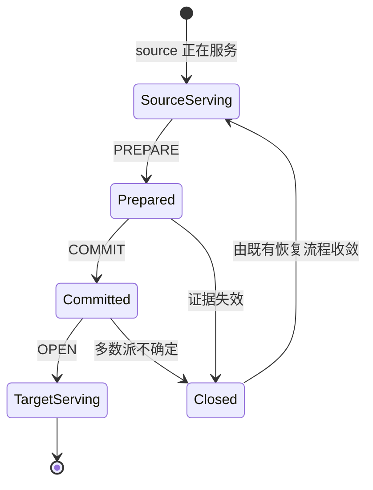
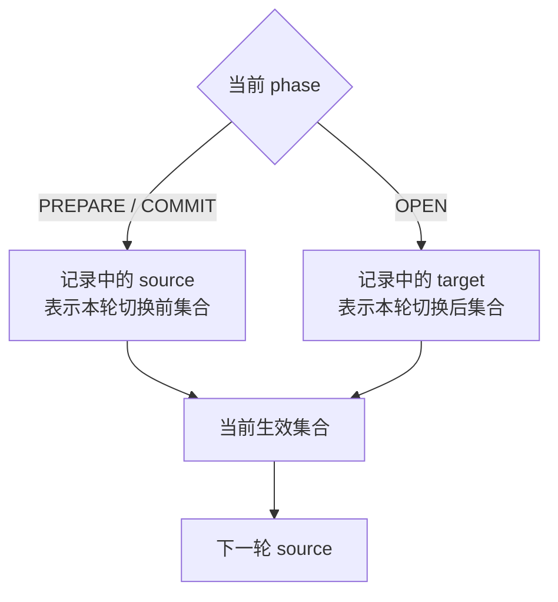

# 1. 状态模型与字段语义

## 1.1 一轮激活有两个集合

一轮能力切换同时记录：

- `source`：本轮开始前正在服务的能力集合；
- `target`：本轮完成后将要服务的能力集合。

例如，集群已经启用 R4，准备继续启用 Resource-X：

```text
source = R4
target = R4 + Resource-X
```

这两个集合在整轮中保持不变，变化的是 phase 和 generation。

## 1.2 phase 决定哪个集合当前生效

| phase | 当前生效集合 | 对业务的含义 |
|---|---|---|
| 初始 | 空集合 | 尚无本体系能力对业务开放 |
| PREPARE | source | target 正在准备，仍不可服务 |
| COMMIT | source | target 已提交，但仍未到开放点 |
| OPEN | target | target 已成为当前服务集合 |
| ROLLBACK_COMPLETE | 已恢复的稳定集合 | 回退过程已经到达稳定终态 |



## 1.3 OPEN 是生效边界

PREPARE 和 COMMIT 都不会让 target 提前接收普通业务请求。只有 OPEN 之后：

- target 路径可以被选择；
- 后继轮次可以把该 target 当成自己的 source；
- 重启节点可以根据已持久状态恢复相同的生效集合。

这使得“代码存在”“内部准备完成”“已经提交”“已经对业务开放”成为四个可区分的状态。

## 1.4 连续轮次不能重读旧 source

假设第一轮是：

```text
source = 空
target = R4
phase  = OPEN
```

第一轮完成后，当前生效集合已经是 R4。第二轮必须是：

```text
source = R4
target = R4 + Resource-X
```



因此，“字段叫 source”不等于“任何时候它都是当前生效集合”。公开状态查询和诊断工具应同时
显示 phase、source、target 与 generation，避免只看单个字段得出错误结论。

## 1.5 generation 的作用

generation 单调推进，用于区分：

- 当前请求和过期请求；
- 同一能力集合在不同历史轮次中的状态；
- 完成响应丢失后的 exact replay；
- 能力先增加、以后又回到相同 bitmap 时的不同历史身份。

即使 bitmap 看起来相同，generation 不同的请求也不是同一个请求。
