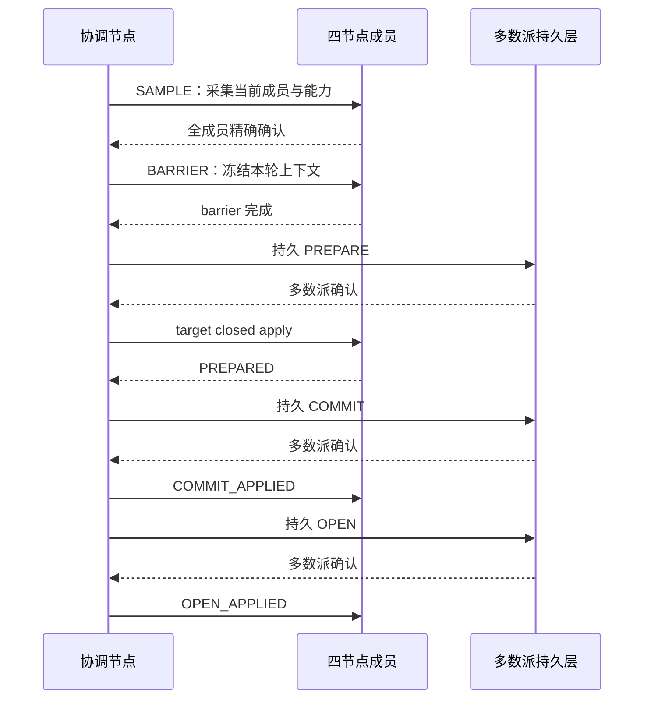
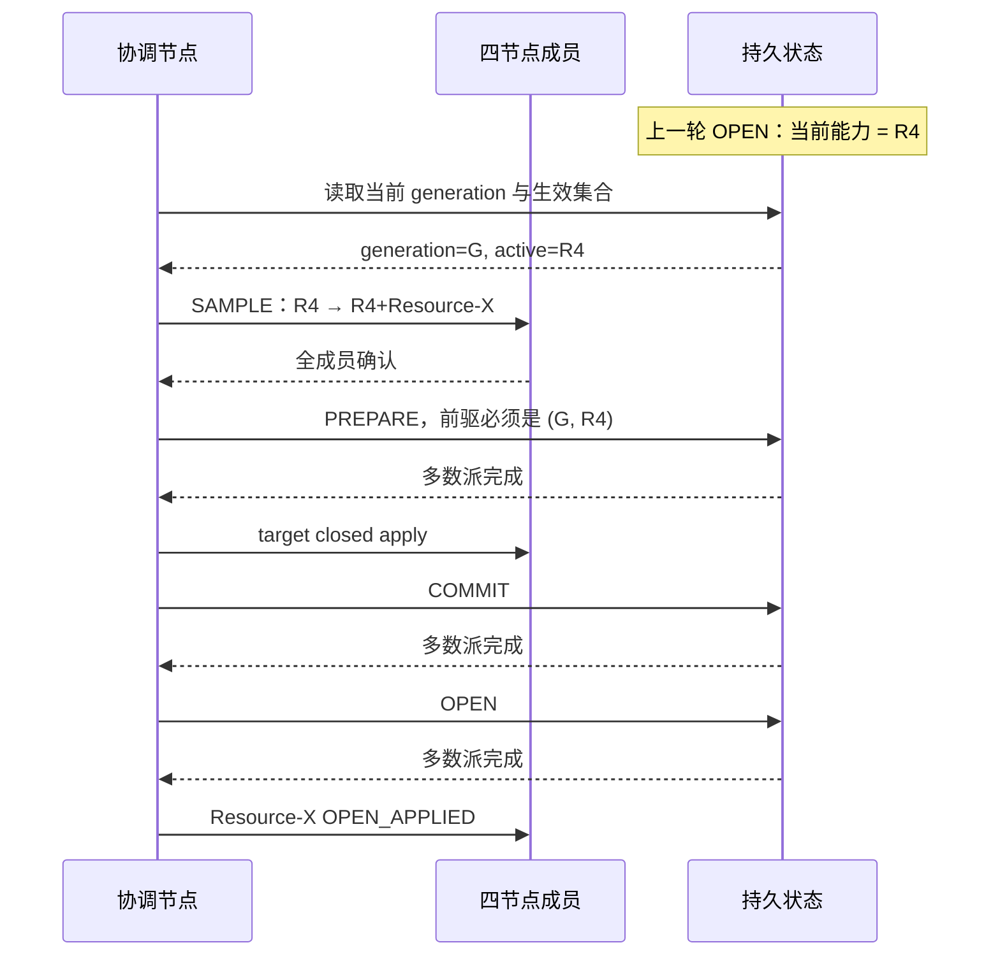
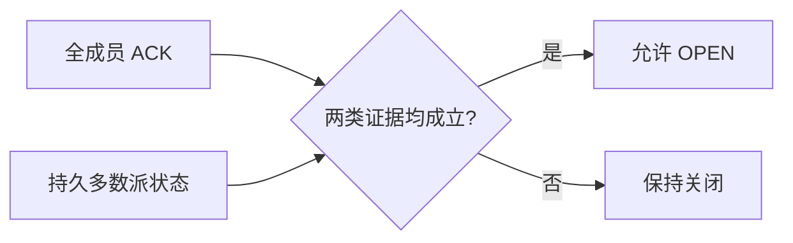

# 2. 连续轮次时序

## 2.1 第一轮：启用 R4

四节点 clean formation 中，R4 轮按以下顺序推进：

OPEN 完成前，普通请求不能把 R4 当成已生效能力。OPEN 完成后，四节点根据同一持久 generation
观察 R4 已启用。

## 2.2 第二轮：启用 Resource-X

第二轮不回到初始空集合，而是从 R4 开始：

## 2.3 成员确认不是持久 OPEN 的替代物

全成员 ACK 证明本轮参与者都对同一上下文完成了规定动作；持久多数派证明切换结果能够跨进程
和节点重启恢复。两者缺一不可：

本地 callback 成功、单节点已进入新路径或某个计数器增加，都不能代替 OPEN。

## 2.4 formation 变化时整轮失效

轮次绑定当前成员集合、节点身份和 formation。以下任一变化都会使未完成轮次失效：

- 节点重连导致 incarnation 改变；
- formation epoch 改变；
- admitted member 集合改变；
- capability 采样不再匹配；
- 协调节点身份改变。

失效后不会局部修补旧轮次。系统重新读取当前稳定状态，再在新的 formation 下开始新轮。

## 2.5 重启恢复

节点重启时以多数派持久状态为准：

| 观察到的稳定状态 | 恢复行为 |
|---|---|
| PREPARE | target 仍关闭，不能作为当前服务集合 |
| COMMIT | target 仍关闭，等待既有恢复流程收敛 |
| OPEN | target 是当前生效集合 |
| 无多数派 | 保持 fail closed |

后继轮次只有在前一轮 OPEN 被稳定观察后才会开始。
