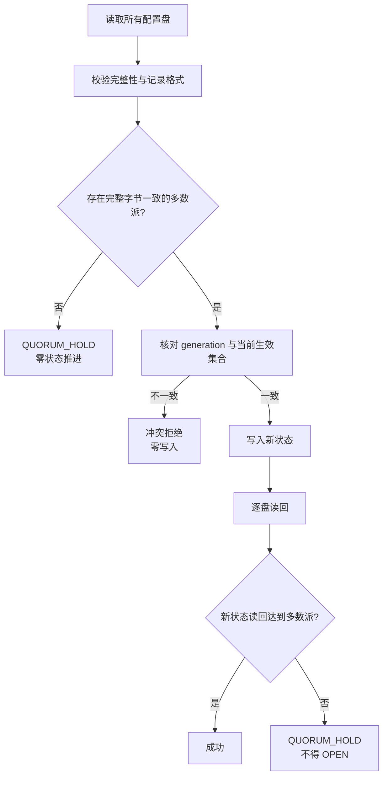
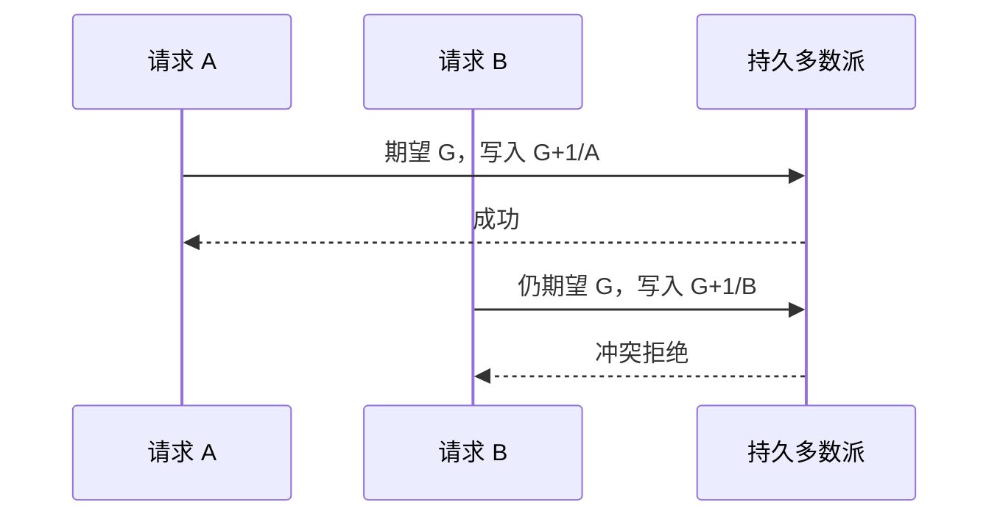

# 3. 多数派、幂等与失败关闭

## 3.1 多数派选择

集群推进持久状态前，先从 voting disks 选择一个完整、一致的多数派视图。不能形成多数派时，
结果是不确定，系统保持关闭。



## 3.2 exact replay

如果持久写入已经达到多数派，但返回给协调层的完成消息丢失，协调层可能重放同一个请求。
当读取到的多数派状态与重放目标完全相同时，重放按幂等成功处理：

```text
same generation
+ same phase
+ same source/target
+ same formation/member identity
+ same complete bytes
= same operation
```

这不会再推进一代，也不会重复开放能力。

## 3.3 不同请求不能 last-writer-wins

两个请求即使声称相同前驱，只要目标状态不同，就不能互相覆盖。一个请求先成为多数派后，另一个
请求会观察到前驱 generation 已变化或当前生效集合不再匹配，并被拒绝。



## 3.4 部分写入

写请求可能只到达一部分磁盘。系统不根据“写调用返回成功的盘数”直接宣布完成，而是重新读取，
只计算确实保存完整新状态的磁盘。

| 三盘示例 | 完成结果 |
|---|---|
| 3 盘新状态 | 成功 |
| 2 盘新状态、1 盘旧状态 | 成功，多数派明确 |
| 1 盘新状态、2 盘无法形成旧/新一致多数 | HOLD |
| 3 盘互不相同 | HOLD |
| 记录损坏或读短 | HOLD |

HOLD 不代表数据已回滚，也不代表新状态成功；它表示当前不能安全发布 OPEN。

## 3.5 常见拒绝路径

| 条件 | 行为 | 是否允许业务进入 target |
|---|---|---:|
| generation 过期 | 冲突拒绝 | 否 |
| 前驱生效集合不匹配 | 冲突拒绝 | 否 |
| formation/incarnation 漂移 | 当前轮失效 | 否 |
| 成员 ACK 不完整 | 等待或终止当前轮 | 否 |
| 多数派不可用 | HOLD | 否 |
| 写后读回不足多数派 | HOLD | 否 |
| exact 已完成请求重放 | 幂等成功 | 已按原 OPEN 状态决定 |

## 3.6 不确定性不会变成 fallback

切换失败不会让普通业务偷偷回到已下线的 legacy 路径。系统只允许：

- 保持当前已确认的 source；
- 在 target 尚未 OPEN 时保持 target 关闭；
- 已经 OPEN 后继续以持久 target 为当前集合；
- 无法确认时 fail closed。

不会因为 timeout、错误码或某个对端不可用而临时建立第二条正常写 authority。
