# 4. 观测、验证与 Oracle RAC 对照

## 4.1 应同时观察哪些信息

排查连续激活时，至少要把以下字段放在同一时间线上：

| 维度 | 需要观察的内容 |
|---|---|
| phase | PREPARE、COMMIT 或 OPEN |
| generation | 当前持久代际与请求期望代际 |
| source | 本轮切换前能力集合 |
| target | 本轮切换后能力集合 |
| active | 根据 phase 得出的当前生效集合 |
| formation | 当前成员与 formation identity |
| ACK | 每个 admitted member 是否完成当前 stage |
| persistence | 新状态是否经多数派读回确认 |

只显示 `source` 容易误判 OPEN 终态；只显示 `target` 又会误判 PREPARE/COMMIT。诊断输出应把 phase
与两个集合一起展示。

## 4.2 正常时间线

```mermaid
gantt
    title 连续激活的可观察阶段
    dateFormat X
    axisFormat %s
    section R4
    PREPARE          :a1, 0, 1
    COMMIT           :a2, 1, 1
    OPEN             :a3, 2, 1
    section Resource-X
    PREPARE from R4  :b1, 3, 1
    COMMIT           :b2, 4, 1
    OPEN             :b3, 5, 1
```

在 `b1` 时，当前前驱应显示为 R4；如果诊断仍把第一轮原始 source（空集合）当作当前状态，说明
观察口径错误。

## 4.3 四节点验证面

完整验证应覆盖：

1. 四个真实数据库节点完成 clean formation；
2. R4 完整到达 OPEN；
3. 后继 Resource-X 轮从 R4 开始；
4. Resource-X 完整到达 OPEN；
5. 四节点执行真实 point `UPDATE+COMMIT`；
6. 无 client error、timeout、forced cancel 或 zero-op；
7. 请求终态、等待图和旧正常路径残留全部符合验收要求。

focused unit 可以验证状态推导和幂等规则，但不能替代四节点生产路径。

## 4.4 Oracle RAC 公开行为对照

### Oracle 官方可确认的部分

- GCS 与 GES 共同维护 Global Resource Directory，资源由 resource master 协调。
- LMS 处理 GCS 请求、资源控制和实例间块传输。
- LMON 监控成员变化并执行 GES/GCS reconfiguration。
- ACMS 协助保证分布式 SGA 更新全局提交或在失败时全局终止。
- RAC two-stage rolling updates 区分“已部署但 disabled”和“集群 enable”。

这些公开事实支持以下外部行为：能力不能靠单节点本地成功宣布全局生效；集群切换需要统一的
协调状态；失败时不能留下半开放能力。

官方来源：

- [Oracle Database 26ai — Background Processes](https://docs.oracle.com/en/database/oracle/oracle-database/26/refrn/background-processes.html)
- [Oracle RAC 21c — Introduction to Oracle RAC](https://docs.oracle.com/en/database/oracle/oracle-database/21/racad/introduction-to-oracle-rac.html)
- [Oracle RAC 26ai — Administering Database Instances and Cluster Databases](https://docs.oracle.com/en/database/oracle/oracle-database/26/racad/administering-database-instances-and-cluster-databases.html)
- [Oracle RAC — Resource Coordination](https://docs.oracle.com/cd/A97630_01/rac.920/a96597/coord.htm)
- [Oracle RAC — Cache Fusion and the Global Cache Service](https://docs.oracle.com/cd/A97630_01/rac.920/a96597/pslkgdtl.htm)

### PGRAC 自有实现边界

Oracle 没有公开其内部 rolling-update 状态字节、持久 CAS 格式或消息细节。PGRAC 的 phase、
generation、能力集合和 voting-disk 持久协调属于 PGRAC 自有实现。

因此可以准确地说：

> PGRAC 对齐 Oracle RAC 公开的全局协调、部署与启用分离、单一生效 authority 和失败关闭语义；
> PGRAC 的持久记录与轮次协议不是 Oracle 已公开或已验证的内部算法。

## 4.5 运维判读速查

| 现象 | 含义 | 建议动作 |
|---|---|---|
| PREPARE 长时间不前进 | target 尚未开放，检查成员/formation/ACK | 不要手工绕过 OPEN |
| COMMIT 已持久但未 OPEN | target 仍关闭，检查完成确认和多数派 | 保持 fail closed |
| OPEN 后后继 PREPARE 冲突 | 核对后继轮是否使用上一 OPEN 的生效集合 | 同时查看 phase/source/target/active |
| 无法形成持久多数派 | authority 不确定 | 恢复 voting-disk quorum 后重试 exact round |
| exact 请求重放成功 | 前次可能已完成但响应丢失 | 继续观察同一 generation，不新建一轮 |
| formation 改变 | 旧轮次已失效 | 等新 formation 下重新开始 |
