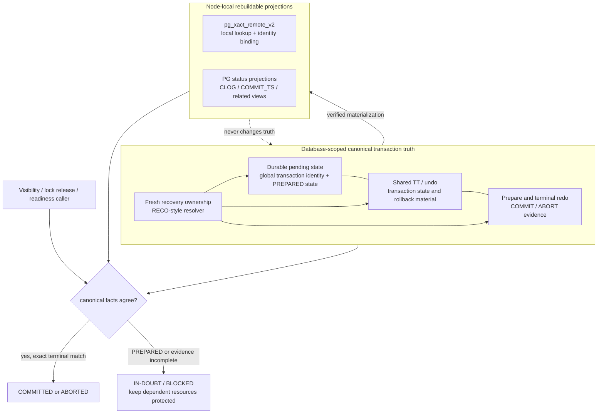
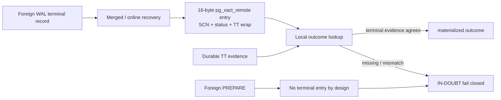
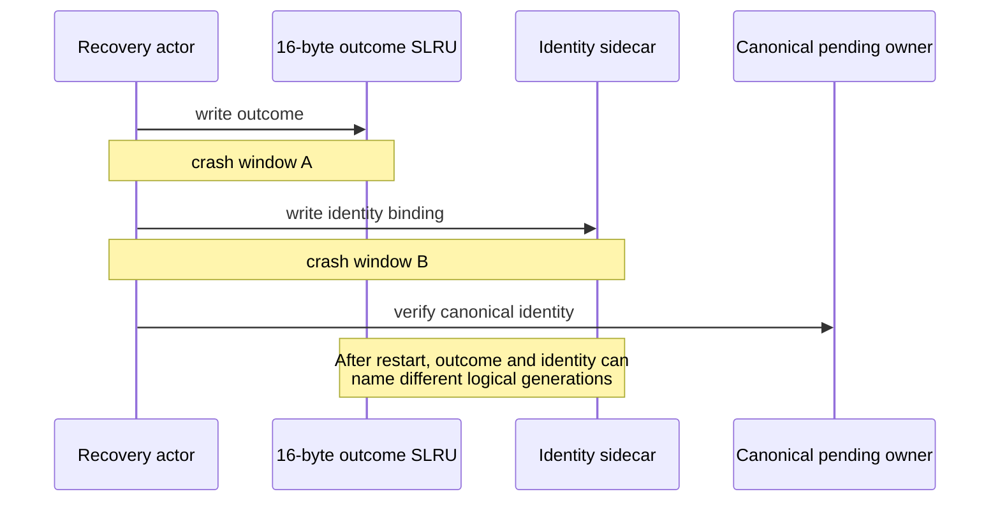
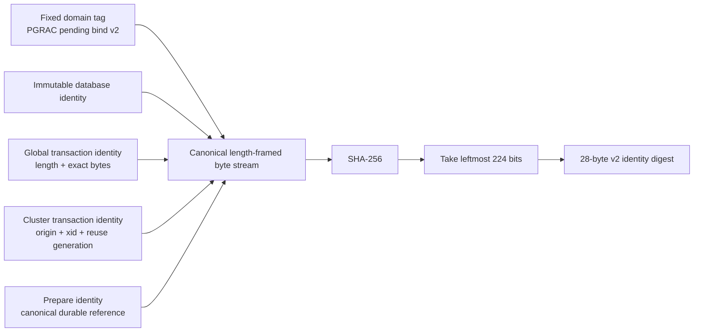
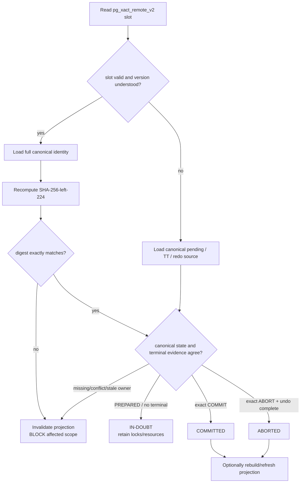

# 未决事务恢复：Oracle RECO 语义与 PGRAC 投影边界

本文解释一个看似只是“事务状态表”，实际上会决定集群能否安全恢复的问题：节点故障后，
谁有资格回答一个事务已经提交、已经回滚，还是仍处于 `PREPARED / IN-DOUBT`？

重点包括：

- Oracle 公开资料能够确认哪些 pending transaction、RECO 和 RAC undo 行为；
- PGRAC 为什么必须把 database-scoped canonical transaction truth 与本地投影分开；
- 当前 16 字节 `pg_xact_remote` 能解决什么、不能解决什么；
- 为什么目标 `pg_xact_remote_v2` 采用 32 字节固定条目；
- 为什么其中使用 28 字节（224 位）截断 SHA-256，而不是 16、20 或完整 32 字节摘要；
- 为什么摘要匹配也绝不能单独授权 `COMMIT` 或 `ABORT`。

> **状态说明（2026-08-21）。** 公开仓库 `main` 当前仍使用 16 字节
> `ClusterRemoteXactEntry`。本文的 `pg_xact_remote_v2`、32 字节条目和 28 字节摘要是
> PGRAC 的目标 adaptation contract，不是 Oracle 已公开的内部格式，也不能写成当前已经交付的
> 磁盘 ABI。

## 证据标识

本文使用四种标识，避免把外部行为对齐误写成内部实现相同：

- **Oracle 已验证**：Oracle 官方文档明确描述的行为；
- **PGRAC 当前实现**：公开 `main` 已存在的源码事实；
- **PGRAC v2 目标**：本文解释的 PGRAC 自研 adaptation；
- **语义映射**：安全职责相近，但 Oracle 未公开对应字节、消息或算法。

## 结论先行：projection 不是 transaction truth

安全结构必须分成上下两层：



`pg_xact_remote_v2` 可以让本节点快速定位候选事务、发现身份错配并缓存已经验证的结果；
它不能成为 PREPARED 真值的唯一保存者，也不能在 canonical pending state、TT/undo 和 terminal
redo 不完整时自行选出终态。

这条边界是全文最重要的规则：

> **持久化不等于权威；摘要相等不等于事务已经提交。**

## Oracle 公开行为：能确认什么

### Pending transaction 是数据库级持久状态

**Oracle 已验证。** `DBA_2PC_PENDING` 描述等待恢复的分布式事务。它记录本地事务 ID、全局事务
ID、状态、失败时间和 RECO 最近重试时间等信息。Oracle 的管理文档进一步说明，每个数据库的
数据字典保存 open distributed transactions；事务解决后，相应 pending row 才会被清理。

官方依据：

- [Oracle `DBA_2PC_PENDING`](https://docs.oracle.com/en/database/oracle/oracle-database/19/refrn/DBA_2PC_PENDING.html)
- [Managing Distributed Transactions](https://docs.oracle.com/en/database/oracle/oracle-database/18/admin/managing-distributed-transactions.html)

这至少证明了三个外部语义：

1. pending state 不能只存在于发起实例的易失内存；
2. 全局事务身份与本地事务身份是两个不同维度；
3. `PREPARED`、`COMMITTED`、forced outcome 等状态必须可区分，不能把“暂时没看到结果”解释成
   自动回滚。

### PREPARED 期间继续保护锁和资源

**Oracle 已验证。** Oracle 把 `Prepared` 描述为已经完成 prepare、尚未收到 commit request 的
状态，并明确指出节点仍持有事务提交所需的本地资源锁。长时间 in-doubt 事务因此可能阻塞其他
访问；只有自动恢复或经过严格人工决策的 force 操作才能释放它们。

所以“实例死了”不能推出“prepared transaction 已 abort”。如果 origin、coordinator 或 recoverer
发生变化，正确结果仍然是保留 pending state 与相关资源保护，直到获得匹配的 terminal 证据。

### RECO 负责解决，而不是猜测

**Oracle 已验证。** RECO 在网络或系统故障后自动连接参与 in-doubt distributed transaction 的
其他数据库，解决事务，并在解决后清理各数据库 pending transaction table 中对应的记录。

官方依据：[Oracle Recoverer Process (RECO)](https://docs.oracle.com/en/database/oracle/oracle-database/26/dbiad/db_RECO.html)。

这里必须避免一个常见混淆：

- Oracle **RECO** 处理 distributed transaction 的 in-doubt resolution；
- Oracle RAC **instance recovery** 处理失败实例留下的 redo/undo 与数据库块恢复；
- 二者可能在一次故障中先后相关，但不是同一个后台职责，也不能把 RECO 写成所有 RAC crash 的
  通用恢复进程。

PGRAC 使用“RECO-style resolution”一词时，只表示：由可接棒的恢复角色读取数据库级 pending
state，验证 prepare/terminal 身份并幂等解决；并不声称复刻了 Oracle RECO 的内部协议。

### RAC undo 位于共享存储，可由其他实例在恢复中处理

**Oracle 已验证。** Oracle RAC 要求每个实例的 undo tablespace 位于共享存储。所有实例可为一致
读访问 undo block；在 transaction recovery 中，只要某个 undo tablespace 没有被其他实例用于
undo 生成或恢复，任一实例都可以更新它。

官方依据：[Administering Storage in Oracle RAC](https://docs.oracle.com/en/database/oracle/oracle-database/21/racad/administering-storage-in-oracle-rac.html)。

这支持“恢复执行者可以接棒”的职责映射，但 Oracle 公开材料没有披露 PGRAC 对应的 TT slot、
pending entry 或摘要布局。

## 当前 16 字节 `pg_xact_remote` 做了什么

**PGRAC 当前实现。** 公开主线把远端事务 materialized outcome 存入 origin-partitioned SLRU。
条目由 [`cluster_remote_xact.c`](../../../src/backend/cluster/cluster_remote_xact.c) 定义，页映射和
接口位于 [`cluster_remote_xact.h`](../../../src/include/cluster/cluster_remote_xact.h)。

当前布局为：

| 字段 | 字节 | 含义 |
|---|---:|---|
| `commit_scn` | 8 | 仅 `COMMITTED` 时有效的 SCN |
| `status` | 1 | `INDOUBT / COMMITTED / ABORTED` |
| `wrap_valid` | 1 | `wrap` 是否有效 |
| `wrap` | 2 | 与 durable TT slot 对拍的复用代次 |
| reserved zero | 4 | 预留 |
| **合计** | **16** | 每个 8 KiB SLRU page 可放 512 项 |



这个 v1 结构解决了两个实际问题：

1. 不把不同 origin 的相同 32 位 xid 写入同一份本地 `pg_xact`，避免原始 xid 别名；
2. 把远端 terminal record 的 outcome、SCN 与 TT wrap 保存为本地可读 materialization。

它也有明确边界。当前头文件说明 foreign PREPARE 不是终态，因此不会创建 outcome entry；缺失条目
返回 `IN-DOUBT`。这对于“不把 PREPARE 猜成 COMMIT”是正确的，但它没有建立 database-scoped
pending owner。

### 为什么 `{origin, xid, wrap}` 仍不够

一个可安全接棒的 PREPARED transaction 至少同时涉及：

- database identity：pending owner 属于哪个数据库；
- global transaction identity：不同参与方如何指向同一全局事务；
- cluster transaction identity：origin、xid 以及抵抗 xid/slot 重用的代次；
- prepare identity：当前 pending record 与哪次 prepare durable event 对应；
- terminal binding：后续 COMMIT/ABORT 是否确实解决同一个 prepare；
- recovery ownership：哪个 fresh actor 正在解决，但 actor 更换不得改变事务结果。

16 字节 v1 已经用 12 字节保存 SCN、状态和 wrap，只余 4 字节。4 字节无法容纳全局事务身份，
也不足以提供可接受的身份摘要。继续把更多语义塞进 bit field，只会让状态、版本、代次和身份绑定
彼此覆盖。

更重要的是：即使扩展条目，完整 pending truth 仍必须在 database-scoped canonical owner 中。
v2 增加的是“这个投影对应哪一个 canonical pending identity”的强绑定，不是把本地 SLRU 升格为
新的事务真值表。

## 为什么从 16 字节扩到 32 字节

### 原因一：给全局身份绑定留下独立空间

v2 必须保留一个可直接判读的控制前缀，同时容纳足够长的 canonical identity digest。本文采用的
格式预算是：

```text
32-byte pg_xact_remote_v2 slot

byte  0 .............................................................. 31
      +----------------------+-----------------------------------------+
      | 4-byte control area  | 28-byte truncated SHA-256             |
      | version/state/flags  | canonical pending identity binding     |
      +----------------------+-----------------------------------------+
```

这里的 4 字节是**格式预算**：需要容纳版本、状态和有效性等可判读控制信息。确切 bit 编码属于未来
磁盘 ABI，当前 `main` 尚未冻结。28 字节摘要不保存 PREPARED 真值，只绑定 canonical identity。

这不是把 v1 的 16 字节原样保留、再追加 16 字节。若保留 v1 的 SCN/status/wrap，再追加 28 字节
摘要，最低已经需要 44 字节，实际对齐后更接近 48 或 64 字节；更严重的是，它会继续暗示本地
outcome 字段可以独立承重。v2 的角色变化是一次重新分工：完整 SCN、TT generation、prepare 与
terminal outcome 回到 canonical pending + TT/undo + redo 核验，slot 只保留快速控制前缀与强身份
绑定。需要缓存 SCN 的 consumer 也只能读取经过 canonical 校验的 derived projection，不能把它
重新塞回 v2 当作裁决者。

### 原因二：避免 sidecar 双写制造新的崩溃窗口

另一个看似节省空间的方案，是保留 16 字节 v1，再新增一个 sidecar 文件存 GID 或摘要。这样会把
一次逻辑 materialization 拆成两次持久化：



系统当然可以再增加 journal、双文件 generation 和恢复协议修补它，但那等于为一个投影重新发明
小型事务系统。把控制信息与摘要放进同一个固定槽，至少能让 slot-level 读取获得同一版本的
materialized binding；canonical authority 仍负责最终复核。

### 原因三：32 字节保持简单、可计算的 SLRU 密度

32 是 16 的两倍，也是 8 KiB 页的整除幂次：

| 条目宽度 | 每 8 KiB page 条目数 | 评价 |
|---:|---:|---|
| 16 B | 512 | 当前密度高，但放不下强身份绑定 |
| 24 B | 341，余 8 B | 非二次幂映射；若留 4 B 控制区，仅余 160-bit 摘要 |
| **32 B** | **256** | 二次幂索引；4 B 控制区 + 224-bit 摘要 |
| 36/40 B | 227/204 | 可容纳完整 SHA-256 加控制信息，但映射和页利用率更差 |
| 64 B | 128 | 布局宽裕，但对可重建投影浪费一半以上密度 |

扩到 32 字节的代价是真实的：相同事务数量占用约两倍 SLRU 空间，缓存页能容纳的 entry 减半。
选择它是因为身份正确性比 v1 密度更重要，同时又不需要为完整 32 字节摘要把 slot 推到 40、48
甚至 64 字节。

## 为什么是 28 字节截断 SHA-256

### 28 字节来自固定槽预算，不是随意缩短

SHA-256 产生 256 位（32 字节）摘要。32 字节 slot 若保留 4 字节控制区，剩余恰好是 28 字节，
即 224 位。因此选择过程是：

```text
32-byte fixed slot
- 4-byte directly readable control area
= 28-byte / 224-bit canonical identity digest
```

若坚持保存完整 32 字节 SHA-256，条目至少需要 36 字节；考虑自然对齐、未来版本字段和简单页索引，
实际往往会扩到 40、48 或 64 字节。对一个不承载终态权威的 rebuildable projection，这些额外字节
收益有限。

### 224 位摘要的安全余量

[NIST FIPS 180-4](https://csrc.nist.gov/pubs/fips/180-4/upd1/final)规定 SHA-256 输出 256 位摘要。
[NIST SP 800-107 Rev.1](https://csrc.nist.gov/pubs/sp/800/107/r1/final)给出的截断规则是选择完整摘要
最左侧的目标位数，并指出 λ 位截断摘要的通用碰撞强度约为 λ/2。

因此 224 位截断摘要具有：

- 约 112-bit generic collision resistance；
- 约 224-bit preimage resistance；
- 明确、无歧义的算法标识：`SHA-256-left-224`，不能只写“截断 hash”。

随机碰撞概率可用 birthday bound 近似：

```text
p(collision) ≈ n × (n - 1) / 2^225
```

| 同一摘要域累计的不同 identity 数量 n | 近似碰撞概率 |
|---:|---:|
| `10^6` | `1.9 × 10^-56` |
| `10^9` | `1.9 × 10^-50` |
| `10^12` | `1.9 × 10^-44` |
| `2^64` | `2^-97`，约 `6.3 × 10^-30` |

这些数字说明 224 位对**身份筛选与错配检测**有极大余量，但不能得出“摘要可替代 canonical
transaction record”的结论。哈希不是证明 COMMIT 的签名，也不是持久事务协议。

### 摘要输入必须 canonical 且 domain-separated

摘要不能直接覆盖 C struct 内存，因为 padding、端序和版本变化会让相同逻辑身份得到不同结果。
推荐的逻辑构造如下；字段的最终 wire/ABI 仍需随 v2 实现冻结：



必须满足：

1. 固定 domain tag 和格式版本，防止其他 SHA-256 用途的摘要被跨域解释；
2. 每个变长字段都有长度前缀，禁止字符串拼接歧义；
3. 整数使用固定端序和固定宽度；
4. database identity 必须参与，不能让不同数据库中的相同 GID 命中；
5. xid 重用维度必须参与，不能只 hash 原始 32 位 xid；
6. 所有节点使用同一截断方向，即 SHA-256 的最左 224 位；
7. 摘要算法、域和版本不匹配时 fail closed，不能尝试“兼容猜测”。

### 28 字节摘要不是 MAC

未加密钥的 SHA-256 摘要只能提供 identity binding、快速比较和意外损坏检测，不能证明写入者身份。
如果攻击者可以任意改写投影文件，摘要本身不能阻止伪造。PGRAC 仍要依赖受保护的 canonical
pending state、redo/undo 完整性、fresh recovery ownership 和 storage fencing。

这也解释了为什么即使 digest 匹配，调用者仍必须回到 canonical owner 验证。

## PREPARED 到终态的正确状态机

```mermaid
stateDiagram-v2
    [*] --> ACTIVE
    ACTIVE --> PREPARING: durable prepare begins
    PREPARING --> PREPARED: pending + TT/undo + prepare redo all match
    PREPARING --> BLOCKED: partial write / identity conflict
    PREPARED --> IN_DOUBT: coordinator/network/system failure
    PREPARED --> COMMITTING: matching commit decision
    PREPARED --> ROLLING_BACK: matching abort decision
    IN_DOUBT --> COMMITTING: fresh resolver verifies commit terminal
    IN_DOUBT --> ROLLING_BACK: fresh resolver verifies abort + undo responsibility
    IN_DOUBT --> IN_DOUBT: evidence incomplete; keep locks/resources
    COMMITTING --> COMMITTED: terminal durable + post-read verified
    ROLLING_BACK --> ABORTED: undo complete + terminal durable
    BLOCKED --> PREPARED: fresh actor reconstructs exact canonical binding
    BLOCKED --> BLOCKED: unknown remains fail-closed
    COMMITTED --> [*]
    ABORTED --> [*]
```



`pg_xact_remote_v2` 的更新时机必须位于 canonical 事实之后：

- PREPARED 投影不能先于 durable pending/prepare truth 发布；
- COMMITTED 投影不能先于 matching terminal redo 和 canonical transaction state 发布；
- ABORTED 投影不能绕过 undo completion；
- projection write 失败只会让本地 lookup 进入 rebuild/BLOCKED，不能回滚或反转 canonical truth。

## 故障后 recoverer 接棒的完整时序

```mermaid
sequenceDiagram
    participant C as Coordinator / origin
    participant P as Canonical pending owner
    participant U as Shared TT / undo
    participant W as Prepare + terminal redo
    participant V as pg_xact_remote_v2 projection
    participant R as Fresh recovery actor

    C->>P: persist database-scoped pending identity
    C->>U: persist matching TT / undo state
    C->>W: persist PREPARE evidence
    P-->>C: PREPARED is durable only after exact binding closes
    C--xC: instance/network failure

    R->>R: acquire fresh recovery ownership
    R->>V: read local candidate binding
    alt projection missing or corrupt
        V-->>R: UNKNOWN
        R->>P: enumerate canonical pending state
    else digest present
        V-->>R: candidate identity digest
        R->>P: load full canonical identity and recompute digest
    end

    R->>U: verify TT / undo identity and generation
    R->>W: verify prepare and matching terminal evidence
    alt no terminal decision
        R-->>P: keep IN-DOUBT
        Note over P,U: dependent locks and resources remain protected
    else exact COMMIT terminal
        R->>P: resolve COMMITTED idempotently
        R->>V: refresh verified projection after canonical resolution
    else exact ABORT terminal + undo complete
        R->>P: resolve ABORTED idempotently
        R->>V: refresh verified projection after canonical resolution
    else mismatch / stale actor / incomplete evidence
        R-->>V: invalidate candidate
        R-->>R: BLOCKED; do not guess
    end
```

recoverer 可以变化，事务身份和结果不能随 recoverer 变化。任何 actor-local cache、PID、epoch snapshot
或未完成的私有进度都不能覆盖 durable canonical state。

## Lookup 必须怎样使用 v2



这里有两个看似重复、实际不同的检查：

- digest check 回答“这个本地 projection 是否指向我刚读取的 canonical identity”；
- canonical terminal check 回答“这个事务现在究竟是什么状态”。

第一个检查通过不能替代第二个。

## Oracle 与 PGRAC 的逐项对照

| 安全职责 | Oracle 公开行为 | PGRAC 对应策略 | 结论 |
|---|---|---|---|
| pending state scope | 每个数据库保存 open/in-doubt distributed transaction 信息 | database-scoped durable pending owner | 外部职责对齐 |
| global identity | `GLOBAL_TRAN_ID` 与 local transaction ID 分开 | canonical global identity；v2 只保存其强摘要绑定 | 语义映射，不是相同格式 |
| PREPARED 资源保护 | prepared 节点继续持有必要本地资源锁 | terminal 未验证前保持 dependent lock/resource fenced | 外部行为对齐 |
| 自动解决 | RECO 重连参与数据库并解决 pending transaction | fresh RECO-style actor 验证 canonical pending + TT/undo + redo | 职责相近，内部协议自研 |
| shared undo recovery | RAC 实例可读共享 undo，并可在条件满足时更新 undo tablespace 做 transaction recovery | shared TT/undo 允许恢复执行者接棒 | 责任映射 |
| 本地快速状态读取 | Oracle 未公开 PGRAC 对应物 | `pg_xact_remote_v2` rebuildable projection | PGRAC 自研 |
| 32 B slot / 28 B digest | 未公开、未验证 | PGRAC 空间与身份绑定折中 | 不能称作 Oracle 实现 |

正确说法是：**PGRAC 的外部事务恢复语义可以与 Oracle 对齐，但 `pg_xact_remote_v2` 是为
PostgreSQL/PGRAC 数据结构与恢复路径设计的 adaptation。**

## Crash 与错误矩阵

| 故障点 | 必须发生的行为 | 禁止行为 |
|---|---|---|
| pending write 前崩溃 | 没有完整 prepare binding，事务保持 UNKNOWN/BLOCKED | 因无 pending row 自动 abort |
| pending durable、prepare redo 未闭合 | fresh actor 重验全部 canonical 事实 | 单看 projection 发布 PREPARED |
| PREPARED 后 coordinator 故障 | 保持 in-doubt 与资源保护，等待 resolver | origin 死亡即释放锁 |
| v2 slot 写到一半 | 格式或 canonical 一致性检测失败，丢弃并从 canonical rebuild | 读取部分摘要猜终态 |
| v2 slot 缺失 | canonical truth 不变；只影响本地 lookup/readiness scope | missing 当 ABORTED |
| v2 digest 与 canonical identity 不符 | invalidate、记录错配、阻塞相关 scope | 选择较新 mtime 或较大 SCN |
| digest 相同但 terminal 缺失 | 仍为 IN-DOUBT | 摘要命中即 COMMITTED |
| COMMIT terminal 后 projection 未刷盘 | canonical COMMITTED；projection 可稍后重建 | projection miss 反转为 UNKNOWN/ABORT |
| rollback 期间 recoverer 再崩溃 | next actor 从 durable undo/progress 幂等继续 | 未完成 undo 就发布 ABORTED |
| mixed-version 节点不认识 v2 | 对相关事务 fail closed 或完成显式 rebuild/migration | 把 v2 page 当 v1 page 读取 |

## v1 到 v2 的迁移原则

16 字节变成 32 字节会改变每页 entry 数和 xid→slot 映射，不能原地把旧 page 强制解释成新 page。
安全迁移至少要满足：

1. **格式显式版本化。** reader 必须先判断 v1/v2，unknown version 直接 fail closed；
2. **不做 in-place reinterpret。** 使用独立目录、独立 page version 或一次受控 rebuild；
3. **从 canonical source 重建。** v1/v2 都是 materialization，迁移不应从旧 projection 推导新的
   PREPARED truth；
4. **切换前验证 coverage。** 所有当前 consumer 所需 identity 都可从 canonical source 重建；
5. **切换后 post-read。** 随机抽查不够，受影响 scope 必须验证版本、digest 和 canonical binding；
6. **回滚只丢 projection。** 软件回退不能回滚 canonical pending/TT/undo/redo truth；不认识 v2 的
   版本必须保持相关 scope 关闭；
7. **崩溃可重入。** rebuild 中途死亡后，新 actor 可以清空未完成 v2 materialization 并重新生成。

由于 v2 密度从每页 512 项降为 256 项，页号和 entry number 计算也必须随格式版本一起改变；只改
`sizeof(entry)` 而不迁移 page mapping 会把旧事务读到错误槽位。

## 验证标准：什么时候才能宣称闭环

实现 v2 后，至少需要以下证据才能宣称与本文策略一致：

- PREPARED 的 full global identity 在 database-scoped canonical owner 中持久存在；
- origin/recoverer 重启或切换后，pending transaction 仍保持 in-doubt，不被自动猜成终态；
- digest 的 canonical framing、domain tag、端序和 left-224 截断有 golden-vector 测试；
- v2 missing、torn、bit flip、wrong database、wrong GID、xid reuse 和 wrong prepare generation 全部
  fail closed；
- digest match 但 canonical terminal evidence 缺失时仍返回 IN-DOUBT；
- COMMIT PREPARED 与 ROLLBACK PREPARED 在每个 durable cut 上可幂等恢复；
- recoverer 在 pending、TT、undo、terminal 或 projection 更新之间死亡，下一 actor 不采用私有
  内存进度；
- v1→v2 rebuild 中途崩溃可重复执行，且不会修改 canonical transaction truth；
- normal lookup 可以使用本地 projection，但 projection miss 不引入错误 terminal outcome；
- 任何 `COMMITTED / ABORTED / readiness` 发布都能追溯到 database-scoped canonical owner 的
  exact binding，而不是仅追溯到 v2 slot。

## 最终判断

从 16 字节扩到 32 字节不是为了让 `pg_xact_remote` 保存更多“权威状态”，而是为了在同一固定槽
里加入足够强的 canonical pending identity binding，并避免 outcome 与 identity sidecar 双写形成
新的崩溃协议。

28 字节截断 SHA-256 是明确的工程折中：

- 32 字节 slot 减去 4 字节控制预算，正好剩余 224 位；
- 保持 32 字节二次幂槽和每 8 KiB page 256 项的简单映射；
- 112-bit 通用碰撞强度远高于本地 projection identity screening 的需求；
- 不为完整 256 位摘要把 rebuildable projection 扩到 40/48/64 字节；
- 最关键的是，它始终只做 identity binding，不能签发事务终态。

因此，PGRAC 可以在外部语义上向 Oracle 的 pending transaction + RECO + shared undo recovery 靠齐，
同时诚实保留实现边界：Oracle 没有公开 `pg_xact_remote_v2`，32 字节条目和 28 字节摘要完全是
PGRAC 自研 adaptation。只有当 canonical pending owner 与真实生产 caller 完成硬绑定后，才可以
宣称完整事务恢复链路已经闭环。

## 公开参考资料

Oracle：

- [DBA_2PC_PENDING](https://docs.oracle.com/en/database/oracle/oracle-database/19/refrn/DBA_2PC_PENDING.html)
- [Recoverer Process (RECO)](https://docs.oracle.com/en/database/oracle/oracle-database/26/dbiad/db_RECO.html)
- [Managing Distributed Transactions](https://docs.oracle.com/en/database/oracle/oracle-database/18/admin/managing-distributed-transactions.html)
- [Administering Storage in Oracle RAC](https://docs.oracle.com/en/database/oracle/oracle-database/21/racad/administering-storage-in-oracle-rac.html)

Hash 标准：

- [NIST FIPS 180-4: Secure Hash Standard](https://csrc.nist.gov/pubs/fips/180-4/upd1/final)
- [NIST SP 800-107 Rev.1: Recommendation for Applications Using Approved Hash Algorithms](https://csrc.nist.gov/pubs/sp/800/107/r1/final)

PGRAC 公开源码：

- [`cluster_remote_xact.c`](../../../src/backend/cluster/cluster_remote_xact.c)
- [`cluster_remote_xact.h`](../../../src/include/cluster/cluster_remote_xact.h)
- [`cluster_terminal_authority.c`](../../../src/backend/cluster/cluster_terminal_authority.c)
- [`cluster_tt_durable.h`](../../../src/include/cluster/cluster_tt_durable.h)
