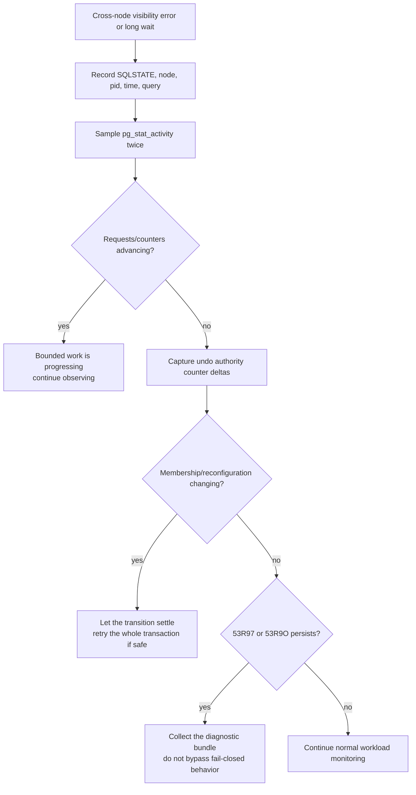

# Cross-node transaction visibility and fail-closed diagnosis

This page explains the user-visible behavior of cross-node transaction
visibility and how to collect useful diagnostics when a read or write cannot
prove another transaction's state.

It is an operations guide, not a release certification. A registered wait
event or counter shows that a diagnostic surface exists; it does not by itself
prove that every multi-node workload is enabled or has passed acceptance in the
installed build.

## Expected behavior

When one node reads a row changed by another node, linkdb must distinguish five
outcomes:

| Outcome | User-visible behavior |
|---|---|
| committed | The change is visible only when the reader's snapshot permits it. |
| aborted | The aborted change is not visible. |
| in progress | A consistent read uses the appropriate older row version; a conflicting write may wait or return a retryable error according to the operation. |
| prepared | The transaction remains nonterminal until its prepared outcome is resolved. |
| unknown or conflicting evidence | The operation fails closed. linkdb does not guess committed or aborted. |

Fail-closed errors are intentional safety behavior. Retrying the whole
transaction may be appropriate after a transient cluster transition, but an
application must never reinterpret an unknown result as a successful commit.

## Quick diagnosis

Run the following queries on the node that reports the error or delay.

### 1. Check active cluster waits

```sql
SELECT pid,
       datname,
       usename,
       state,
       wait_event_type,
       wait_event,
       left(query, 160) AS query
  FROM pg_stat_activity
 WHERE wait_event IN (
           'ClusterCfTerminalResolve',
           'UndoTtLookupRemote',
           'PcmItlCleanout',
           'ClusterGCSBlockShipWait'
       )
 ORDER BY pid;
```

| Wait | Meaning during triage |
|---|---|
| `ClusterCfTerminalResolve` | The backend is resolving cross-instance transaction evidence. |
| `UndoTtLookupRemote` | The backend is waiting on a remote transaction-table lookup. |
| `PcmItlCleanout` | The backend is waiting for ITL cleanout or commit-SCN backfill. |
| `ClusterGCSBlockShipWait` | The backend is waiting for a block image. This can be normal while request/reply counters continue to advance. |

A wait name alone is not a hang. Sample twice and compare progress, errors,
timeouts, and outstanding work.

### 2. Read transaction-authority counters

```sql
SELECT key, value
  FROM pg_cluster_state
 WHERE category = 'undo'
   AND key LIKE 'terminal_authority_%'
 ORDER BY key;
```

The main keys are:

| Key | Meaning |
|---|---|
| `terminal_authority_check_count` | Total authority decisions evaluated. |
| `terminal_authority_ok_count` | Decisions with complete evidence. |
| `terminal_authority_failclosed_count` | Decisions rejected for any fail-closed reason. |
| `terminal_authority_epoch_failclosed_count` | Membership epoch evidence was missing or changed. |
| `terminal_authority_ownership_failclosed_count` | Origin or transaction ownership did not match. |
| `terminal_authority_unknown_failclosed_count` | Terminal state or commit SCN could not be proved. |
| `terminal_authority_nonterminal_failclosed_count` | The observed transaction was still nonterminal for that consumer. |
| `terminal_authority_durable_failclosed_count` | Durable transaction evidence was missing or mismatched. |
| `terminal_authority_retention_failclosed_count` | Required retention evidence was unavailable. |

These are lifetime counters for the running instance. Capture a before/after
delta around one reproduction; do not diagnose from a large absolute value
alone.

### 3. Check topology and cluster state

```sql
SELECT *
  FROM pg_cluster_nodes
 ORDER BY node_id;

SELECT category, key, value
  FROM pg_cluster_state
 WHERE category IN ('guc', 'undo', 'visibility')
 ORDER BY category, key;
```

Confirm that the expected origin node is present and that the cluster is not
changing membership while the transaction runs.

### 4. Record the exact SQLSTATE

Two relevant fail-closed codes are:

| SQLSTATE | Condition | Application response |
|---|---|---|
| `53R97` | Cluster transaction status is unknown. | Roll back the current application transaction, verify cluster health, and retry the complete unit of work if it is safe and idempotent. |
| `53R9O` | Cache Fusion terminal authority is unresolved. | Treat the operation as failed; inspect authority counters and cluster waits before retrying. |

The server log may include a more specific reason. Preserve the full error,
DETAIL, and HINT fields.

## Triage flow



## Minimal diagnostic bundle

Collect the following from every involved node for the same short time window:

```sql
SELECT clock_timestamp() AS captured_at,
       inet_server_addr() AS server_addr,
       inet_server_port() AS server_port,
       pg_backend_pid() AS collector_pid;

SELECT * FROM pg_cluster_nodes ORDER BY node_id;

SELECT pid, state, wait_event_type, wait_event, left(query, 160) AS query
  FROM pg_stat_activity
 WHERE wait_event_type LIKE 'Cluster:%'
    OR wait_event IN ('ClusterCfTerminalResolve',
                      'UndoTtLookupRemote',
                      'PcmItlCleanout',
                      'ClusterGCSBlockShipWait')
 ORDER BY pid;

SELECT category, key, value
  FROM pg_cluster_state
 WHERE category IN ('guc', 'undo', 'visibility')
 ORDER BY category, key;
```

Also retain:

- the exact SQLSTATE, message, DETAIL, and HINT;
- origin and requester node IDs;
- transaction start/end timestamps;
- whether the application committed, rolled back, or lost its connection;
- relevant server-log lines from all involved nodes;
- whether the result reproduces with one transaction and one row.

Avoid including credentials or unrelated row contents in an issue report.

## Safe application handling

- Roll back the current transaction after `53R97` or `53R9O`.
- Retry the complete transaction, not only the last statement, when the
  application's idempotency rules allow it.
- Use an application request ID or idempotency key when duplicate submission
  would be harmful.
- Do not set hint bits, edit transaction metadata, or manually declare the
  remote transaction committed/aborted.
- Do not disable a safety check to turn an unknown result into success.
- If the client lost the connection during commit, treat the outcome as unknown
  until the application's normal commit-outcome mechanism proves it.

## Distinguishing progress from a stall

`ClusterGCSBlockShipWait` is commonly visible while a node is scanning data it
does not yet cache. It indicates a stall only when the surrounding evidence
also stops changing.

Use a short repeated sample:

```sql
SELECT clock_timestamp(), pid, wait_event, state
  FROM pg_stat_activity
 WHERE wait_event IS NOT NULL
 ORDER BY pid;
```

Then compare:

- block request/reply counters;
- timeout and retransmit counters;
- outstanding requests;
- the current node or phase being processed;
- client transaction completion counts.

Increasing request/reply counts with zero timeout and zero stale/outstanding
growth is evidence of forward progress, even if the same wait event remains
prominent. Flat progress plus growing timeouts or outstanding work requires a
diagnostic bundle.

## Important limitations

- Some cluster wait events are registered before every runtime call site is
  active in a release. An event's presence in the registry is not a feature
  availability promise.
- `pg_stat_gcluster_wait_events` is currently a cross-node placeholder; use
  `pg_stat_activity` and local views on each node for live diagnosis.
- `pg_cluster_state` counters are instance-lifetime values and may reset on
  restart.
- A zero counter does not prove that a code path was exercised.
- Successful cluster formation does not by itself prove transaction visibility
  or workload acceptance.

## Related references

- [Cluster wait events](../reference/wait-events.md)
- [System views](../reference/system-views.md)
- [Verification cheatsheet](verification.md)
- [GCS current and consistent-read blocks](../architecture/gcs/02-current-and-cr-blocks.md)
