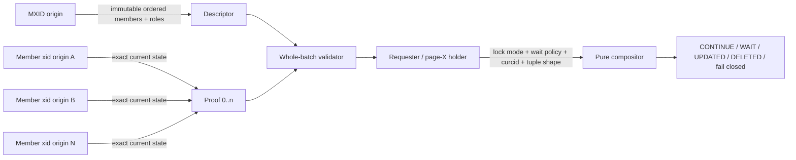
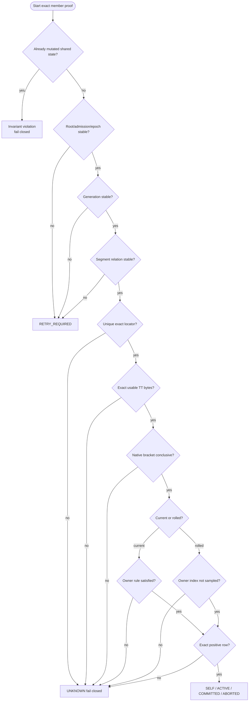
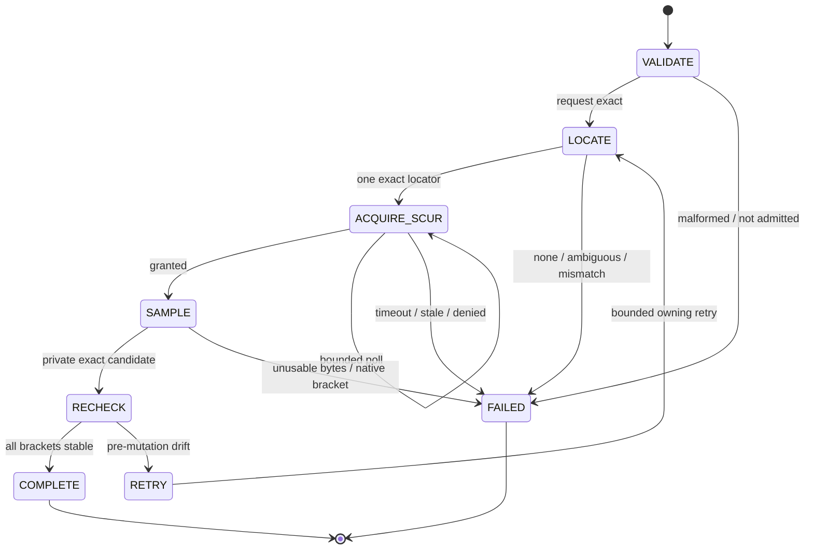
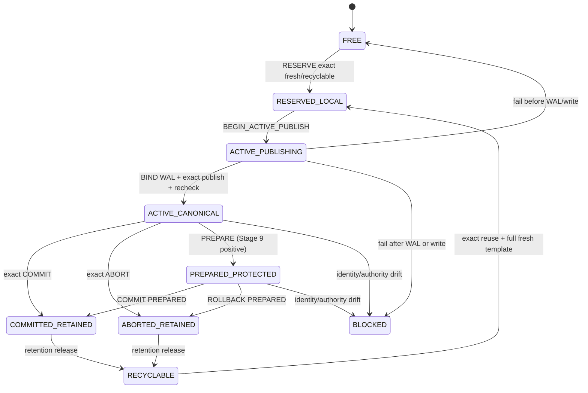
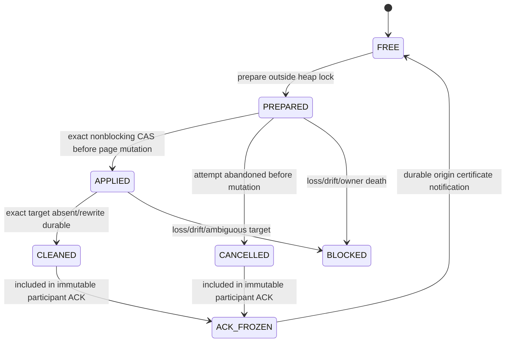
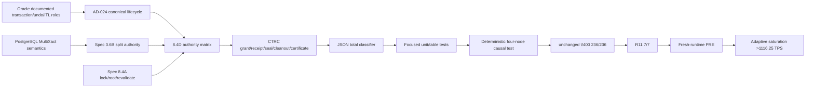

# Spec 8.4D — Stage 8 current-MultiXact transaction-authority state matrix

> **Status:** FROZEN FOR IMPLEMENTATION 2026-09-01 (`APPROVE_CTRC`)
> **Normative machine source:**
> [`matrices/spec-8.4d-authority-matrix-v2.json`](matrices/spec-8.4d-authority-matrix-v2.json)
> **Frozen canonical JSON SHA-256:**
> `7c56f3d686804297814043c0454fc8024a6a660ae22e156a10b44f46b144f90d`
> **Architecture authority:**
> [AD-024](../docs/ad-024-canonical-active-transaction-authority.md)
> **MultiXact protocol authority:**
> [Spec 3.6B](spec-3.6b-multixact-current-dml.md)
> **Block-0 and heap unlock/relock authority:**
> [Spec 8.4A](spec-8.4a-undo-block0-authority-prerequisite.md)
> **Privacy:** private design material. Never copy this document, its matrix
> identifiers, reasoning, Oracle mapping, or implementation plan into the public
> `sqlrush/pgrac` repository.

---

## 0. Binding decision and document precedence

### 0.1 Writer go/hold decision

`APPROVE_CTRC` was recorded on 2026-09-01. The earlier authority/composition
matrix remains frozen, but its former `L11/L12 retention release` guard was not
an implementable ownership contract. This amendment freezes **Canonical
Terminal Reference Census (CTRC)** as the only Stage 8 release protocol.

This document, AD-024, the JSON matrix, its checker, and the implementation plan
form one frozen private handoff. The Writer resumes only from that complete
handoff and continues from the existing fail-closed WIP; it must not delete or
redo conforming canonical ACTIVE/COMMIT/ABORT work.

This is not a new authority or a request to discard current WIP. Existing exact
locator, canonical sampler, canonical ACTIVE publisher, terminal transition,
whole-batch proof and compositor implementations are retained when they satisfy
the rows below.

### 0.2 Precedence

For the bounded Stage 8 path, use this order:

1. the current Stage 8 scope override in repository `AGENTS.md`;
2. AD-024 for transaction authority and lifecycle architecture;
3. Spec 8.4A for block-0 authority, lock order, and heap capture/relock;
4. Spec 3.6B for MultiXact descriptor ownership and PostgreSQL composition;
5. this document for the **closed current-MultiXact cross-product**;
6. the JSON matrix for exact enumerated domains, ordered rules, test IDs, and
   checker inputs.

If prose and JSON disagree, implementation stops before product mutation. Fix
the private documents and make the checker GREEN first; neither side may select
the more permissive interpretation.

### 0.3 What this specification changes

Previous documents specified the parts but did not provide one executable,
total cross-product joining:

- exact physical transaction-table authority;
- current-versus-rolled segment owner semantics;
- native PostgreSQL transaction brackets;
- whole-MultiXact member proof;
- requester-local lock/wait/update composition;
- mutation and retry boundaries.

This specification closes that integration gap. It does **not** replace the
approved architecture. The CTRC amendment authorizes only the exact
capability-gated wire/WAL additions in §12.4–§12.15; they carry release
evidence and never transaction-status authority.

---

## 1. Scope

### 1.1 Included

Only the following current Stage 8 path is in scope:

```text
homogeneous four-node R4 OPEN
→ ordinary point UPDATE/DELETE/tuple-lock encounters foreign current xmax MXID
→ exact immutable descriptor from MXID origin
→ exact per-member proof from each member xid origin
→ requester-local PostgreSQL conflict composition
→ wait/retry/continue/update/delete result
→ exact tuple/page revalidation before shared mutation
→ ordinary COMMIT or ABORT
```

Included states are canonical physical TT `ACTIVE`, `COMMITTED`, and `ABORTED`,
both allocator-current and stably rolled TT segments, exact self recognition,
all-or-nothing member batches, and pre-mutation retry/fail-closed behavior.

Also included are publication registration for every Stage 8 page reference
that can still require the physical terminal TT slot: ordinary heap ITL/UBA,
current-MX member references, retained updater/HOT topology, and recomposed
survivors. Terminal close, exact reference cleanout, durability-vector
settlement, release certification, and normal-path journal reclamation are in
scope. The existing `cluster_undo_cleaner` remains the sole progress owner.

### 1.2 Excluded

The following are not Stage 8 positive paths and must not be smuggled in through
a matrix row:

- positive prepared-transaction member proof;
- physical rollback by a surviving instance;
- full crash, rejoin, repeated-recoverer, or rolling-upgrade certification;
- shared catalog or shared WAL/redo-thread parity;
- heterogeneous compatibility or deployment certification;
- performance optimization before this correctness matrix is GREEN.
- positive crash/rejoin recovery of a lost volatile CTRC journal or seal
  coordinator; loss or boot mismatch keeps the exact slot retained and is
  Stage 9 liveness work;
- a global transaction server, durable terminal archive, second transaction
  status authority, or new background process.

Existing safety code for these seams remains. An excluded state is never
converted into success; it remains fail-closed or follows its owning Stage 9
specification.

### 1.3 Completion boundary

This document is complete only when:

1. the JSON checker proves total deterministic classification;
2. every required focused RED/GREEN is present;
3. the minimal four-node causal test proves the relevant transitions;
4. unchanged `t/400` remains `236/236`;
5. R11 remains `7/7` with source-removal proof;
6. a fresh runtime reaches PRE without using PRE to discover another state in
   this bounded matrix.

Passing this specification is necessary but not sufficient for the Stage 8 TPS
verdict.

---

## 2. Evidence boundary and Oracle RAC mapping

### 2.1 Evidence classes

| Class | Meaning | Permitted claim |
|---|---|---|
| `ORACLE_FACT` | Directly stated by Oracle public documentation. | State only the documented role or behavior. |
| `EVIDENCE_INFERENCE` | Required implication of Oracle facts plus frozen PGRAC constraints. | State explicitly as an inference, never as an Oracle internal. |
| `PGRAC_ADAPTATION` | PGRAC-specific representation, wire, algorithm, lock order, failure polarity, or test. | Normative for PGRAC only. |
| `POSTGRESQL_COMPATIBILITY` | Native PostgreSQL MultiXact/tuple-lock/CLOG/subtransaction semantics retained by PGRAC. | Normative at the requester compatibility boundary. |

### 2.2 Verified Oracle facts

| ID | Oracle fact | Official source | PGRAC mapping |
|---|---|---|---|
| `O8D-01` | First DML allocates an undo-segment transaction-table slot. The transaction ID contains undo segment, slot, and sequence components. | Oracle Database 26, [Transactions](https://docs.oracle.com/en/database/oracle/oracle-database/26/cncpt/transactions.html) | Supports a durable transaction entity existing during ACTIVE lifetime. It does not disclose PGRAC's bytes or WAL. |
| `O8D-02` | An active transaction-table entry points to undo records; undo records form the reverse change chain. | Oracle Database 26, [Transactions](https://docs.oracle.com/en/database/oracle/oracle-database/26/cncpt/transactions.html) | Supports the dependency direction “transaction entity before externally resolvable undo/ITL reference.” The exact PGRAC publish protocol is an inference/adaptation. |
| `O8D-03` | Block ITL entries identify transaction changes and point to the transaction table in an undo segment. | Oracle Database 19, [Data Concurrency and Consistency](https://docs.oracle.com/en/database/oracle/oracle-database/19/cncpt/data-concurrency-and-consistency.html) | An ITL/UBA reference cannot safely outlive or precede its resolvable canonical transaction entity. |
| `O8D-04` | At commit, the transaction table records the terminal state and commit SCN; later block cleanout can consult the undo header. | Oracle Database 26, [Transactions](https://docs.oracle.com/en/database/oracle/oracle-database/26/cncpt/transactions.html) | ACTIVE and terminal outcomes are states of one entity, not independent hints. |
| `O8D-05` | All RAC instances can read undo blocks for consistent reads; during transaction recovery an instance can operate on another instance's undo under documented ownership restrictions. | Oracle RAC 26, [Managing Undo in an Oracle RAC Environment](https://docs.oracle.com/en/database/oracle/oracle-database/26/adrac/rac_undo_tblspc.html) | Shared accessibility and recovery ownership are required roles. It does not imply that arbitrary instances may mutate live foreign undo. |
| `O8D-06` | Oracle exposes transaction-table states including ACTIVE, COMMITTED, and PREPARED. | Oracle Database 26, [`V$TRANSACTION_TABLE`](https://docs.oracle.com/en/database/oracle/oracle-database/26/refrn/V-TRANSACTION_TABLE.html) | Supports state vocabulary only. PGRAC `TTSlot`, `0x20`, `0xFB`, owner index, and status encoding remain adaptations. |
| `O8D-07` | Instance recovery rolls transactions forward with redo and rolls uncommitted work back with undo. | Oracle RAC 26, [Managing Backup and Recovery](https://docs.oracle.com/en/database/oracle/oracle-database/26/racad/managing-backup-and-recovery.html) | Establishes the Stage 9 survivor-recovery target; it does not move physical rollback into Stage 8. |
| `O8D-08` | RAC database/undo files reside on supported cluster-accessible storage administered for all instances. | Oracle RAC 26, [Administering Storage in Oracle RAC](https://docs.oracle.com/en/database/oracle/oracle-database/26/racad/administering-storage-in-oracle-rac.html) | A participant death does not prove a shared tuple reference disappeared; CTRC must retain without exact cleanup evidence. |

### 2.3 Claims that are not Oracle facts

The following are frozen PGRAC adaptations and must be labelled that way in
code comments and private design material:

- `ClusterTTStatusKey` field layout and exact identity comparison;
- `XLOG_UNDO_TT_SLOT_BIND` opcode `0x20` and its WAL ordering;
- block-0 `0xFB` SCUR/XCUR resource and resident-image protocol;
- current-owner observation and the current/rolled owner rule;
- descriptor/member-proof wire messages and whole-batch hash binding;
- the CTRC touched registry, receipt/seal FSMs, source census, SHA-256 encoding,
  capability `0x00400000`, wire kind 11/status 30, `0xA0` certificate and TT
  release bit;
- the `MXA-*` rule IDs, retry classes, SQLSTATE mapping, and test schedule.

Oracle public documentation does not reveal those internal choices. Lack of
publication is not evidence that Oracle lacks an equivalent internal mechanism.

---

## 3. Problem statement and causal invariant

### 3.1 The failure being closed

The invalid state is not “GCS delivered the wrong block.” It is:

> A shared heap/undo dependency names a transaction identity before every
> remote consumer can resolve that identity through the canonical transaction
> table under a stable authority bracket.

Under concurrency, a remote requester can therefore hold an exact tuple/MXID
member pointer yet receive an empty, recycled, stale, ambiguous, or
native-only transaction state. Upgrading any of those observations to ACTIVE or
terminal would risk a false conflict decision, lost update, or dirty visibility.

### 3.2 Required end-to-end chain

```mermaid
sequenceDiagram
    autonumber
    participant W as DML origin backend
    participant P as Prepare outside heap lock
    participant B0 as Canonical TT block 0
    participant U as Shared undo
    participant H as Heap page / ITL
    participant M as MXID member origin
    participant R as Requester / page-X holder

    W->>P: reserve exact segment/slot/wrap/xid and resident capacity
    P->>B0: acquire stable authority; publish exact ACTIVE
    B0-->>P: receipt bound to root/generation/admission
    P-->>W: READY receipt
    W->>W: acquire/reacquire heap content lock
    W->>W: conditionally revalidate receipt before mutation
    W->>U: write undo using exact published identity
    W->>H: publish tuple + ITL/UBA + WAL
    R->>R: capture tuple/MXID identity, release heap content lock
    R->>M: request exact member proof
    M->>B0: locate and sample canonical slot under stable bracket
    B0-->>M: exact ACTIVE / terminal / no proof
    M-->>R: all-or-nothing bound proof batch
    R->>R: reacquire heap lock and exact-revalidate tuple/page
    R->>R: compose PostgreSQL conflict/wait result
```

No arrow may be reordered across these boundaries:

1. canonical ACTIVE precedes dependent undo/ITL/heap exposure;
2. remote I/O and `0xFB` acquisition occur without a heap content lock;
3. requester composition consumes only a complete exact proof set;
4. a proof is consumed only after the captured tuple/page identity is unchanged;
5. retry is selected before any shared mutation, never after it.

### 3.3 Authority is split, not centralized



| Actor | Sole authority | Must never do |
|---|---|---|
| MXID origin | Immutable ordered `(member_xid, MultiXactStatus)` descriptor for exact `(origin, mxid, epoch)` | Decide foreign member liveness or requester wait policy. |
| Member xid origin | Exact `SELF/ACTIVE/COMMITTED/ABORTED/UNKNOWN` proof derived from canonical TT plus native bracket | Decode a foreign MXID or synthesize status from request-local bytes. |
| Requester/page-X holder | Tuple identity, target lock mode, wait policy, self CID, HOT/updater challenge, final PostgreSQL result | Decode a foreign descriptor locally or treat a partial batch as sufficient. |

### 3.4 Exact transaction identity

A positive member proof binds the full identity already owned by AD-024 and the
current ABI. Conceptually it contains at least:

```text
member origin node
+ cluster epoch / admission episode
+ undo root identity
+ undo segment id
+ physical segment generation
+ TT slot id / byte offset
+ TT slot wrap or incarnation
+ exact xid (including required top/subtransaction relationship)
+ canonical block-0 sample generation
+ request id + descriptor hash + member ordinal + member role
```

A raw xid, raw mxid, segment id, local allocator owner, cached status, CLOG bit,
or physical locator is only one input. None is a positive identity by itself.

---

## 4. Normative invariants

| ID | Invariant | Required implementation consequence |
|---|---|---|
| `MXA-I01 CANONICAL_BYTES_ONLY` | Only the exact canonical physical TT slot sampled under stable block-0 current authority provides ACTIVE/COMMITTED/ABORTED. | Cache, locator, overlay, allocator, reply, and native status are predicates, never substitute bytes. |
| `MXA-I02 EXACT_IDENTITY` | Origin, segment, generation, slot, wrap, xid, root, epoch, request and ordinal bindings are exact. | Any mismatch is UNKNOWN; do not “best match” or fall back. |
| `MXA-I03 ACTIVE_BEFORE_DEPENDENCY` | Canonical ACTIVE precedes dependent undo, ITL, tuple, heap WAL, GCS image, or member-proof exposure. | Publisher and prepared receipt must be upstream of every DML shared mutation. |
| `MXA-I04 CURRENT_ACTIVE_OWNER` | Current-segment ACTIVE also needs stable exact ACTIVE allocator-owner observation. Current terminal accepts exact matching terminal owner or stable absence. | Retired/absent owner cannot prove current ACTIVE; stable absence need not erase terminal truth. |
| `MXA-I05 ROLLED_OWNER_NOT_AUTHORITY` | Rolled segment does not consult the current-owner index. | Require `NOT_SAMPLED_ROLLED`; any owner-index participation invalidates the row. |
| `MXA-I06 TERMINAL_NATIVE_BRACKET` | COMMITTED/ABORTED needs canonical terminal bytes plus matching stable native terminal bracket. | Conflicting or incomplete terminal evidence is UNKNOWN. |
| `MXA-I07 PREPARED_DISTINCT` | PREPARED is neither ACTIVE nor Stage 8 terminal. | Preserve the state internally; current-MX Stage 8 consumer returns no positive proof. |
| `MXA-I08 WHOLE_BATCH` | Every descriptor ordinal has exactly one correctly bound non-UNKNOWN proof. | Any partial, duplicate, missing, overlap, mismatch, timeout, or unknown invalidates the whole batch. |
| `MXA-I09 NO_RETRY_AFTER_MUTATION` | `RETRY_REQUIRED` is legal only before shared mutation. | Drift after heap/ITL/undo/proof mutation is an invariant violation and fails closed. |
| `MXA-I10 NO_WAIT_UNDER_HEAP_CONTENT` | No network, file I/O, block-0 acquisition, extent claim/recycle/extend, victim selection, or blocking non-heap lock while heap content is held. | Use prepare/consume or capture/unlock/resolve/relock/revalidate. |
| `MXA-I11 UNKNOWN_PRECEDENCE` | UNKNOWN member/context/updater proof defeats otherwise compatible or terminal results. | Check validity and whole proof set before all positive composition. |
| `MXA-I12 NO_PARTIAL_FALLBACK` | No fallback to local foreign-MXID decoding, raw CLOG/ProcArray authority, request-local rolled-live projection, overlay repair, or legacy ticket path. | The default branch is explicit fail-closed UNKNOWN. |
| `MXA-I13 RELEASE_NOT_STATUS_AUTHORITY` | CTRC journal rows, seal ACKs, digests, dependency vectors, and the TT release bit prove only that dependent references were discharged. | No CTRC byte can yield ACTIVE/COMMITTED/ABORTED or repair canonical status. |
| `MXA-I14 REGISTER_BEFORE_REFERENCE` | A nonzero origin-issued grant and one requester-local `PREPARED` receipt exist before any heap ITL/UBA, tuple/MX, updater-edge, or recomposed-survivor mutation can publish a physical-TT-dependent reference. | The heap-lock phase may only pure-plan the page successor, exact-recheck/finalize the preallocated receipt, and atomically mark it `APPLIED` before the first shared mutation. |
| `MXA-I15 CLOSE_BEFORE_CENSUS` | Terminal cleanup first closes the exact `(transaction key, grant generation)` at every origin-recorded touched node. | A closed participant refuses later receipt prepare/apply; an in-flight old ACTIVE proof cannot publish after close. |
| `MXA-I16 PREPARED_MUST_DRAIN` | A seal cannot freeze its participant journal while any matching receipt is `PREPARED`. | It waits for `APPLIED` or `CANCELLED`; timeout, backend loss, or ambiguity retains the slot. |
| `MXA-I17 CLEANOUT_BEFORE_RELEASE` | Every `APPLIED` reference is either shown absent under exact page authority or rewritten to a terminal-independent representation before participant ACK. | Moves/recomposition publish successor receipts first; unknown topology or a live committed-updater mixture retains. |
| `MXA-I18 DURABILITY_BEFORE_CERTIFICATE` | Every cleanout WAL dependency reported by every touched node is durable before the origin emits the sole release certificate. | Reuse never depends on message receipt, wall time, or a merely inserted WAL record. |
| `MXA-I19 LOSS_RETAINS` | Lost journal state, boot/formation/admission drift, missing participant, lost ACK, checksum mismatch, or coordinator crash before durable certificate means no release proof. | The exact slot remains `COMMITTED_RETAINED`/`ABORTED_RETAINED` or `BLOCKED`; Stage 8 does not reconstruct positive release. |
| `MXA-I20 BOUNDED_FAIL_CLOSED` | CTRC shared memory is bounded and allocated before R4 target OPEN. | Capacity exhaustion refuses receipt preparation before heap mutation, wakes the cleaner outside locks, and never degrades to untracked publication. |
| `MXA-I21 COMMIT_HORIZON_STILL_REQUIRED` | CTRC does not replace MVCC retention. | `L11` needs both exact CTRC release and the existing valid commit-SCN horizon; `L12` needs exact CTRC release and durable ABORTED predecessor but no invented time horizon. |
| `MXA-I22 COMPLETE_DEPENDENCY_CENSUS` | Every Stage 8 source that can leave a physical-TT dependency is either registered before mutation or is proved unreachable/local by the generated source census. | A successful ITL terminal hint may discharge an existing receipt; missing/invalid terminal-stamp proof, a skipped hint, or absence from the legacy touch list is never evidence that no dependency exists. |

Every code path that produces a positive member state or a positive tuple
decision must cite the applicable invariant IDs in a nearby unit-test name or
comment. A code comment alone is not a test anchor.

---

## 5. Bounded state variables

### 5.1 Raw authority axes

The JSON matrix defines nine axes. These domains are closed for the current
scope; adding a value requires a private spec and checker change before code.

| Axis | Values | Meaning |
|---|---|---|
| `requester_relation` | `SELF_EXACT`, `OTHER` | Whether the exact member xid is the requester's own current/top xid under the approved subtransaction rule. |
| `locator` | `EXACT_PHYSICAL`, `MISSING_OR_AMBIGUOUS`, `MALFORMED_OR_IDENTITY_MISMATCH` | Result of exact physical segment lookup. Locator carries no transaction verdict. |
| `segment_relation` | `CURRENT_STABLE`, `ROLLED_STABLE`, `DRIFT_OR_UNKNOWN` | Relation between located segment and stable allocator-current generation bracket. |
| `owner_observation` | `EXACT_ACTIVE_STABLE`, `EXACT_COMMITTED_STABLE`, `EXACT_ABORTED_STABLE`, `ABSENT_STABLE`, `NOT_SAMPLED_ROLLED`, `MISMATCH_DRIFT_OR_UNAVAILABLE` | Current-owner observation. `NOT_SAMPLED_ROLLED` is a proof that the forbidden index was not consulted. |
| `tt_slot` | `UNUSED`, `ACTIVE_EXACT`, `COMMITTED_EXACT_VALID_SCN`, `COMMITTED_EXACT_INVALID_SCN`, `ABORTED_EXACT`, `RECYCLABLE`, `IDENTITY_MISMATCH`, `INVALID_DOMAIN` | Exact canonical on-block state after byte and identity validation. |
| `native_bracket` | `IN_PROGRESS`, `COMMITTED`, `ABORTED`, `SUB_TOP_IN_PROGRESS`, `SUB_TOP_COMMITTED`, `SUB_TOP_ABORTED`, `PREPARED`, `UNKNOWN_OR_DRIFT` | Stable PostgreSQL-native status bracket for the exact xid/top relationship. |
| `canonical_generation` | `STABLE`, `UNKNOWN_OVERFLOW_OR_DRIFT` | Pre/post sample agreement of physical and resident generation. |
| `root_admission_epoch` | `STABLE_CURRENT`, `DRIFT_OR_NOT_ADMITTED` | Pre/post agreement of undo root, R4 episode/epoch, and writable/serve admission. |
| `mutation_phase` | `PRE_SHARED_MUTATION`, `POST_SHARED_MUTATION` | Whether any heap, ITL, undo, shared-page, or proof-publication mutation has happened in this attempt. |

The cross-product has exactly:

```text
2 × 3 × 3 × 6 × 8 × 8 × 2 × 2 × 2 = 55,296 combinations
```

The checker must classify each combination through exactly one first-match
rule. “Impossible in practice” is not permission to omit a combination; it
must reach a positive rule, a pre-mutation retry, or explicit fail-closed.

### 5.2 Composition axes

Requester-local composition uses ten aggregate axes. Raw member roles and target
lock modes are first reduced using the exact native conflict table in §10.

| Axis | Values |
|---|---|
| `input_validity` | `VALID`, `INVALID` |
| `proof_set` | `ALL_PROVEN`, `ANY_UNKNOWN` |
| `precheck` | `OK`, `INVISIBLE`, `SELF_MODIFIED`, `BEING_MODIFIED` |
| `self_effect` | `NONE`, `SELF_MODIFIED`, `INVISIBLE` |
| `committed_updater` | `NONE`, `DELETED_TUPLE`, `UPDATED_VALID_PROOF`, `UPDATED_INVALID_PROOF` |
| `active_follow_candidate` | `NONE`, `VALID_PROOF`, `INVALID_PROOF` |
| `active_conflict` | `NONE`, `PRESENT` |
| `action_class` | `UPDATE_DELETE`, `LOCK_HOT` |
| `wait_policy` | `BLOCK`, `SKIP`, `ERROR` |
| `wait_for_conflict` | `YES`, `NO` |

This cross-product is exactly:

```text
2 × 2 × 4 × 3 × 4 × 3 × 2 × 2 × 3 × 2 = 13,824 combinations
```

Again, the final default is an explicit `CONTINUE` only after all higher
precedence invalid, unknown, visibility, self, terminal-updater, follow, and
active-conflict rules have been evaluated.

---

## 6. Authority decision funnel



The evaluation order is normative. It prevents a later positive predicate from
masking an earlier authority drift or malformed canonical state.

---

## 7. Ordered authority rules

### 7.1 First-match precedence

The classifier evaluates rules by ascending priority. The first matching rule
is final. Implementations may factor predicates into helpers, but may not
change the observable precedence.

| Priority | Rule | Trigger | Result |
|---:|---|---|---|
| 0 | `MXA-A00` | `mutation_phase=POST_SHARED_MUTATION` | `INVARIANT_VIOLATION_FAIL_CLOSED` |
| 10 | `MXA-A01` | root/admission/epoch drift | `RETRY_REQUIRED` |
| 20 | `MXA-A02` | generation unknown, overflow, or drift | `RETRY_REQUIRED` |
| 30 | `MXA-A03` | current/rolled relation drift | `RETRY_REQUIRED` |
| 40 | `MXA-A04` | missing, ambiguous, malformed, or mismatched locator | `UNKNOWN_FAIL_CLOSED` |
| 50 | `MXA-A05` | unusable canonical slot | `UNKNOWN_FAIL_CLOSED` |
| 60 | `MXA-A06` | unsupported/inconclusive native bracket | `UNKNOWN_FAIL_CLOSED` |
| 70 | `MXA-A07` | a rolled segment consulted the current-owner index | `UNKNOWN_FAIL_CLOSED` |
| 100–170 | `MXA-A10..A17` | one exact positive row in §7.2 | exact member state |
| 999 | `MXA-A99` | no prior exact row | `UNKNOWN_FAIL_CLOSED` |

`RETRY_REQUIRED` is not a wire authority state. It is an owning-loop action
available only while the attempt is still pre-mutation. Existing APIs may
encode the inability to complete a remote attempt as typed `RETRY` or a
non-OK whole batch, but no layer may expose a partially positive member proof.

### 7.2 Exact positive rows

Every cell below is mandatory; a wildcard is forbidden in a positive row.
`A|B` means the row is duplicated for each listed value, not that the caller
may skip the predicate.

| Rule | Requester | Locator | Segment | Owner observation | Canonical TT | Native bracket | Generation | Root/admission | Phase | Result |
|---|---|---|---|---|---|---|---|---|---|---|
| `A10` | `SELF_EXACT` | exact | current stable | exact ACTIVE stable | exact ACTIVE **or** exact COMMITTED+valid SCN | in-progress or sub/top in-progress | stable | stable current | pre-mutation | `MEMBER_SELF` |
| `A11` | `SELF_EXACT` | exact | rolled stable | `NOT_SAMPLED_ROLLED` | exact ACTIVE **or** exact COMMITTED+valid SCN | in-progress or sub/top in-progress | stable | stable current | pre-mutation | `MEMBER_SELF` |
| `A12` | other | exact | current stable | exact ACTIVE stable | exact ACTIVE **or** exact COMMITTED+valid SCN | in-progress or sub/top in-progress | stable | stable current | pre-mutation | `MEMBER_ACTIVE` |
| `A13` | other | exact | rolled stable | `NOT_SAMPLED_ROLLED` | exact ACTIVE **or** exact COMMITTED+valid SCN | in-progress or sub/top in-progress | stable | stable current | pre-mutation | `MEMBER_ACTIVE` |
| `A14` | other | exact | current stable | exact COMMITTED stable or stable absent | exact COMMITTED+valid SCN | committed | stable | stable current | pre-mutation | `MEMBER_COMMITTED` |
| `A15` | other | exact | rolled stable | `NOT_SAMPLED_ROLLED` | exact COMMITTED+valid SCN | committed | stable | stable current | pre-mutation | `MEMBER_COMMITTED` |
| `A16` | other | exact | current stable | exact ABORTED stable or stable absent | exact ABORTED | aborted or sub/top aborted | stable | stable current | pre-mutation | `MEMBER_ABORTED` |
| `A17` | other | exact | rolled stable | `NOT_SAMPLED_ROLLED` | exact ABORTED | aborted or sub/top aborted | stable | stable current | pre-mutation | `MEMBER_ABORTED` |

The exact COMMITTED/native-in-progress rows are a **conservative transition
classification**, not a commit verdict. The entity is exact, but the native
terminal barrier is incomplete, so a requester may only treat it as live and
wait/recheck. It cannot clean out, expose a commit SCN, or declare terminal.

No exact ABORTED/native-in-progress row exists. Ordinary abort publication is
durable-before-terminal under AD-024; the mismatch therefore has no positive
Stage 8 interpretation.

### 7.3 Current segment owner rule

For `CURRENT_STABLE`, sample owner state before and after canonical bytes:

```text
current_segment_before
→ owner_before (if any)
→ canonical generation + exact slot
→ native bracket
→ canonical generation recheck
→ current_segment_after
→ owner_after (same presence and byte identity)
→ root/admission recheck
```

Then:

- a live result requires a present exact owner whose xid, segment, slot, wrap,
  status and required generation match;
- a terminal result permits a matching terminal owner or owner absence that is
  stable across the bracket;
- a mismatched, changing, unavailable, or unbracketed observation is UNKNOWN
  or pre-mutation retry according to the first failed predicate;
- owner metadata never repairs missing or mismatched canonical bytes.

### 7.4 Rolled segment owner rule

For `ROLLED_STABLE`, the current-owner index is irrelevant to the old physical
entity and therefore **must not be called**. The proof records
`owner_observation=NOT_SAMPLED_ROLLED` only after the code path proves that it
used:

```text
unique physical locator
+ exact canonical old-segment bytes
+ stable old-segment generation
+ stable native bracket
+ stable root/admission/epoch
+ stable current-versus-rolled relation before and after
```

This does not revive the removed rolled-live shortcut. Rolled ACTIVE is legal
only when the canonical old slot itself is exact and the native bracket is
live. Native status alone remains insufficient.

### 7.5 Fail-closed and retry mapping

| First failed condition | Before mutation | After mutation |
|---|---|---|
| admission/root/epoch changed | discard private state; restart owning loop | invariant violation; fail closed |
| generation or current/rolled relation changed | discard; restart locator/sample | invariant violation; fail closed |
| locator missing/ambiguous/malformed | whole member proof UNKNOWN | whole operation fail closed |
| TT empty/recycled/mismatched/invalid | whole member proof UNKNOWN | whole operation fail closed |
| native status unknown/prepared/unsupported | whole member proof UNKNOWN | whole operation fail closed |
| owner rule fails | whole member proof UNKNOWN | whole operation fail closed |
| batch member missing/duplicate/mismatched | whole batch non-OK/UNKNOWN | whole operation fail closed |
| tuple/page changed after relock | discard old proof and restart tuple owner | not applicable: revalidation precedes mutation |

“Retry” never means recursively call the same blocking helper while retaining a
heap content lock. It means unwind to the named outer restart point.

---

## 8. Exact member-proof algorithm

### 8.1 Locator is not status authority

`gcs_block_current_mx_origin_locate_physical()` has one responsibility: return
one exact physical location or fail. Its selection order is:

```text
validate request binding and member origin
→ if an exact current-owner locator exists and its identity is well formed:
     return that locator only
→ otherwise enumerate durable physical locators for the exact xid identity
→ exactly one candidate: return it
→ zero, multiple, malformed, or inconsistent candidates: fail closed
```

The function must not copy owner `status`, infer live/terminal state, fabricate
a `TTSlot`, or read native CLOG as a substitute. The returned locator is
untrusted until canonical sampling succeeds.

### 8.2 Canonical sampling

The semantic algorithm for
`cluster_runtime_visibility_physical_locator_sample_held()` is:

```text
sample_exact_member(locator, request_context):
  require request/member/origin shape valid
  require current semantic admission
  capture formation epoch and resolved shared undo root
  capture allocator current segment

  if locator.segment == current segment:
      capture exact owner observation; reject mismatched owner immediately
      mark relation CURRENT_STABLE
  else:
      do not call current-owner lookup
      mark relation candidate ROLLED_STABLE

  acquire/poll exact block-0 SCUR outside every heap content lock
  sample known non-overflow canonical generation
  copy the admitted resident block into private memory
  read and validate exact TT slot identity/status/SCN
  sample exact native xid/top/subtransaction bracket
  run authority rules against private inputs
  re-sample generation
  re-sample allocator current segment
  if current: re-sample owner presence and exact bytes
  re-resolve root and recheck admission/epoch
  release all block-0/GRD/network state

  any pre/post drift before shared mutation => RETRY_REQUIRED
  exact positive row => bound member proof
  anything else => UNKNOWN_FAIL_CLOSED
```

The implementation may retain its asynchronous plan/advance functions. The
semantic result is identical whether the request completes in one local step
or multiple event-loop polls.

### 8.3 Native bracket rules

Native status is sampled only after exact TT identity exists. The rules are:

1. direct `IN_PROGRESS` is rechecked against exact prepared state;
2. `SUB_COMMITTED` follows the bounded parent chain to a top xid, rechecks the
   chain for ABA/drift, and records a sub/top bracket;
3. a parent-chain cycle, overflow, missing parent, changed link, or unsupported
   terminal combination is UNKNOWN;
4. PREPARED remains distinct and never enters a Stage 8 positive current-MX
   proof;
5. CLOG/ProcArray/TwoPhase samples never supply segment, slot, wrap, generation,
   root, or admission identity.

### 8.4 Member proof construction

`cluster_multixact_current_resolve_origin_member_proof()` converts exactly one
authority result:

```text
MEMBER_SELF:
  state = CCM_SELF
  key = exact canonical TT key
  commit_scn = InvalidScn

MEMBER_ACTIVE:
  state = CCM_ACTIVE
  key = exact canonical TT key
  commit_scn = InvalidScn

MEMBER_COMMITTED:
  state = CCM_COMMITTED
  key = exact canonical TT key
  commit_scn = exact valid canonical commit SCN

MEMBER_ABORTED:
  state = CCM_ABORTED
  key = exact canonical TT key
  commit_scn = InvalidScn

all retry/failure/default cases:
  state = CCM_UNKNOWN
  clear every positive field
```

Every reply echoes and validates:

```text
cluster epoch
+ request id / nonce
+ exact MXID key
+ full ordered descriptor hash
+ member ordinal
+ member xid
+ member MultiXactStatus role
+ expected member origin
+ optional exact updater challenge identity
```

Reserved bytes must be zero. Unknown proofs must not retain a stale key or SCN.

### 8.5 Asynchronous service state

The service state machine may be implemented with request-local plan state:



The state object is request-local orchestration, not authority. Cancellation,
timeout, stale Resource-X, malformed reply, and process death must release the
guard and zero partial outputs.

---

## 9. Whole-descriptor and whole-proof contract

### 9.1 Descriptor authority

Only the MXID origin returns the immutable ordered descriptor for exact
`(origin_node_id, multixact_id, cluster_epoch)`. The descriptor contains every
member xid and its six-valued PostgreSQL `MultiXactStatus`. It is hashed over
the complete ordered representation, including count and reserved-zero bytes.

The descriptor result is non-consumable when:

- the origin is wrong or unavailable;
- epoch/request/key differs;
- count exceeds the authenticated supported capacity;
- count, entries, order, roles, reserved bytes, or hash are malformed;
- a timeout, denial, partial reply, or duplicate ordinal occurs.

### 9.2 Per-origin batching

The requester groups descriptor entries by `member_xid` origin, preserving each
original ordinal. Each origin resolves only its own xids. Replies may arrive in
any network order; assembly always returns to descriptor ordinal order.

### 9.3 All-or-nothing validator

`cluster_multixact_current_members_resolve()` returns
`CMX_RESOLVE_OK` only if all of the following hold:

```text
reply request identity exact
AND reply epoch exact
AND reply descriptor hash exact
AND every ordinal in [0,n) appears once
AND no ordinal outside [0,n) appears
AND every xid and role echoes descriptor[ordinal]
AND every responder is the expected member origin
AND every proof state is non-UNKNOWN
AND every positive proof has the fields required by its state
AND updater proof, when requested, is exact and unique
```

Any false predicate produces a whole-batch non-OK result. Before returning, the
implementation zeroes all output proofs and the updater proof. A caller may not
consume the valid subset.

### 9.4 Batch sequence

```mermaid
sequenceDiagram
    autonumber
    participant R as Requester
    participant X as MXID origin
    participant A as Member origin A
    participant B as Member origin B

    R->>X: DESCRIBE(exact mxkey, request)
    X-->>R: ordered members[], full_hash
    R->>R: validate complete descriptor; group ordinals by origin
    par exact batch A
        R->>A: RESOLVE(hash, ordinals A, identities)
        A-->>R: proofs for exactly ordinals A
    and exact batch B
        R->>B: RESOLVE(hash, ordinals B, identities)
        B-->>R: proofs for exactly ordinals B
    end
    R->>R: validate union == [0,n), no overlap, all non-UNKNOWN
    alt complete exact set
        R->>R: compose requester-local decision
    else any defect
        R->>R: zero outputs; whole batch UNKNOWN/non-OK
    end
```

### 9.5 No fallback

If DESCRIBE or RESOLVE fails, the requester must not:

- call local `GetMultiXactIdMembers()` for a foreign MXID;
- query local ProcArray/CLOG for a foreign member as final authority;
- reuse a previous descriptor across a changed key/epoch/page identity;
- omit the failed member and compose the remainder;
- replace an exact updater challenge with a raw xid comparison.

---

## 10. PostgreSQL-native conflict and composition matrix

### 10.1 Exact 6 × 4 conflict table

This table is copied from the approved PostgreSQL compatibility boundary. `Y`
means an ACTIVE member conflicts with the requested lock mode. Terminal members
do not use this table as live conflicts.

| Existing member role | KeyShare | Share | NoKeyExclusive | Exclusive |
|---|:---:|:---:|:---:|:---:|
| `MultiXactStatusForKeyShare` | N | N | N | Y |
| `MultiXactStatusForShare` | N | N | Y | Y |
| `MultiXactStatusForNoKeyUpdate` | N | Y | Y | Y |
| `MultiXactStatusForUpdate` | Y | Y | Y | Y |
| `MultiXactStatusNoKeyUpdate` | N | Y | Y | Y |
| `MultiXactStatusUpdate` | Y | Y | Y | Y |

The implementation must continue to derive the answer through the same native
status-to-lock-mode and `DoLockModesConflict()` semantics. The literal JSON
table is a drift detector, not authorization for a divergent hand-coded
algorithm.

### 10.2 Aggregate reduction

After whole-proof validation, one pure pass derives:

```text
self_effect:
  exact SELF updater and tuple_cmax >= curcid → SELF_MODIFIED
  exact SELF updater and tuple_cmax <  curcid → INVISIBLE
  otherwise → NONE

committed_updater:
  no relevant committed updater → NONE
  exact committed updater + deleted tuple → DELETED_TUPLE
  exact committed updater + updated tuple + exact successor MATCH → UPDATED_VALID_PROOF
  any required successor miss/mismatch/unknown → UPDATED_INVALID_PROOF

active_follow_candidate:
  compatible ACTIVE updater + lock/HOT follow + exact successor proof → VALID_PROOF
  same shape without exact proof → INVALID_PROOF
  otherwise → NONE

active_conflict:
  any ACTIVE non-self member whose role conflicts under §10.1 → PRESENT
  otherwise → NONE
```

At most one updater role may exist. Descriptor validation rejects two updater
members before composition. Multiple active conflicting lockers are legal; the
wait target is the lexicographically smallest exact key:

```text
(origin_node_id, local_xid, tt_slot_id, undo_segment_id)
```

### 10.3 Ordered composition rules

The compositor applies first-match precedence:

| Priority | Rule | Condition | Decision |
|---:|---|---|---|
| 0 | `MXA-C00` | malformed context/descriptor/proof binding | `CMDL_UNKNOWN` |
| 10 | `MXA-C01` | any member proof UNKNOWN | `CMDL_UNKNOWN` |
| 20 | `MXA-C02` | native precheck `TM_Invisible` | `CMDL_INVISIBLE` |
| 30 | `MXA-C03` | native precheck `TM_SelfModified` | `CMDL_SELF_MODIFIED` |
| 40 | `MXA-C04` | exact member reduction says self-modified | `CMDL_SELF_MODIFIED` |
| 50 | `MXA-C05` | exact member reduction says invisible | `CMDL_INVISIBLE` |
| 60 | `MXA-C06` | exact committed updater deleted tuple | `CMDL_DELETED` |
| 70 | `MXA-C07` | exact committed updater and successor proof valid | `CMDL_UPDATED` |
| 80 | `MXA-C08` | committed updater requires invalid/missing successor proof | `CMDL_UNKNOWN` |
| 90 | `MXA-C09` | compatible active updater follow candidate exact | `CMDL_FOLLOW_UPDATED` |
| 100 | `MXA-C10` | active follow candidate proof invalid/missing | `CMDL_UNKNOWN` |
| 110 | `MXA-C11` | UPDATE/DELETE active conflict, `wait=false` | `CMDL_BEING_MODIFIED` |
| 120 | `MXA-C12` | UPDATE/DELETE active conflict, `wait=true` | `CMDL_WAIT_MEMBER` |
| 130 | `MXA-C13` | LOCK/HOT active conflict, SKIP | `CMDL_WOULD_BLOCK` |
| 140 | `MXA-C14` | LOCK/HOT active conflict, NOWAIT | `CMDL_LOCK_NOT_AVAILABLE` |
| 150 | `MXA-C15` | LOCK/HOT active conflict, BLOCK | `CMDL_WAIT_MEMBER` |
| 999 | `MXA-C99` | no preceding condition | `CMDL_CONTINUE` |

`precheck=TM_BeingModified` is intentionally not a final positive rule. It says
the raw header requires current-xmax resolution. Once the exact descriptor and
proof set show no live conflict or updater consequence, the compositor may
reach `CONTINUE`; if they show a conflict, §§10.2–10.3 select the exact result.
The precheck alone never chooses a holder or wait.

### 10.4 Pure compositor pseudocode

```text
decide(members, proofs, context, challenge, updater_proof):
  zero wait_key
  if context/descriptor shape invalid: return UNKNOWN

  for ordinal in ordered descriptor:
      require proof binds ordinal+xid+role+epoch exactly
      derive native role conflict through approved matrix
      switch proof.state:
        SELF:
          require xid equals exact current/top xid
          derive curcid/cmax self effect
        ACTIVE:
          record unique updater if role is updater
          if role conflicts: retain smallest exact holder key
        COMMITTED:
          if updater and (conflicting or follow_updates): record candidate
        ABORTED:
          no conflict or updater consequence
        UNKNOWN:
          mark whole set unknown

  if any unknown: return UNKNOWN
  apply C02..C10 in exact priority order
  apply active-conflict wait policy C11..C15
  return CONTINUE
```

The function performs no I/O, network operation, sleep, lock acquisition,
allocation with blocking side effects, tuple mutation, or MultiXact creation.

### 10.5 Updater successor proof

A raw updater xid is not sufficient across striped origins. A positive
`UPDATED` or `FOLLOW_UPDATED` result requires an exact challenge/proof binding:

```text
mxkey
+ descriptor hash
+ unique updater ordinal and role
+ updater xid and member origin
+ candidate next tuple xmin full TT key
+ proof verdict MATCH
+ unchanged old/new tuple topology and authority fingerprints
```

`MISMATCH`, `UNKNOWN`, recycled slot, raw-xid-only equality, wrong origin,
changed HOT edge, or missing full key yields `CMDL_UNKNOWN`. It does not yield
`UPDATED` and does not fall back to native raw xid helpers.

### 10.6 Wait policy and restart

| Decision | Immediate behavior | Mandatory next step |
|---|---|---|
| `CMDL_WAIT_MEMBER` | Call existing TX enqueue wait with the exact selected holder key and no heap content lock. | On any resolved/retry wake, restart from tuple capture and DESCRIBE; never reuse old proof. |
| `CMDL_BEING_MODIFIED` | Return native `TM_BeingModified`; do not enqueue or sleep. | Caller follows its native `wait=false` contract. |
| `CMDL_WOULD_BLOCK` | Return native skip result immediately. | No TX wait. |
| `CMDL_LOCK_NOT_AVAILABLE` | Immediate caller raises native NOWAIT error. | No TX wait. |
| TX `RESOLVED`/`RETRY` | Cleanup wait slot/edge first. | Full tuple/MXID restart. |
| TX `DEADLOCK` | Cleanup wait slot/edge first, then raise `40P01`. | Abort/retry at transaction boundary. |
| TX timeout | Cleanup first, then existing typed timeout error. | Never assume holder terminal. |
| TX dead-holder without exact terminal proof | No positive continuation. | Re-resolve exact transaction authority. |

### 10.7 Recomposition

Only `CMDL_CONTINUE` may reach requester-local recomposition. The operation:

1. starts with the exact immutable descriptor;
2. removes terminal lock-only members and aborted updater members;
3. retains ACTIVE compatible lockers and the exact self member;
4. never accepts a committed updater here—it must have returned
   `UPDATED/DELETED/UNKNOWN` earlier;
5. merges duplicate requester status only through PostgreSQL strength rules;
6. creates a new local striped MXID and publishes it under valid page-X
   authority;
7. leaves the old MXID immutable;
8. permits markerless tuple publication only where the existing approved
   marker-capacity rule permits it; the immutable local SLRU descriptor remains
   the MXID-origin authority.

An orphan newly created MXID after a later tuple restart is harmless and
reclaimable. A tuple must never point to a descriptor that was not durably
created first.

---

## 11. Heap-lock, preparation, mutation, and retry contract

### 11.1 Two legal protocols

There are two different slow paths and both obey the same lock law:

```text
DML producer:
  prepare undo/TT/block0/resources outside heap content lock
  → acquire/reacquire heap content lock
  → conditional exact receipt recheck
  → consume already resident reservation without waiting
  → mutate heap/ITL/undo

current-MX consumer:
  capture tuple/page/MXID under heap content lock
  → release heap content lock
  → DESCRIBE/RESOLVE/wait outside lock
  → reacquire heap content lock
  → exact tuple/page/authority revalidation
  → consume decision or restart
```

Neither protocol nests heap content with network, file I/O, block-0 current
acquisition, or a blocking lower-level producer.

### 11.2 Prepared undo receipt

The existing `ClusterUndoRecordPrepareReceipt` is backend-local, stack-owned,
single-use, and non-authoritative. It must bind all prerequisites that could
otherwise cause a slow path under the heap lock:

| Receipt field/identity | Required meaning |
|---|---|
| `magic`, version/zero reserve | exact initialized receipt shape |
| `record_type`, `payload_capacity` | bounded future record shape; actual payload may be smaller only |
| `owner_instance` | exact DATA undo owner |
| `tt_slot_segment_id`, `tt_slot_offset` | exact transaction binding |
| `actual_segment_id` | exact reserved DATA segment |
| `extent` | exact first/nblocks/current block/free offset/slot count range |
| `reservation_sequence` | monotonic backend-local single-use generation; zero invalid |
| resident reservation/ref | already resident backend-owned DATA image and exact ref slot |
| `block0_publication` | retained exact canonical block-0 live-owner publication receipt |
| `modifier_admission` | retained exact R4/root/admission identity and modifier debt |
| absolute deadline | fixed by the heap operation; never refreshed by internal retry |
| xid/binding identity | exact current/top transaction represented by TT slot |

The current C struct may represent some identities transitively inside
`block0_publication`, `extent`, or `modifier_admission`; tests must prove those
nested fields cover generation/root/epoch/admission. Do not duplicate fields
unless an exact predicate is otherwise missing.

### 11.3 Typed prepare/consume semantics

Existing APIs are retained:

```text
cluster_undo_record_prepare(...)
  → PREPARE_READY
  → PREPARE_RETRY_REQUIRED
  → PREPARE_REFUSED

cluster_undo_record_consume_prepared(...)
  → CONSUME_APPLIED
  → CONSUME_RETRY_REQUIRED
  → CONSUME_REFUSED
```

Their semantics are exact:

- `prepare` may create/choose a segment, claim or extend an extent, obtain
  `0xFB`, perform file I/O, load a DATA block, retain admission, and reserve
  capacity, but only outside heap content;
- `prepared_recheck` and the pre-mutation portion of `consume_prepared` are
  conditional/nonblocking checks only;
- `consume_prepared` may copy into the already prepared resident image, insert
  permitted WAL, advance a backend-local cursor/head, and install the prepared
  image through a conditional resident operation;
- it may not claim/extend/recycle, select a victim, read a DATA block, acquire
  `0xFB`, send/wait on network, perform direct file I/O, sleep, or acquire a
  blocking LWLock while heap content is held;
- `RETRY_REQUIRED` must be returned before ITL allocation, undo shared
  mutation, heap mutation, or proof publication;
- after any such mutation, a newly observed drift is an invariant failure, not
  a retry result.

### 11.4 Exact pre-mutation order

For every producer caller, the locked section is:

```text
capture page/tuple/PCM authority guard
→ make any terminal census capacity check
→ exact guard recheck
→ exact prepared-receipt recheck
→ choose/allocate current-xid ITL slot once
→ consume the prepared undo reservation once
→ publish tuple/ITL/heap changes
```

If a census operation itself can wait or perform I/O, it must be moved into
prepare and represented in the receipt. No caller may allocate an ITL before a
receipt predicate that can return `RETRY_REQUIRED`.

### 11.5 Payload sizing

INSERT may know its fixed payload before selecting a final page. DELETE and
UPDATE must not read mutable tuple bytes without the appropriate content lock.
Therefore:

- prepare reserves a bounded worst-case payload capacity outside the lock;
- under the lock, the caller calculates/copies the exact tuple payload;
- `actual_length <= reserved_capacity` proceeds;
- `actual_length > reserved_capacity` returns pre-mutation retry/refusal,
  releases locks, prepares a larger bounded reservation, and restarts the
  native loop;
- no payload pointer captured before unlock is consumed after relock.

### 11.6 Producer restart points

| Caller | Required restart boundary after receipt/authority change |
|---|---|
| INSERT | release/cancel reservation as required, reselect page and offset, recapture all page authority |
| DELETE | release content, cancel/reprepare, return to existing `l1`, refetch and revalidate tuple |
| UPDATE | release both content locks, cancel/reprepare, return to the existing full reacquire path (`l2` or its current equivalent), revalidate old/new topology |
| `heap_lock_tuple` | release, cancel/reprepare, return to `l3`, refetch tuple/page and re-evaluate xmax |
| multi-insert | restart the unmutated tuple/batch unit; do not replay already applied entries |

Labels are anchors, not authority. If upstream refactoring renames a label, the
test must still prove the same native restart boundary.

### 11.7 Consumer capture/revalidate

The current-MX consumer captures at least:

```text
buffer tag and requested TID
+ page LSN as fast reject only
+ ItemId flags/offset/length and max offset
+ tuple length and fixed header fields
+ raw xmin/xmax/infomask/ctid/cid inputs
+ exact MXID key/origin/epoch and optional marker identity
+ page-X/PCM generation and lease/fence fingerprint
+ updater old/new topology when follow_updates is possible
```

After remote resolution and relock, it refetches the page/ItemId/tuple from the
TID and compares every decision input. Page LSN equality alone is insufficient.
If anything changes, the old proof and old error are discarded and the owning
loop restarts before mutation.

---

## 12. Canonical transaction lifecycle

### 12.1 State machine



### 12.2 Exact transition table

| ID | From + event | To | Mandatory guard |
|---|---|---|---|
| `L01` | FREE + RESERVE | RESERVED_LOCAL | fresh or exact recyclable predecessor; incremented nonzero wrap; complete successor template |
| `L02` | RESERVED_LOCAL + BEGIN_ACTIVE_PUBLISH | ACTIVE_PUBLISHING | writable admission; no forbidden lock; exact binding reserved |
| `L03` | ACTIVE_PUBLISHING + PUBLISH_ACTIVE | ACTIVE_CANONICAL | BIND WAL inserted; exact canonical write; identical resident bytes; final authority recheck |
| `L04` | ACTIVE_PUBLISHING + FAIL_PRE_BIND | FREE | no BIND WAL and no canonical mutation |
| `L05` | ACTIVE_PUBLISHING + FAIL_POST_WAL_OR_WRITE | BLOCKED | retain/fence entity; never expose or reuse binding |
| `L06` | ACTIVE_CANONICAL + COMMIT | COMMITTED_RETAINED | exact ACTIVE predecessor, same identity, valid SCN, ordered terminal WAL |
| `L07` | ACTIVE_CANONICAL + ABORT | ABORTED_RETAINED | exact ACTIVE predecessor, same identity, durable abort evidence |
| `L08` | ACTIVE_CANONICAL + PREPARE | PREPARED_PROTECTED | retained compatibility state; no Stage 8 positive proof |
| `L09` | PREPARED_PROTECTED + COMMIT_PREPARED | COMMITTED_RETAINED | exact protected entity and exact 2PC terminal evidence |
| `L10` | PREPARED_PROTECTED + ROLLBACK_PREPARED | ABORTED_RETAINED | exact protected entity and exact 2PC terminal evidence |
| `L11` | COMMITTED_RETAINED + RETENTION_RELEASE | RECYCLABLE | exact terminal predecessor; durable CTRC release certificate/TT release bit for the same full identity; valid `commit_scn`; valid folded horizon from the same epoch with `commit_scn <= horizon` |
| `L12` | ABORTED_RETAINED + RETENTION_RELEASE | RECYCLABLE | exact durable ABORTED predecessor and durable CTRC release certificate/TT release bit for the same full identity; no wall-clock/SCN guess |
| `L13` | RECYCLABLE + REUSE | RESERVED_LOCAL | disk and resident old bytes exact; full fresh template; wrap increments without zero/overflow |
| `L14` | ACTIVE_CANONICAL + authority drift | BLOCKED | no guessed terminal and no reuse |
| `L15` | PREPARED_PROTECTED + authority drift | BLOCKED | no guessed terminal and no reuse |

All other 102 `(state,event)` pairs are
`FAIL_CLOSED_NO_STATE_MUTATION`. The JSON checker proves that totality.

### 12.3 Reuse and segment lifecycle

Whole-segment reuse is legal only when:

1. disk and resident images are byte-identical exact RECYCLABLE predecessors;
2. horizon/retention inputs are valid and sampled before any WAL;
3. the successor is a complete fresh template—header, bitmap, flags, tail,
   reserved bytes and every TT slot—not a header-only patch;
4. wrap/generation increments cannot become zero or overflow;
5. the lifecycle lock freezes only a candidate; it is released before waiting
   for `0xFB`, reading disk, writing WAL, or doing file I/O, followed by exact
   revalidation;
6. no old raw `reuse_in_place` or recycle writer bypasses the canonical path.
7. every COMMITTED/ABORTED slot in the predecessor image carries its own exact
   CTRC release bit; a certificate for one slot never releases its neighbors;
8. `TT_SLOT_FLAG_CTRC_RELEASE_PROVEN` is cleared in every terminal transition,
   RECYCLABLE image and fresh successor template, so it cannot cross
   xid/wrap/segment-generation reuse.

The successor-template and invalid-horizon cases require focused negative REDs.

### 12.4 CTRC authority boundary and ownership

CTRC solves one question only:

> May the canonical terminal TT slot be forgotten because every Stage 8
> reference that could still need that terminal result has been discharged?

It does **not** answer whether the transaction is active, committed, or
aborted. That answer remains the exact canonical physical TT slot plus the
native bracket in §§6–8.

| Artifact | Owner | What it proves | What it can never prove |
|---|---|---|---|
| canonical physical `TTSlot` | member xid origin under block-0 current authority | ACTIVE/COMMITTED/ABORTED and exact identity | that remote tuple references are gone |
| origin grant/touched registry | exact member xid origin | which nodes may publish a reference for one ACTIVE generation | terminal status or cleanout completion |
| participant receipt journal | publishing node | one possible/applied tuple/MX reference | transaction status |
| participant seal ACK | touched node cleaner service | a frozen per-key sequence range is drained and its cleanout WAL dependencies are durable | authority outside the named exact key/range |
| `0xA0` release certificate and TT release bit | origin `cluster_undo_cleaner` under block-0 X-current | every recorded touched node ACKed exact reference release | COMMIT/ABORT by itself |

The only progress process is the existing `cluster_undo_cleaner`. CTRC may add
helpers, shared memory and asynchronous GCS handlers, but it must not register a
new auxiliary process, leader, global transaction service or quorum authority.

Oracle public material documents transaction-table/undo identity, terminal
status, commit SCN and RAC-wide undo accessibility. It does not disclose an
internal Oracle reference-drain/slot-reuse protocol. Therefore the ownership
analogy is evidence-backed, while the CTRC journal, wire values, release bit,
WAL record and state machines below are explicitly **PGRAC adaptations**.

### 12.5 Exact transaction and publication identities

`ClusterCtrcTxnKeyV1` is a logical identity with one mandatory 96-byte
canonical wire/digest encoding. Native struct `memcpy` is forbidden. Every
integer is unsigned little-endian except where the table explicitly says
otherwise; all reserved bytes are zero on emit and checked on consume.

| Offset | Bytes | Field |
|---:|---:|---|
| 0 | 1 | `format_version = 1` |
| 1 | 1 | `owner_instance` |
| 2 | 2 | `origin_node_id` |
| 4 | 4 | `segment_id` |
| 8 | 4 | `segment_generation` |
| 12 | 2 | `slot_offset` |
| 14 | 2 | `slot_wrap` |
| 16 | 4 | `xid` |
| 20 | 4 | `cluster_epoch` |
| 24 | 8 | `system_identifier` |
| 32 | 8 | `origin_boot_incarnation` |
| 40 | 8 | `formation_epoch` |
| 48 | 8 | `admission_record_generation` |
| 56 | 8 | `root_descriptor_incarnation` |
| 64 | 8 | `root_id` |
| 72 | 8 | `root_generation` |
| 80 | 16 | reserved, all zero |

The existing 24-byte `ClusterTTStatusKey` is embedded as a compatibility key
but is not sufficient by itself because its reserved words remain zero and it
does not carry physical segment generation or slot wrap.

Every receipt additionally carries a `ClusterCtrcPublicationIdV1`:

```text
requester_node_id
requester_boot_incarnation
current-MX capability-record generation
requester_backend_id
wire request_id
backend-local current-MX operation_id + attempt_generation
descriptor_hash + member_ordinal + member_role
reference_kind + target_kind
node-global nonzero journal_sequence + journal_slot_generation
per-transaction-key nonzero key_sequence
origin grant_generation
```

`journal_sequence` is assigned by one node-global atomic counter at receipt
allocation. It prevents backend-id/request-id reuse from aliasing an older
receipt. Under the participant key's short journal lock, the first new
publication ID receives `key_sequence=1` and every later new ID receives the
exact predecessor plus one. An exact duplicate publication ID returns the
same receipt and both sequence values; a duplicate with any conflicting byte
sets the local key `BLOCKED`. Thus a closed nonempty key freezes exactly
`key_sequence=1..N` even though unrelated transactions interleave in the
node-global journal. Counter zero, wrap, overflow, or inability to allocate a
fresh slot is `REFUSE` before mutation; there is no modulo aliasing.

Reference kinds are closed:

| Value / kind | Publication | Terminal dependency |
|---|---|---|
| `1 / CTRC_REF_HEAP_ITL_UBA` | a shared heap page publishes or reuses an ACTIVE ITL whose UBA names this physical TT slot | retain until the exact ITL incarnation is absent or has a durable terminal-independent page state |
| `2 / CTRC_REF_CURRENT_MX_LOCKER` | tuple `xmax` names an ACTIVE lock-only member | remove terminal lock-only member or prove target absent |
| `3 / CTRC_REF_CURRENT_MX_UPDATER` | tuple `xmax` names an ACTIVE updater member | preserve update/delete consequence until a page-local terminal projection is installed |
| `4 / CTRC_REF_RECOMPOSED_SURVIVOR` | cleanup/DML publishes a new descriptor retaining an ACTIVE member | successor receipt must precede removal of the predecessor reference |
| `5 / CTRC_REF_HOT_FOLLOW_EDGE` | current-MX updater proof publishes/retains an old→new tuple edge | both old target fingerprint and exact successor topology are bound |

`cluster_itl_touch_register_exact()` and the transaction-end ITL stamper remain
optimization/projection paths, not census authority. The observed production
implementation deliberately drops a touch when its ownership proof cannot be
captured and deliberately skips a terminal stamp when the saved proof no
longer matches. Those outcomes are safe only because TT/CLOG/undo remains as a
fallback; therefore they cannot prove CTRC release. Every shared ordinary
ITL/UBA publication must already have an `APPLIED
CTRC_REF_HEAP_ITL_UBA` receipt. A successful exact terminal stamp may discharge
that receipt; a missing touch entry, invalid proof, typed skip, backend loss or
elapsed time leaves it for delayed census.

Target-kind values are closed:

- `1 / CTRC_TARGET_EXACT_ITL_SLOT`: relation/fork/block, exact pre-mutation page
  LSN and SCN, publication ownership generation/epoch, ITL index, ITL xid/wrap/
  class, exact UBA bytes and WAL requirement;
- `2 / CTRC_TARGET_EXACT_TID`: relation/fork/block/offset, exact pre-mutation
  page LSN and SCN, ItemId flags/offset/length, tuple-header SHA-256 fingerprint, exact
  MXID key and descriptor hash;
- `3 / CTRC_TARGET_PAGE_PENDING_ITL_SLOT`: relation/fork/block and prepared
  page operation, with the slot successor still unchosen;
- `4 / CTRC_TARGET_PAGE_PENDING_OFFNUM`: the same page/relation identity with a
  reserved publication slot but no tuple offset yet.

Under the heap content lock, the ITL allocator must first produce a
nonmutating exact plan containing predecessor and successor slot bytes. A
pending ITL receipt is finalized from that plan and becomes `APPLIED` before
the plan writes the page. Likewise `PAGE_PENDING_OFFNUM` becomes `EXACT_TID`
before the tuple write. An unfinalized receipt can only become `CANCELLED` or
remain blocking; it never appears in a release ACK. Publication ownership
generation is evidence for the original write, not a permanent equality gate:
the cleaner acquires a new exact Resource-X/page round and decides from the
bound slot/tuple identity. A later generation alone is neither absence nor
permission to mutate.

The receipt records the page LSN/SCN observed by the exact pre-mutation plan,
not a future post-WAL value that cannot exist before `APPLIED`. The later page
may advance; cleanout therefore rejects LSN/SCN regression and still requires
the exact ITL/tuple identity or a source-censused successor/absence proof. It
never demands equality to an unknowable post-mutation LSN and never treats a
newer LSN alone as target absence.

### 12.6 ACTIVE grant and receipt protocol

The canonical ACTIVE publisher first reserves the bounded origin-key entry,
then publishes the exact physical ACTIVE slot, and before reporting publication
success opens that entry with a nonzero `grant_generation` and an empty touched
set. Failure at any point refuses DML before a dependent shared mutation; an
ACTIVE slot left by an interrupted open is retained, never interpreted as an
empty registry. This guarantees that even a transaction which never issues a
remote proof has positive evidence for its zero-node seal.

The member origin issues that grant only while the exact canonical slot is
ACTIVE and the origin registry is `OPEN`. Before sending an ACTIVE/SELF proof,
or before a local ordinary ITL receipt is prepared, the origin atomically
records:

```text
(full CTRC key, grant_generation,
 requester_node_id, requester_boot_incarnation,
 capability_record_generation)
```

in the touched-node registry. The record happens before reply enqueue. A
failure to record returns UNKNOWN/DENIED; it cannot send a positive proof.
Duplicate requests with the same complete request identity reuse the same
grant; a new attempt may receive the same still-open generation but is still a
distinct publication receipt. COMMITTED/ABORTED proofs carry grant zero.
For a requester-local SELF/ACTIVE proof there is no wire enqueue, but the same
rule records the local node before the compositor may publish the reference.
The first `(node, boot incarnation, capability generation)` tuple for a grant
is immutable. A later boot/capability/formation/admission identity for the same
node and open grant blocks the key; it is never merged or substituted.

A zero-grant terminal/UNKNOWN proof is a decision input only. It is never
permission to copy, move or newly publish a physical-TT-dependent member. A
DML path encountering such an old reference must either leave the predecessor
untouched, remove/project the dependency to an exact terminal-independent form
in the same WAL-protected mutation, or refuse before mutation. It cannot ask a
closed terminal key for a successor receipt.

The grant is a node-global monotonic `uint32`, allocated when the exact ACTIVE
key first opens and constant until close. Seal generation and journal sequence
are node-global monotonic `uint64`; key sequence is a monotonic `uint64` scoped
to the exact participant key/grant; receipt-slot generation increments on
every physical slot reuse. Zero is invalid. Any counter wrap/exhaustion blocks
or retires the affected key/slot; no counter wraps modulo its width.

The participant protocol is typed:

```text
prepare outside heap content lock
  input: exact ACTIVE proof + intended reference/target + operation identity
  result: READY(receipt) | REFUSE

apply under heap content lock
  pure-plan exact ITL/tuple successor without mutation
  exact target and proof recheck
  finalize pending ITL slot/offnum if needed
  atomic PREPARED -> APPLIED with release ordering
  result: APPLIED | RETRY_REQUIRED | FAIL_CLOSED

only after APPLIED
  publish descriptor/tuple/heap WAL mutation
```

`PREPARED -> APPLIED` is an atomic CAS on a preallocated backend-owned slot;
the heap-lock phase performs no allocation, network, I/O, sleep, blocking
LWLock, journal-shard lock, extent/recycle work or deadline refresh. The target
fields are written before the release-CAS; the cleaner reads them only after an
acquire load observes `APPLIED`.

Repeated DML by one transaction on the same page does not allocate one receipt
per tuple. Outside the heap lock, a backend-local map may return an existing
`APPLIED CTRC_REF_HEAP_ITL_UBA` for the same page and transaction key. Under the
lock the pure ITL plan must match its exact slot/xid/wrap/UBA target; only then
may that existing receipt cover the next tuple mutation. A miss or mismatch
restarts before mutation and prepares a fresh pending-ITL receipt outside the
lock. The map is a lookup accelerator only: lost map state cannot cancel or
clean the shared receipt, and no probable page match may bypass the exact
under-lock target check.

If the statement abandons the attempt before page mutation, it changes its own
`PREPARED` receipt to `CANCELLED` outside heap content lock. An `APPLIED`
receipt is never cancelled, even when the transaction later aborts; it is
cleaned by census. If the CAS finds close/drift, the caller returns
`RETRY_REQUIRED` before any descriptor, heap, ITL, undo or WAL mutation and
restarts at the owning native loop.



Every unspecified receipt `(state,event)` pair is
`FAIL_CLOSED_NO_STATE_MUTATION`.

### 12.7 Terminal close and seal coordinator

COMMIT/ABORT changes the canonical slot to `COMMITTED_RETAINED` or
`ABORTED_RETAINED` and clears `TT_SLOT_FLAG_CTRC_RELEASE_PROVEN`. It does not
synchronously contact every participant. The origin cleaner later coordinates
the exact key:

```mermaid
sequenceDiagram
    participant O as Origin cleaner
    participant T as Canonical TT block0
    participant P as Touched participant(s)
    participant H as Heap/Resource-X
    O->>T: sample exact terminal key (SCUR)
    O->>O: freeze touched set + seal_generation
    O->>P: CLOSE(key, grant_generation, seal_generation)
    P->>P: close new PREPARE/APPLY; drain PREPARED
    P->>H: exact census/cleanout one target at a time
    H-->>P: heap WAL LSN + dependency vector
    P->>P: wait dependencies durable with no page/CTRC lock
    P-->>O: immutable LOCAL_RELEASE_ACK
    O->>O: verify complete touched set, ACK ranges and digest
    O->>T: block0 X-current; recheck terminal; emit+flush 0xA0
    O->>T: set exact TT release bit; write through
    O-->>P: CERTIFICATE_COMMITTED (journal reclamation only)
```

The coordinator FSM is closed:

```text
OPEN
  --BEGIN_SEAL--> SEALING
SEALING
  --ALL_PARTICIPANTS_CLOSED--> SEALED
SEALED
  --BEGIN_CLEANOUT--> CLEANING
CLEANING
  --ALL_ACKS_DURABLE--> CERTIFYING
CERTIFYING
  --CERTIFICATE_DURABLE--> RELEASE_PROVEN
OPEN|SEALING|SEALED|CLEANING|CERTIFYING
  --IDENTITY_AUTHORITY_OR_STATE_LOSS--> BLOCKED
```

On `BEGIN_SEAL`, the origin freezes the exact touched bitmap, each node's boot
incarnation/capability generation, the nonzero grant generation and a new
nonzero seal generation. It then closes every touched node. A node not in the
frozen set is never contacted; a node cannot be removed from the set because it
is dead, slow or lacks capability. Zero touched nodes is legal only when the
origin registry positively proves no ACTIVE proof was ever issued for the
exact grant generation; missing registry is not an empty set.

A participant CLOSE is idempotent for the exact request and seal generation.
It atomically changes the local key from `OPEN` to `CLOSED_DRAINING`. If the
proof was recorded at origin but has not yet created a local key/receipt, CLOSE
creates an exact closed zero-range tombstone for that grant; it is release
evidence only and persists until `CERTIFICATE_COMMITTED`. Thus close-before-
proof cannot be followed by a newly opened local receipt. CLOSE refuses all
later prepares and causes a racing PREPARED→APPLIED CAS to fail. It waits
until every pre-close PREPARED receipt becomes APPLIED or CANCELLED. It must not
infer cancellation from backend death, timeout, ProcArray absence or elapsed
time. An unresolved PREPARED receipt keeps the ACK unavailable.

### 12.8 Exact census and page cleanout rules

The participant freezes `key_sequence=1..N` only after PREPARED count reaches
zero. Node-global journal sequences may contain arbitrary gaps caused by other
transaction keys; they remain unique identity/audit fields but are not range
cardinality. For a nonempty key, every sequence from 1 through N must appear
exactly once with a unique publication ID and receipt-slot generation. A
duplicate, missing key sequence, duplicate publication ID, conflicting target,
or extra sequence greater than N is protocol failure, not zero references.
For a close-before-proof tombstone, `N=0` is the only legal empty form.

For `CTRC_REF_HEAP_ITL_UBA`, exact page authority applies this table before the
current-MX table below:

| Exact ITL target state | Allowed result |
|---|---|
| same xid/wrap/UBA still ACTIVE or NEEDS_CLEANOUT | resolve exact terminal outcome outside page lock, then reacquire/revalidate and install the existing WAL-protected terminal page state; unresolved outcome retains |
| same xid/wrap/UBA is terminal-independent COMMITTED/ABORTED or terminal lock-only | `CLEANED`, after its page WAL and cross-origin dependency frontier are identified |
| slot/page target absent or exact slot incarnation has been replaced through a source-censused reuse path | `CLEANED_ABSENT` |
| different xid/wrap/UBA without a proved predecessor-discharge transition, malformed page, relation identity ambiguity, or unsupported persistence class | `RETAIN/BLOCKED` |

The transaction-end ITL hint can perform the same exact transition early. A
data COMMIT stamp to `NEEDS_CLEANOUT` is not yet terminal-independent and does
not clean the receipt; the stable native commit bracket plus the later
`COMMITTED` page projection is required. A typed skipped hint leaves the
receipt `APPLIED`. Any terminal projection based on a remote origin installs
the exact origin required-LSN vector into the existing Smart Fusion page
dependency mechanism and into the CTRC receipt; inability to obtain that vector
retains.

For each target it performs `capture → release → remote/slow preparation →
reacquire → exact revalidate → mutate`, one page at a time. Resource-X/page
authority and heap content lock are never held while resolving members,
creating a descriptor, allocating successor receipts, waiting WAL durability or
sending wire traffic.

| Exact target state under current page authority | Allowed result |
|---|---|
| target absent or exact descriptor/member no longer present | `CLEANED_ABSENT`, but only because every move/rewrite source is subject to the successor-before-predecessor census below |
| terminal lock-only member | remove it; no terminal semantic consequence remains |
| ABORTED updater member | remove it; the attempted update/delete has no surviving consequence |
| COMMITTED updater and any ACTIVE/UNKNOWN companion remains | `RETAIN`; do not erase updater consequence or invent a dual representation |
| COMMITTED updater with every companion terminal and exact successor topology | install the existing durable page-local committed projection/ITL commit SCN, reduce the tuple through the native approved xmax helper, then mark cleaned |
| one or more ACTIVE survivors after removing a releasable terminal member | prepare CTRC successor receipts for every retained ACTIVE member and durably create the successor descriptor before page relock/mutation |
| malformed descriptor, missing proof, moved page authority, HOT ambiguity, unsupported one-member reduction, or any identity mismatch | release locks and `RETAIN/BLOCKED`; never guess absent |

The exact tuple rewrite table is:

1. zero surviving members: use the existing native invalid-xmax form;
2. one surviving member: use only the already-approved native single-member
   helper if it preserves exact striped origin/ITL identity; otherwise create a
   local one-member MultiXact through the existing approved constructor;
3. two or more survivors: create the immutable local descriptor first, with
   native member-strength ordering, then publish its MXID;
4. a committed updater is not a survivor unless it is the sole remaining
   semantic updater and its page-local terminal projection is installed in the
   same WAL-protected critical section;
5. the old descriptor remains immutable; only the tuple reference changes.

Every path that moves, copies, prunes, freezes, HOT-links, recomposes or replaces
a target follows:

```text
prepare+APPLY successor receipt(s)
→ make successor descriptor/page representation durable as required
→ remove/replace predecessor reference
```

If a path cannot meet that order it must refuse the operation before the
predecessor mutation. Therefore a later exact absence at the predecessor is a
valid discharge proof; it cannot hide an unregistered moved reference.
For an already-terminal zero-grant member, no successor physical-TT-dependent
reference is legal: the same operation must install the exact
terminal-independent form or leave/refuse without moving the predecessor.

`DROP`, `TRUNCATE`, relation rewrite and physical relfilenode/block reuse are
also predecessor-removal paths; a naked `ENOENT`, buffer miss or reused
`RelFileLocator` is never an absence proof. Before the existing KO barrier may
return `DONE` locally or from a peer, its bounded CTRC journal scan must show
every matching relation/fork/block-range receipt already CANCELLED/CLEANED or
must drive exact terminal cleanout and WAL/dependency durability first.
PREPARED, ACTIVE, ambiguous or undurable entries make KO fail closed before
physical deletion/truncation. Only then may buffers be dropped and the existing
KO ACK/storage operation proceed. This adds no new KO wire and performs no full
heap scan; it makes the existing object-reuse chokepoint part of the source
census.

### 12.9 Participant ACK and durability vector

`ClusterCtrcLocalReleaseAckV1` is a fixed 416-byte field-encoded object. Native
struct bytes are never sent or hashed.

| Offset | Bytes | Field |
|---:|---:|---|
| 0 | 96 | `ClusterCtrcTxnKeyV1` canonical bytes |
| 96 | 4 | `grant_generation` |
| 100 | 1 | result; positive v1 is `CTRC_ACK_RELEASED=1` |
| 101 | 1 | first-failed predicate; zero for positive ACK |
| 102 | 2 | known flags: `ZERO_RANGE=0x0001`, `ALL_DURABLE=0x0002` |
| 104 | 8 | `seal_generation` |
| 112 | 2 | participant node id |
| 114 | 2 | dependency entry count; v1 requires exactly `16` |
| 116 | 4 | participant capability-record generation |
| 120 | 8 | participant boot incarnation |
| 128 | 8 | participant formation epoch |
| 136 | 8 | participant admission-record generation |
| 144 | 8 | first key sequence |
| 152 | 8 | last key sequence |
| 160 | 8 | minimum node-global journal sequence |
| 168 | 8 | maximum node-global journal sequence |
| 176 | 8 | total receipt count |
| 184 | 8 | PREPARED count at freeze |
| 192 | 8 | APPLIED count at freeze |
| 200 | 8 | CANCELLED disposition count |
| 208 | 8 | CLEANED disposition count |
| 216 | 8 | ACK_FROZEN count after freeze |
| 224 | 32 | sorted canonical-row SHA-256 |
| 256 | 8 | highest local cleanout WAL LSN |
| 264 | 128 | 16 little-endian required-LSN entries indexed exactly as `ClusterSfDepVec` |
| 392 | 20 | reserved, all zero |
| 412 | 4 | CRC32C over bytes `0..411` |

The implementation reuses `ClusterSfDepVec`'s **vector semantics and durability
comparison only**. CTRC receipt/seal state never enters Smart Fusion's
BufferTag table and Smart Fusion never becomes an authority owner. When a CTRC
cleanout creates a page image that depends on another origin's not-yet-durable
terminal WAL, however, that normal WAL dependency is also installed in the
existing Smart Fusion page dependency table so writeback/commit cannot outrun
it. V1 statically requires `CLUSTER_SF_DEP_MAX_ORIGINS == 16`; an origin outside
that encodable domain refuses positive cleanout/ACK.

An ACK is positive only when:

- a nonempty key has every `key_sequence` exactly once from `1..N`, while
  node-global journal min/max are informational and may contain inter-key gaps;
- PREPARED and APPLIED counts are zero, CANCELLED + CLEANED equals N, and
  ACK_FROZEN equals N after the immutable freeze;
- no duplicate publication ID/target exists;
- every local WAL LSN and every vector component has crossed the owning durable
  flush frontier;
- the close/key/boot/formation/admission/capability generations are unchanged;
- a second exact journal digest/count sample matches the first.

The only positive empty encoding is the persistent close-before-proof
tombstone: both key-sequence fields, both journal-sequence fields, every count
and highest-local-LSN are zero; `ZERO_RANGE|ALL_DURABLE` is set; every vector
entry is zero; and the row digest is
`e3b0c44298fc1c149afbf4c8996fb92427ae41e4649b934ca495991b7852b855`
(SHA-256 of the empty byte string). For a nonempty ACK, first key sequence is
1, last key sequence and total count are N, global journal min/max are nonzero,
and `ZERO_RANGE` is clear.

The participant retains the frozen ACK summary after reclaiming individual
rows. It may return the byte-identical ACK to a duplicate CLOSE. It releases
the summary only after `CERTIFICATE_COMMITTED` for the same exact key/seal or
after a later positive recovery owner proves the certificate; TTL is forbidden.

All nonempty digests use SHA-256 over canonical little-endian,
length-delimited bytes. The JSON machine freezes every publication/target
field tag, width and order. Release-disposition values are closed:
`CANCELLED_PREMUTATION=1`, `CLEANED_ABSENT=2`,
`CLEANED_TERMINAL_REWRITE=3`, and `CLEANED_SUCCESSOR_REPLACED=4`; zero and
unknown values block the ACK.

For each receipt, canonical `row_bytes` is exactly:

```text
96-byte transaction key
|| uint32_le(publication-TLV byte length) || publication TLV
|| uint32_le(target-TLV byte length)      || target TLV
|| uint8 release disposition
|| uint64_le(highest local WAL LSN)
|| 16 * uint64_le(required origin WAL LSN, node-id order 0..15)
```

`CLEANED_*` requires an exact finalized target. Only
`CANCELLED_PREMUTATION` may retain its canonical pending-target encoding. For
`N>0`, participant `row_digest` is exactly:

```text
SHA256("PGRAC-CTRC-ROW-V1\0"
       || uint64_le(N)
       || for key_sequence=1..N:
            uint32_le(length(row_bytes)) || row_bytes)
```

The sole `N=0` tombstone is the explicit exception: its digest is
`SHA256(empty byte string)`, with no domain or count bytes. This exception does
not authorize any other empty range.

For `P` participant ACKs, sorted by strictly increasing participant node id,
the ACK-set digest is exactly:

```text
SHA256("PGRAC-CTRC-ACKSET-V1\0"
       || uint16_le(P)
       || for each ACK:
            uint32_le(416) || all 416 ACK bytes including CRC32C)
```

The participant ACK carries all 32 row-digest bytes. The `0xA0` payload carries
the first 16 hash-output bytes of the ACK-set digest without integer byte-order
conversion. A digest is integrity/idempotency/audit evidence, not a substitute
for exact key, range, count, typed result or durable-LSN checks.

### 12.10 Sole release certificate and `0xA0` WAL

The origin accepts exactly one ACK per frozen touched node, rejects extras and
duplicates, sorts by node id, and computes a deterministic 128-bit digest over
the exact ACK bytes. It then releases all CTRC locks and durability waits before
acquiring canonical block-0 X-current.

Under block-0 X-current it rechecks the complete transaction identity, exact
terminal status, release-bit clear state, root/generation/formation/admission
brackets, frozen touched set and seal generation. Only then it emits
`XLOG_UNDO_TT_SLOT_CTRC_RELEASE = 0xA0`.

The fixed 96-byte `xl_undo_tt_slot_ctrc_release_v1` payload is encoded by
fields, not native wire copy:

| Offset | Bytes | Field |
|---:|---:|---|
| 0 | 4 | `segment_id` |
| 4 | 4 | `segment_generation` |
| 8 | 4 | `xid` |
| 12 | 4 | `cluster_epoch` |
| 16 | 8 | `root_id` |
| 24 | 8 | `root_generation` |
| 32 | 8 | `formation_epoch` |
| 40 | 8 | `admission_record_generation` |
| 48 | 8 | `seal_generation` |
| 56 | 8 | touched nodes `0..63` bitmap |
| 64 | 8 | touched nodes `64..127` bitmap |
| 72 | 16 | sorted ACK-set digest |
| 88 | 2 | `slot_offset` |
| 90 | 2 | `slot_wrap` |
| 92 | 1 | `owner_instance` |
| 93 | 1 | exact terminal status (`COMMITTED` or `ABORTED`) |
| 94 | 1 | format version `1` |
| 95 | 1 | flags; v1 requires `ALL_TOUCHED_ACKED=0x01` and no unknown bits |

V1 permits touched-node bits `0..15` only. Bits `16..127` are zero, and the
bitmap must byte-for-byte represent the frozen origin touched registry; it is
not a lossy node-count summary.

The writer inserts and flushes `0xA0`, then writes through the exact block-0
slot with `TT_SLOT_FLAG_CTRC_RELEASE_PROVEN = 0x01`; disk/resident equality and
final block-0 generation are rechecked before reporting success. The release
bit is valid only on exact COMMITTED/ABORTED bytes. ACTIVE, UNUSED, RECYCLABLE,
INVALID, terminal-transition successors and fresh templates require it clear;
unknown flag bits fail closed.

Redo is exact and idempotent:

- exact same segment generation/xid/slot/wrap/terminal predecessor with clear
  bit: apply;
- exact same predecessor with bit already set: idempotent;
- a provably newer segment generation or slot wrap: stale record, skip;
- same generation/wrap with different xid, opposite terminal state, illegal
  flags, malformed record, or nonzero reserved/unknown bits: PANIC through the
  existing exact TT mutation policy;
- never turn ACTIVE/UNUSED/RECYCLABLE into terminal and never derive status from
  the certificate.

The runtime emitter validates live root/formation/admission before WAL insert.
Redo does not require that historical formation to be currently OPEN: the
valid WAL record plus exact storage root/segment-generation/slot predecessor is
its recovery input. Requiring a live historical admission during redo would
turn an already-durable certificate into an unreplayable leak.

`L11/L12` sample the canonical release bit, not an in-memory ACK cache. The
current allocator GC becomes two-phase: freeze an exact shmem candidate under
its lock, release the lock, sample canonical release/horizon outside it, then
reacquire and exact-revalidate before marking the allocator entry free.

### 12.11 Capability and wire ABI

The protocol is formation-wide and target-only:

```text
PGRAC_IC_HELLO_CAP_MULTIXACT_CTRC_V1 = 0x00400000
PGRAC_IC_HELLO_CAP_DEFINED_COUNT = 21
GCS_BLOCK_FORWARD_KIND_CURRENT_MX_CTRC_SEAL = 11
GCS_BLOCK_REPLY_CURRENT_MX_CTRC_SEAL_RESULT = 30
CLUSTER_CURRENT_MX_WIRE_VERSION = 2
```

`0x00004000` and `0x00040000` remain reserved holes. Forward kind `10` remains
`UNDO_FRESHREF_C1B_PAIR`; reply status `29` remains current-MX stats. All new
values are appended and statically asserted.

R4 target OPEN requires every admitted peer to advertise both
`MULTIXACT_CURRENT_V1` and `MULTIXACT_CTRC_V1` from one current capability
record. A reconnect/generation change closes positive publication until a new
R4 formation/admission sample. No v1 proof containing zero CTRC grant may be
used by the target path.

Because the frozen ACK embeds the existing 16-entry `ClusterSfDepVec` index
directly, CTRC v1 target OPEN also requires every admitted node id in `0..15`
and at most `CLUSTER_SF_DEP_MAX_ORIGINS` admitted nodes. A wider/sparse node-id
formation needs a later wire version; v1 never truncates, remaps or hashes an
origin into the vector.

When cluster peer mode is disabled, or the R4 target path is not OPEN, existing
standalone/source behavior remains unchanged and sends no CTRC v2 traffic. In
peer mode, missing CTRC capability never falls back to the old current-MX
positive path: target OPEN or the first prospective shared mutation refuses.

ACTIVE/SELF `ClusterCurrentMemberProof.reserved8[0..3]` becomes an explicitly
little-endian nonzero `ctrc_grant_generation` in wire version 2; terminal and
UNKNOWN proofs require zero. Struct size stays 48 bytes. Decoder version/cap
gates prevent an old binary from seeing nonzero formerly-reserved bytes.

`CLUSTER_CTRC_WIRE_MAGIC` is `0x50474354`. Suboperations are
`CLOSE_AND_CLEAN=1` and `CERTIFICATE_COMMITTED=2`. The 128-byte request is
field-encoded and preserves the routing offsets used by the existing current-MX
GCS handler:

| Offset | Bytes | Field |
|---:|---:|---|
| 0 | 8 | node-global request id |
| 8 | 8 | cluster epoch; must fit/equal the key's 32-bit epoch |
| 16 | 20 | canonical `ClusterTTStatusKey` bytes `0..19` |
| 36 | 4 | original requester node; must equal transaction origin node |
| 40 | 4 | requester backend; exactly `CLUSTER_GCS_BLOCK_R4_INTERNAL_ENDPOINT (-2)` |
| 44 | 4 | canonical `ClusterTTStatusKey` bytes `20..23` |
| 48 | 4 | grant generation |
| 52 | 2 | slot wrap |
| 54 | 1 | owner instance |
| 55 | 1 | suboperation |
| 56 | 4 | segment generation |
| 60 | 2 | request flags; v1 exactly zero |
| 62 | 1 | CTRC selector version `1` |
| 63 | 1 | forward kind `11` |
| 64 | 4 | magic `0x50474354` |
| 68 | 2 | current-MX wire version `2` |
| 70 | 2 | exact wire length `128` |
| 72 | 8 | origin boot incarnation |
| 80 | 8 | formation epoch |
| 88 | 8 | admission-record generation |
| 96 | 8 | root-descriptor incarnation |
| 104 | 8 | root id |
| 112 | 8 | root generation |
| 120 | 8 | seal generation |

The split 24-byte compatibility key is itself encoded field-by-field in its
existing canonical little-endian layout; native struct copy is forbidden and
both reserved words must be zero. The receiver reconstructs the full CTRC key
without choice: `system_identifier` is the already authenticated local cluster
identifier; `segment_id` is the zero-extension of `undo_segment_id`;
`slot_offset = tt_slot_id - 1`; xid, origin and the 32-bit epoch come from the
status key; every other field comes from the fixed positions above. The 64-bit
epoch must fit `uint32` and equal the status-key epoch. The segment-derived
owner, origin node, slot range, authenticated source (the transaction origin),
local destination (the touched participant), stored capability generation and
every root/formation/admission field must match the participant entry and live
bracket. Both source and destination node ids must be in `0..15`; neither is
truncated into the ACK or dependency vector. The selector locates exactly one
stored full key and is not authority; ambiguity or more than one match is
DENIED. `CERTIFICATE_COMMITTED` may reclaim only the exact frozen summary after
the origin has read back the durable release bit. It never grants status or
release at the participant.

The outer GCS reply status is `30`. Its BLCKSZ body is exactly one
`ClusterCtrcSealReplyPageV1`:

| Offset | Bytes | Field |
|---:|---:|---|
| 0 | 4 | magic `0x50474354` |
| 4 | 2 | current-MX wire version `2` |
| 6 | 2 | header length `64` |
| 8 | 8 | echoed request id |
| 16 | 8 | echoed cluster epoch |
| 24 | 8 | echoed seal generation |
| 32 | 4 | authenticated source node |
| 36 | 4 | destination/origin node |
| 40 | 1 | result: `DENIED=0`, `LOCAL_RELEASE_ACK=1`, `PENDING_DRAIN=2`, `BLOCKED_RETAIN=3`, `CERTIFICATE_RECLAIMED=4` |
| 41 | 1 | echoed suboperation |
| 42 | 2 | typed first reason; zero only for results 1 or 4 |
| 44 | 2 | reply flags; v1 exactly zero |
| 46 | 2 | ACK length: `416` only for result 1, otherwise zero |
| 48 | 8 | first eight SHA-256 bytes of the exact 128-byte request |
| 56 | 4 | exact body length `BLCKSZ` |
| 60 | 4 | CRC32C over header bytes `0..59` |
| 64 | 416 | exact `ClusterCtrcLocalReleaseAckV1`, or all zero when ACK length is zero |
| 480 | `BLCKSZ-480` | all zero |

Wrong envelope/body length, magic, version, suboperation, source/destination,
key/request echo, selector digest, ACK length/result pairing, unknown result or
flags, nonzero reserve/tail, duplicate-conflicting request, stale connection,
or either CRC failure is DENIED/fail-closed. `PENDING_DRAIN` is polling progress,
not an ACK and never counts toward a certificate.

### 12.12 Capacity and pressure behavior

No correctness GUC is introduced. Shared memory is sized at postmaster start:

```text
origin-key entries =
  CLUSTER_UNDO_SEGS_PER_INSTANCE * TT_SLOTS_PER_SEGMENT

participant-key entries =
  origin-key entries
  * min(max(cluster_conf_declared_node_count_early(), 1),
        CLUSTER_SF_DEP_MAX_ORIGINS)

receipt entries =
  NBuffers
  + MaxBackends * CLUSTER_CURRENT_MX_MAX_MEMBERS

frozen ACK summaries =
  participant-key entries
```

Every multiplication/addition uses checked `Size` arithmetic. R4 target
activation refuses if these tables or their hash indexes cannot be allocated;
runtime never silently downsizes. Receipt storage may use fixed hash/slot
arrays, but capacity semantics and the counts above are normative.

When a receipt table is full, preparation returns `REFUSE_CAPACITY` before heap
mutation, increments one dedicated counter, and wakes `cluster_undo_cleaner`
after releasing the journal lock. It may retry within the existing fixed
statement deadline. It must not steal PREPARED/APPLIED rows, evict by age,
raise the deadline, publish untracked state, or recycle a terminal slot to make
space.

### 12.13 Global lock and wait order

The only legal order is:

```text
capture identity / reserve receipt
→ release CTRC shard/lifecycle locks
→ network, block0, Resource-X, page I/O, descriptor creation
→ acquire one heap content lock
→ conditional receipt recheck/finalize/APPLY
→ page mutation + WAL insert
→ release heap content lock
→ WAL/dependency durability wait
→ reacquire CTRC state and exact revalidate
→ block0 X-current last for release certificate
```

Forbidden nests include:

- heap content → CTRC shard/lifecycle lock, network, `0xFB`, file I/O, sleep or
  blocking LWLock;
- CTRC shard/lifecycle lock → Resource-X, heap content, WAL flush, pwrite/fsync,
  network send/wait or victim selection;
- block0 current → participant wait or page cleanout;
- allocator segment lock → canonical block0 I/O;
- page/Resource-X authority on two reference targets at once.

All slow helpers follow `probe → slow resolve → release/publish → result consume
→ applied ACK`; no helper named `*_try`, `*_lookup` or `*_recheck` may hide a
blocking fallback.

### 12.14 Crash-cut and uncertainty matrix

| Cut | Durable/shared evidence after cut | Required restart/result |
|---|---|---|
| before touched-node record | no proof reply may have been sent | no reference can be published; retain if this cannot be established |
| touched record durable in shared memory, before proof send | extra touched node | seal contacts it; empty positive ACK is safe |
| proof sent, before participant PREPARED | close either arrives first and refuses prepare, or later drains the new receipt | no untracked mutation |
| PREPARED, before APPLIED | unresolved PREPARED blocks ACK | no timeout cancellation |
| APPLIED, before tuple mutation | extra receipt; exact target absence cleans it | safe false positive |
| tuple mutation, before heap WAL durability | normal PostgreSQL WAL/abort recovery owns page outcome; participant cannot ACK until exact page state and dependencies settle | retain on ambiguity |
| cleanout WAL inserted, before flush | ACK unavailable | wait exact local/vector frontier |
| participant ACK frozen, reply lost | byte-identical duplicate CLOSE returns same ACK | no new census range |
| all ACKs collected, before `0xA0` | no canonical release bit | slot retained |
| `0xA0` inserted, before flush/write-through | certificate not yet usable | redo or retry exact apply; slot retained until canonical bit observed |
| durable `0xA0`, before participant notification | canonical release is sufficient for `L11/L12`; participant summaries may leak until recovery/notification | no early summary eviction by TTL |
| participant boot/reconnect during any open seal | boot/capability generation mismatch | coordinator `BLOCKED`, slot retained |
| origin crash before durable certificate | volatile touched/seal state may be lost | Stage 8 cannot recreate positive release; retain/fail closed |
| origin crash after durable certificate | exact release bit/WAL survives | ordinary redo preserves release; Stage 9 owns broader recovery certification |

Every uncertain cut sacrifices liveness, never retention safety.

### 12.15 CTRC source census

Before `MXA-T35`, every producer/remover of a terminal physical-TT dependency is
classified in a generated manifest. At minimum it covers:

- all heap INSERT/DELETE/UPDATE/multi-insert/tuple-lock ITL allocation/reuse
  and UBA publication sites, including the paths on which
  `cluster_itl_touch_register_exact()` captures no proof;
- the four `heapam.c` current-DML publication/recomposition sites using
  `cluster_current_mx_make_stamp`;
- `MultiXactIdCreate`, `MultiXactIdCreateFromMembers`,
  `MultiXactIdCreateFromCurrentMembers`, and `MultiXactIdExpand` call sites that
  can publish a foreign/current member;
- HOT update/follow topology, tuple-lock, DELETE and UPDATE restart loops;
- vacuum/prune/freeze and page-move/rewrite paths that can remove or transfer an
  `xmax` reference;
- `DROP`/`TRUNCATE`/relation rewrite, `cluster_ko_flush_and_wait_ack`, peer KO
  apply, `smgrdounlinkall` and `smgrtruncate2` chokepoints that can make a
  relation/fork/block target disappear or reuse its physical identity;
- `cluster_itl_cleanout_lazy` and xact COMMIT/ABORT ITL stamping paths;
- every writer of TT terminal/recyclable/reuse status and `TTSlot.flags`;
- current shmem GC and rolled-segment recycle/reuse callers;
- current-MX origin positive proof send sites and every wire decoder.

Each row is exactly one of `REGISTERED_REFERENCE`,
`TERMINAL_PROJECTION_DISCHARGE`, `SUCCESSOR_BEFORE_PREDECESSOR`,
`PROVEN_LOCAL_NONCLUSTER`, or `FAIL_CLOSED_UNREACHABLE`. An unclassified hit,
an unexplained count change, or a path classified only by filename/comment is
RED and blocks product GREEN.

---

## 13. Code ownership and exact landing points

### 13.1 Observed WIP baseline

This mapping was grounded against the read-only Writer tree at:

```text
tree: /Users/sqlrush/pgrac/.writer-public
branch: codex/stage8-r4-ipmi
HEAD: ff95f806d8ff3e7ba308f91ca80f147e0e27a110
tracked-diff SHA-256: 5158eff7b5e025e5b69655e9814740df93a3469952698236fad50bf8606d0958
observed: 2026-09-01 Asia/Shanghai
```

The hash is an evidence snapshot, not a frozen code authority. Line numbers are
deliberately omitted. Writer commits may move the implementation; symbol and
semantic ownership below remain.

### 13.2 Required symbol contracts

| ID | File / symbol | Sole responsibility | Forbidden expansion |
|---|---|---|---|
| `MXA-K01` | `src/backend/cluster/cluster_gcs_block.c` — `gcs_block_current_mx_origin_locate_physical` | Select one exact current-owner locator or unique durable physical locator. | No status verdict, fabricated slot, native fallback, or ambiguity selection. |
| `MXA-K02` | `src/backend/cluster/cluster_runtime_visibility.c` — `cluster_runtime_visibility_physical_locator_sample_held` | Bracket and sample canonical slot, segment relation, owner where applicable, native status, generation, root, epoch, admission. | No request-local authority or rolled owner lookup. |
| `MXA-K03` | same file — `cluster_runtime_visibility_candidate_decide` | Pure TT/native precedence and exact SCN decision. | No network, locator selection, page mutation, or projection authority. |
| `MXA-K04` | `src/backend/cluster/cluster_multixact_current.c` — `cluster_multixact_current_resolve_origin_member_proof` | Convert one exact authority result into SELF/ACTIVE/COMMITTED/ABORTED or UNKNOWN; validate bounded parent chain. | No foreign MXID decode or requester composition. |
| `MXA-K05` | same file — `cluster_multixact_current_members_resolve` | Group requests by origin and assemble one exact all-or-nothing proof set. | No partial results or local fallback. |
| `MXA-K06` | same file — `cluster_multixact_current_decide` | Pure PostgreSQL conflict, self, updater, follow, and wait-policy composition. | No I/O, wait, mutation, or proof repair. |
| `MXA-K07` | `src/backend/cluster/cluster_gcs_block.c` — `gcs_block_current_mx_origin_advance` | Advance asynchronous locator/SCUR/sample/recheck service state. | No blocking heap-lock call chain and no partial reply publication. |
| `MXA-K08` | `src/backend/access/heap/heapam.c` current-MX callers | Capture/unlock/resolve/relock/revalidate; consume exact decision at native restart boundary. | No remote wait under heap content and no stale tuple/proof consumption. |
| `MXA-K09` | **new** `cluster_terminal_ref_census.h` — `ClusterCtrcTxnKeyV1` and typed protocol | Exact key/publication/receipt/seal identities and result enums. | No transaction-status verdict or native struct wire copy. |
| `MXA-K10` | **new** `cluster_terminal_ref_census.c` — `cluster_ctrc_receipt_prepare` | Allocate and bind one bounded PREPARED receipt outside heap content. | No page mutation, guessed grant or runtime eviction. |
| `MXA-K11` | same — `cluster_ctrc_receipt_apply_prepared` | Exact target finalize/recheck and nonblocking release-CAS before page mutation. | No allocation, wait, network, I/O, blocking lock or post-mutation retry. |
| `MXA-K12` | existing `cluster_gcs_block.c` current-MX origin path | Record touched node/grant before ACTIVE proof; carry kind 11/status 30 seal traffic. | No status from CTRC or send-before-record. |
| `MXA-K13` | existing `cluster_undo_cleaner.c` — `UndoCleanerMain` | Sole progress owner for close, clean, ACK collection and certificate. | No second daemon, global coordinator or lock-held wait. |
| `MXA-K14` | **new** `cluster_terminal_ref_census.c` — `cluster_ctrc_clean_reference` | One-target exact cleanout using §12.8 table and successor-before-predecessor. | No UNKNOWN-as-absent or committed-updater semantic loss. |
| `MXA-K15` | existing `cluster_undo_xlog.h` — new `XLOG_UNDO_TT_SLOT_CTRC_RELEASE` | Freeze opcode `0xA0`, 96-byte layout and release flag. | No padding-dependent WAL ABI or extra status state. |
| `MXA-K16` | existing `cluster_undo_xlog.c` — new insert/redo | Exact certificate emission, flush, write-through and idempotent redo. | No ACTIVE→terminal transition or stale identity apply. |
| `MXA-K17` | existing `cluster_tt_slot_gc_current_pass` and rolled recycle | Gate current/rolled slot reuse on canonical release; L11 still uses horizon. | No shmem ACK cache as release authority. |
| `MXA-K18` | existing `heapam.c` — `cluster_current_mx_make_stamp` callers | Prepare/APPLY all retained member receipts and preserve native restarts. | No unregistered recomposed/HOT successor. |
| `MXA-K19` | existing semantic activation/capability collector | Require CTRC capability/resources before target OPEN. | No mixed v1/v2 target traffic or runtime downsizing. |
| `MXA-K20` | existing `heapam.c` ITL allocation/reuse callers plus a typed nonmutating ITL plan/apply split | Prepare/finalize/APPLY one exact ordinary ITL/UBA receipt before the planned slot/page mutation; reuse only an exact existing per-page receipt. | No page mutation to discover the slot, post-mutation registration, or touch-list-as-census shortcut. |
| `MXA-K21` | existing `cluster_itl_touch.c` and `cluster_itl_cleanout.c` terminal paths | Convert an already-APPLIED ordinary receipt to CLEANED only after exact terminal-independent page projection and WAL/dependency capture. | Missing touch, invalid proof, typed skip, NEEDS_CLEANOUT, timeout or backend death is not discharge. |

The source census also treats the existing KO/SMGR drop and truncate
chokepoints as extensions of `MXA-K14`: they may remove a physical target only
after the matching bounded CTRC receipt set is drained durably. They are not a
new status authority or a sixth source class.

### 13.3 Producer symbols retained

The WIP already contains the typed producer seam and it must be completed, not
replaced:

| File / symbol | Required contract |
|---|---|
| `src/backend/cluster/cluster_undo_record.c` — `cluster_undo_record_prepare` | All slow reservation, extent, block-0, DATA resident, and modifier-admission work outside heap content. |
| same — `cluster_undo_record_prepared_recheck` | Conditional exact check only; no wait, allocation, I/O, sleep, or deadline refresh. |
| same — `cluster_undo_record_consume_prepared` | Single-use resident consumption; return RETRY only before shared mutation. |
| same — `cluster_undo_record_cancel_prepared` | Release retained ref/admission exactly once and zero receipt. |
| `src/backend/access/heap/heapam.c` — `cluster_heap_prepare_undo_record_exact` | Owning outside-lock bounded retry; fixed absolute deadline. |
| same — `cluster_heap_itl_alloc_and_consume_prepared_undo` and equivalent UPDATE path | Final guard/receipt recheck before ITL/undo mutation; exhaustive typed result. |

Do not create a second receipt type, a second canonical publisher, or a second
member resolver unless an existing frozen ABI demonstrably cannot express a
required predicate. Such a finding is a private spec defect, not an automatic
code extension.

### 13.4 Required source census

Before declaring GREEN, source assertions or an equivalent semantic census
must cover:

- all heap INSERT/DELETE/UPDATE/multi-insert/tuple-lock entrances that publish
  cluster undo or ITL/UBA;
- all current-DML consumers of `GetMultiXactIdMembers`,
  `MultiXactIdIsRunning`, `MultiXactIdWait`, `MultiXactIdExpand`, and raw updater
  xid helpers;
- all callers of `cluster_tx_enqueue_wait`, with exhaustive result handling;
- all writers of TT ACTIVE/COMMITTED/ABORTED/RECYCLABLE state;
- all segment recycle/reuse writers;
- all positive current-MX member-proof producers.

Each hit must be classified as this path, a proven-local native path, an
existing reader/recovery owner, or explicit fail-closed. Unclassified hits are
RED.

For CTRC, the exact classification names are the five §12.15 values. The
manifest additionally records producer function, reference kind, target kind,
successor-transfer owner, terminal-discharge owner and focused test. A source
count without symbol-level classification is not a census.

---

## 14. Observability and first-cause evidence

### 14.1 Wait events

The private WIP currently names:

- `GcsMultixactDescribeWait` — waiting for the immutable descriptor;
- `GcsMultixactMemberProofWait` — waiting for per-origin member proof or updater
  challenge;
- `GcsMultixactStatsWait` — bounded statistics snapshot synchronization.

These waits are diagnostics, not authority. A timeout cannot transform UNKNOWN
into terminal. No new wait event is needed merely to identify every matrix row;
the first-failed-predicate diagnostic should carry the bounded reason class.

CTRC adds no user-backend blocking wait under heap content. Cleaner-side
progress is exposed through its existing process status plus one closed reason
enum, not a proliferation of per-state wait events:

```text
NONE / PREPARED_DRAIN / RESOURCE_X / PAGE_REVALIDATE /
WAL_DURABILITY / PARTICIPANT_ACK / BLOCK0_CERTIFICATE / BLOCKED
```

At minimum the private cluster-state dump carries monotonic counters for grants
issued/refused, receipt prepared/applied/cancelled/capacity-refused, seal
started/blocked, target absent/rewritten/retained, ACK frozen/resent, certificate
applied/replayed, and L11/L12 recycle. Each counter has exactly one semantic;
do not overload an existing retention counter.

### 14.2 Required causal fields

For a non-OK attempt, the earliest server event must be reconstructable across
all nodes with:

```text
wall-clock timestamp + monotonic request timing
requester node/backend/request id
mxid origin + mxid + epoch
descriptor hash + total member count
member ordinal + xid + role + expected member origin
locator segment/slot/wrap
current/rolled relation
first failed authority predicate / rule id
Resource-X request/owner/generation when applicable
root/admission/generation bracket values
tuple TID/page identity fingerprint
result class and SQLSTATE at the owning layer
CTRC full-key digest + grant/seal/global-journal/per-key sequence
receipt/seal state + touched bitmap + participant boot/capability generation
frozen per-key range + global min/max + count/digest + local/dependency durable LSNs
certificate LSN + release-bit observation + CTRC rule/test id
```

The log may hash or omit fields already protected by existing security rules,
but it must never log credentials or raw shared-storage secrets.

### 14.3 Error polarity

| Failure owner | Existing public class | Meaning |
|---|---|---|
| descriptor/membership authority unavailable | `53R9C` | exact foreign MultiXact membership/current proof not available; entire statement fails closed |
| exact transaction status unavailable | `53R97` | canonical transaction state could not be proved; not a guessed commit/abort |
| TX wait timeout/admission families | existing typed classes | holder was not proven resolved; caller restarts or errors according to owning contract |
| malformed durable bytes | corruption class only after positive structural proof | never use corruption for a normal protocol miss or drift |

Client-visible errors make a PRE sample invalid. They are not dropped from the
record and are never relabelled as zero-op success.

---

## 15. Verification matrix

### 15.1 Machine gate

`MXA-T00` is the first gate:

```sh
python3 tools/check-spec-8.4d-authority-matrix.py
python3 tools/check-spec-8.4d-authority-matrix.py \
  --public-tree /path/to/writer-public
```

Expected output invariants are:

```text
authority_combinations=55296
authority_rules_reached=17
composition_combinations=13824
composition_rules_reached=17
lifecycle_pairs=117
lifecycle_default_fail_closed_pairs=102
invariants=22
tests=36
code_contracts=21
ctrc_source_classes=5
ctrc_reference_kinds=5
ctrc_target_kinds=4
ctrc_publication_fields=16
ctrc_request_fields=24
ctrc_reply_header_fields=16
ctrc_ack_fields=27
ctrc_receipt_pairs=49
ctrc_receipt_default_fail_closed_pairs=40
ctrc_seal_pairs=49
ctrc_seal_default_fail_closed_pairs=38
ctrc_crash_cuts=9
ctrc_wal_fields=18
```

The checker fails when:

- a domain, invariant, test, or code-contract reference is missing;
- priorities or IDs duplicate;
- a final explicit default is absent;
- a rule is shadowed/unreachable;
- any combination has no first match;
- a positive authority rule omits an axis, invariant, or test;
- the native 6 × 4 conflict table is malformed;
- lifecycle pairs or tests are inconsistent;
- CTRC identity fields, source classes, receipt/seal totality, wire/capability
  allocations, WAL byte coverage, release rules, capacity formulas or crash
  cuts drift;
- an optional Writer-tree symbol/path anchor is absent.

The checker does not prove the C implementation's runtime semantics. Focused
tests and causal TAP provide that evidence.

### 15.2 Focused authority tests

| ID | Status at observed WIP | Test anchor | Required proof |
|---|---|---|---|
| `MXA-T01` | existing | `test_current_member_target_canonical_active_requires_exact_physical_slot` | current ACTIVE needs exact canonical bytes and all brackets |
| `MXA-T02` | existing | `test_current_member_active_on_current_segment_requires_live_owner_index` | absent/retired owner cannot prove current ACTIVE |
| `MXA-T03` | existing | `test_current_member_terminal_on_current_segment_survives_retired_owner_index` | stable owner absence does not erase exact terminal truth |
| `MXA-T04` | existing | `test_current_member_rolled_terminal_uses_locator_then_canonical_scur` | rolled terminal does not consult current-owner status |
| `MXA-T05` | **new required** | `test_current_member_rolled_active_requires_exact_canonical_slot_and_native_live_bracket` | rolled ACTIVE exact positive and native-only/owner-index negative legs |
| `MXA-T06` | existing | `test_empty_physical_slot_remains_unknown_despite_current_allocator_owner` | empty/mismatch/recycled physical slot cannot be upgraded |
| `MXA-T07` | existing | `test_exact_origin_conflicting_terminal_evidence_fails_closed` | terminal conflicts and invalid SCN remain nonterminal/UNKNOWN as specified |
| `MXA-T08` | extend table | `test_canonical_sample_reports_first_failed_predicate` | every root/epoch/admission/generation/segment/owner drift class attributed |
| `MXA-T09` | extend table | `test_exact_origin_prepared_is_distinct_live_outcome` | PREPARED distinct internally, no Stage 8 positive member proof |
| `MXA-T19` | existing | `test_visibility_precommit_committed_slot_with_live_origin_stays_in_progress` | exact COMMITTED/native-live window is conservative live, carries no commit SCN, and is never terminal |

`T07` and `T19` are deliberately separate: `T07` proves terminal conflicts
remain UNKNOWN, while `T19` proves the one exact conservative live transition.
`T05` extends the latter to the rolled-segment positive/negative boundary.

### 15.3 Focused composition tests

| ID | Status | Test anchor | Required proof |
|---|---|---|---|
| `MXA-T10` | existing | `test_current_multixact_proof_request_batches_by_member_origin` | exact descriptor hash/origin/ordinal binding and whole-batch zeroing |
| `MXA-T11` | extend table | `test_current_multixact_compositor_status_mode_state_cross_product` | all aggregate `C00..C99` rules and exact 6 × 4 conflict table |
| `MXA-T12` | existing | `test_current_multixact_active_wait_policies_and_stable_key` | deterministic holder and BLOCK/SKIP/NOWAIT/update-wait mapping |
| `MXA-T13` | existing | `test_current_multixact_terminal_nonconflict_and_unknown_precedence` | UNKNOWN/updater-proof failure defeats compatible terminal members |

The table test must assert the selected rule/decision for every bounded input,
not merely sample each enum once.

### 15.4 Producer/lifecycle tests

`MXA-T14` extends
`test_prepared_consumer_rechecks_exact_receipt_before_record_mutation` and its
neighboring focused suite to prove:

- prepare contains every slow producer and runs outside heap content;
- receipt binds actual segment/extent/cursor/single-use generation/TT identity,
  resident ref, block-0 publication, root/admission, and fixed deadline;
- consume rechecks before ITL and undo mutation;
- every `RETRY_REQUIRED` path is pre-mutation;
- no blocking slow-path call is reachable from consume;
- exact COMMIT/ABORT predecessor and WAL ordering;
- full successor-template reuse and invalid-horizon REDs;
- every lifecycle positive transition plus representative default
  fail-closed pairs.

Source-order string tests alone are insufficient for transition behavior; pair
them with pure transition/unit tests and at least one controlled concurrent
schedule.

### 15.5 Focused CTRC tests

`MXA-T20..T35` are mandatory, table-driven RED/GREEN tests. Their exact names,
paths and purposes are frozen in JSON. They close these independent layers in
order:

| Tests | Layer | Required RED before product change |
|---|---|---|
| `T20` | origin grant/touched registry | positive ACTIVE proof can be sent without prior touched record |
| `T21..T23` | receipt and publication producers | page/reference mutation can precede APPLIED, ordinary ITL registration is post-mutation, or a skipped hint is mistaken for discharge |
| `T24` | close/apply race | timeout/death can cancel PREPARED or close misses an applied reference |
| `T25..T27` | target census/cleanout/moves | UNKNOWN treated absent, updater consequence lost, or predecessor removed before successor receipt |
| `T28` | participant identity/loss | dead/reconnected member is silently omitted |
| `T29` | participant ACK | per-key gap/duplicate, illegal empty encoding, inter-key global gaps, or undurable LSN still produces positive ACK |
| `T30..T31` | origin certificate and L11/L12 | incomplete ACK set or missing horizon/release bit permits recycle |
| `T32` | crash cuts | any pre-certificate cut releases rather than retains |
| `T33` | flag/redo/reuse | flag crosses terminal/recycle/reuse identity or redo mutates wrong predecessor |
| `T34` | capacity | allocation/runtime exhaustion downsizes, evicts or mutates before refusal |
| `T35` | source census | a reference/release writer remains unclassified |

Unit/source-string tests cannot substitute for the deterministic concurrency
schedules in `T20/T24/T27/T29/T30/T32`. Every injected cut controls scheduling
only; it never modifies authority, receipt, ACK or verdict bytes.

### 15.6 Minimal four-node causal test

`MXA-T15` extends the existing
`src/test/cluster_tap/t/405_cluster_current_mx_foreign.pl`. Do not create a
parallel broad campaign. Add deterministic barriers for these cuts:

1. origin member canonical ACTIVE before dependent tuple publication;
2. remote requester DESCRIBE and exact member proof while owner remains active;
3. exact current-segment terminal with stable owner retirement;
4. exact rolled-segment ACTIVE or terminal without current-owner lookup;
5. ordinary COMMIT and ordinary ABORT transitions;
6. one injected generation/admission drift before mutation causing restart;
7. one UNKNOWN member causing whole-batch failure;
8. one real active conflict exercising exact TX wait then full tuple restart;
9. one compatible lock composition proceeding without unnecessary wait;
10. zero partial proof consumption, zero stuck wait edge, zero Resource-X debt.
11. origin touched-node record exists before the remote ACTIVE proof is
    consumable;
12. ordinary ITL/UBA and remote member receipts are APPLIED before their
    respective page/tuple/current-MX publication;
13. terminal close refuses a deliberately delayed old-grant publication;
14. participant cleanout produces an ACK only after its exact WAL dependencies
    are durable;
15. exact `0xA0`/release bit appears before L11/L12 recycle; one wrong-grant or
    boot-mismatch leg remains retained.

The test must expose a stable barrier/control hook, not rely on a sleep race.
The barrier may alter scheduling only, never verdict or authority bytes.

### 15.7 Immutable and campaign gates

Run in this exact order:

```text
T00 JSON/checker GREEN
→ T01..T14 plus T19 authority/producer GREEN
→ T20..T35 CTRC focused/source/concurrency GREEN
→ T15 minimal four-node causal GREEN
→ T16 unchanged t/400 exact 236/236
→ T17 R11 exact 7/7 and source-removal proof
→ build/install a fresh four-node runtime from the same eligible bytes
→ T18 PRE correctness sample
→ only then adaptive saturation/performance scoring
```

`t/400` is
`src/test/cluster_tap/t/400_pcm_x_queue_4node_liveness.pl`. R11 is
`src/test/cluster_tap/t/430_pcm_grd_resource_reuse_4node.pl`. Their workload,
judge, item counts, timeout polarity, negative legs, and source-removal checks
remain unchanged.

PRE is final integration and performance evidence. It is not the mechanism for
discovering another state in the bounded matrix. An unclassified PRE state is
a spec/checker defect first, not permission for r+1 local patching.

---

## 16. Writer implementation sequence

The Writer uses the following smallest closed sequence. Existing GREEN code is
retained and marked verified; only missing/RED contracts are changed.

| Step | Work | Exit evidence |
|---:|---|---|
| `8D-01` | Preserve current permanent-retention WIP; run `T00`; inventory `T01..T35` anchors without product edits. | checker GREEN + exact missing-test/contract list |
| `8D-02` | Add `T05`, table extensions and all `T20..T35` deterministic REDs before CTRC product changes. | every missing authority/release invariant has a focused RED |
| `8D-03` | Close authority rows in K01–K04; retain all conforming current/rolled logic. | `T01..T09` GREEN |
| `8D-04` | Close all-or-nothing batch and pure composition in K05–K06. | `T10..T13` GREEN |
| `8D-05` | Close prepared producer/consume/lifecycle only where `T14` proves a gap. | `T14` GREEN; no forbidden call edge |
| `8D-06` | Close heap capture/restart callers K08 and asynchronous cleanup K07. | focused restart/interrupt tests GREEN |
| `8D-07` | Add CTRC types, activation-sized shared memory and capability/wire v2 constants; no positive runtime path yet. | layout/capacity/decoder REDs GREEN; target OPEN refuses partial capability |
| `8D-08` | Add origin registry at canonical ACTIVE open, touched-before-proof/local-DML, and participant receipt prepare/APPLY/cancel APIs with global plus per-key sequence. | `T20..T24` GREEN; all heap mutations remain after APPLIED |
| `8D-09` | Wire ordinary ITL/UBA plus the four current-MX publication/recomposition caller families using nonmutating page plans and frozen native retry points. | caller census GREEN; invalid/skipped touch proof still has an APPLIED receipt; no unregistered reference path |
| `8D-10` | Implement participant CLOSE, PREPARED drain and one-target cleanout table, including successor-before-predecessor. | `T25..T28` GREEN |
| `8D-11` | Implement immutable ACK/durability vector, origin exact ACK-set validation, `0xA0`, release bit and redo. | `T29..T33` GREEN |
| `8D-12` | Convert current/rolled GC and whole-segment reuse to exact L11/L12 gates; remove permanent ABORTED hold only after the positive release tests pass. | `T31/T33/T34` GREEN; old safe hold remains until this step completes |
| `8D-13` | Generate and enforce the closed source census; delete temporary diagnostics that are not normative observability. | `T35` GREEN; zero unclassified hits |
| `8D-14` | Add deterministic CTRC cuts to existing `t/405`; run the full focused suite. | `T01..T35` and `T15` GREEN with all four nodes participating |
| `8D-15` | Run immutable correctness/source-removal gates. | `T16=236/236`, `T17=7/7` |
| `8D-16` | Build/install fresh runtime and enter PRE. | eligible-byte identity recorded; no stale runtime |
| `8D-17` | If correctness remains GREEN, resume existing adaptive saturation judge. | Stage 8 contract decides performance |

### 16.1 Explicitly forbidden work

Do not:

- start over from AD-024 or delete conforming canonical publisher code;
- add a new authority, overlay repair, owner projection, or native-only fallback;
- make MXID origin decide foreign member state;
- globally replicate PostgreSQL MultiXact SLRU;
- change immutable judges, timeouts, item counts, SQL workload, or error polarity;
- treat a client error as an ignorable sample or delete an invalid sample;
- optimize wait batching/cache/fairness before the correctness chain is GREEN;
- pull Stage 9 catalog/WAL/recovery scope into this repair;
- remove permanent peer-mode retention before `T20..T34` prove exact positive
  release, or treat the design commit itself as release evidence;
- make receipt/ACK/certificate a transaction-status authority, infer an empty
  touched set from missing state, cancel PREPARED from death/time, or omit a
  participant because it is unavailable;
- invent a new daemon, correctness GUC, terminal archive, full-heap scan,
  commit-time all-node barrier, or TTL/LRU journal eviction;
- repurpose Smart Fusion's BufferTag dependency store; only its vector
  durability semantics may be reused;
- continue a third “same causal chain” onion patch without updating the complete
  state matrix and its table-driven RED first.

### 16.2 When design work must stop code work

Pause product modification and return to the private design documents only if:

- a runtime state uses a value absent from the closed domains;
- two existing normative documents require different verdicts for one exact
  combination;
- a positive path needs an authority not owned by MXID origin, member origin,
  canonical TT, or requester under the current architecture;
- a required retry can occur only after shared mutation;
- a legal lock order cannot avoid heap-content nesting with slow work;
- a reference producer/remover cannot be classified into one §12.15 class or
  cannot register a successor before removing its predecessor;
- the existing page-local terminal projection cannot preserve a sole committed
  updater consequence without continued canonical-TT dependency;
- a positive normal-path release would require reconstructing a lost
  origin/participant journal rather than retaining;
- the same causal chain reaches a third unmodelled breakpoint.

If the state can be mapped to an existing row and the C behavior is wrong, that
is an implementation bug, not a design escalation.

---

## 17. Definition of done

All boxes are mandatory for this specification:

- [ ] JSON parses and `MXA-T00` reports exact expected counts.
- [ ] Optional public-tree anchor validation is GREEN on the eligible Writer
      bytes.
- [ ] All nine authority axes and ten composition axes remain closed and total.
- [ ] Every positive member verdict matches exactly one `A10..A17` row.
- [ ] Current ACTIVE owner and rolled no-owner-index rules are separately tested.
- [ ] Exact COMMITTED/native-live transition is conservative live only, never
      terminal.
- [ ] PREPARED is distinct and Stage 8 current-MX positive path rejects it.
- [ ] Every descriptor ordinal has one exact proof or the whole batch is non-OK.
- [ ] Native 6 × 4 conflict semantics and `C00..C99` precedence are table-tested.
- [ ] UNKNOWN and invalid updater proof precede all compatible/terminal success.
- [ ] TX wait uses one exact full holder key and restarts the entire tuple proof.
- [ ] No heap content lock crosses network, I/O, `0xFB`, extent/recycle/extend,
      victim selection, blocking LWLock, or sleep.
- [ ] Prepared undo receipt binds all slow prerequisites and is single-use.
- [ ] `RETRY_REQUIRED` cannot occur after ITL/undo/heap/shared proof mutation.
- [ ] ACTIVE, COMMIT, ABORT, retention, and reuse transitions have exact
      predecessors and durability order.
- [ ] ACTIVE/SELF current-MX proof records touched node before enqueue and
      carries the nonzero v2 grant; terminal/UNKNOWN grant is zero.
- [ ] Every terminal-dependent publication has PREPARED/APPLIED before mutation
      and no heap-lock slow path.
- [ ] Every ordinary shared ITL/UBA publication has one exact receipt before
      mutation; invalid/missing legacy touch proof and typed terminal-stamp skip
      retain that receipt.
- [ ] Receipt/seal state machines are total; all unspecified pairs fail closed.
- [ ] Terminal close drains rather than times out PREPARED receipts and refuses
      every stale-grant publication.
- [ ] Cleanout table preserves committed updater semantics and successor
      receipts/descriptors precede predecessor removal.
- [ ] Participant ACK exactly covers per-key sequence `1..N`, uses the sole
      zero-range encoding for `N=0`, tolerates only inter-key global gaps, and all local/
      per-origin WAL dependencies are durable.
- [ ] Exact complete touched-node ACK set precedes the fixed 96-byte `0xA0`
      certificate and canonical release-bit write-through.
- [ ] Release bit is clear in terminal predecessors before certificate and in
      ACTIVE/RECYCLABLE/fresh images; exact redo/reuse tests cover ABA.
- [ ] `L11` requires CTRC plus valid horizon; `L12` requires CTRC plus durable
      ABORTED; current and rolled paths obey the same rule.
- [ ] Capacity formulas are activation-sized/overflow-checked; runtime full
      refuses before mutation without eviction.
- [ ] Capability `0x00400000`, wire v2, forward kind 11 and reply status 30 are
      formation-gated and preserve old allocations/reserved holes.
- [ ] CTRC source census has zero unclassified producer/mover/remover/status/
      flag/recycle/reuse/proof-send hits.
- [ ] `t/405` deterministic four-node causal cuts are GREEN.
- [ ] Unchanged `t/400` is exact `236/236`.
- [ ] R11 is exact `7/7` with target sole-path and ticket source removal.
- [ ] Fresh runtime byte identity is recorded before PRE.
- [ ] PRE has no error/timeout/forced cancel/zero-op/nonzero process RC and all
      four nodes commit before performance samples are scored.

---

## 18. Matrix maintenance rule

The JSON file is the executable coverage ledger. When a new explicit state is
required:

1. classify the evidence as Oracle fact, evidence inference, PGRAC adaptation,
   or PostgreSQL compatibility;
2. add the domain value or rule in private design only;
3. add a focused test ID and expected polarity;
4. run the checker and ensure no existing rule becomes shadowed;
5. add a deterministic RED;
6. only then change product code.

Do not add a broad wildcard positive rule to make the checker pass. The final
defaults remain fail-closed authority and `CONTINUE` only after the compositor
has discharged every higher-priority consequence.

The state-space counts are expected to change only when a consciously approved
axis/domain change occurs. A count change in an ordinary code bugfix is a design
review trigger.

---

## 19. Traceability summary



This chain is deliberately one-way. A broad PRE failure may identify the first
failing row, but it may not redefine authority, bypass focused evidence, or
manufacture a new positive path.
